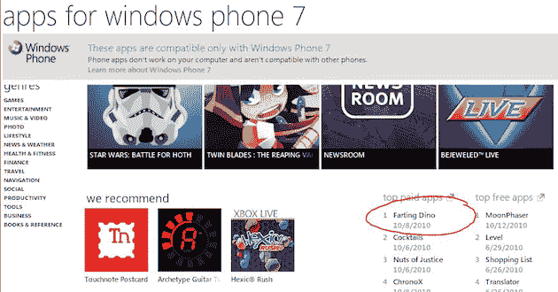

# 气体已经从 iPhone 传到了 Windows Phone 7:屁应用高居榜首

> 原文：<https://web.archive.org/web/http://techcrunch.com/2010/10/13/windows-phone-7-fart-apps/>

# 这种气体已经从 iPhone 传到了 Windows Phone 7:屁应用高居排行榜榜首

你闻到了吗？这是成功的甜蜜味道。或者——嗯，什么的。Windows Phone 7 设备甚至还没有向公众开放，但看起来微软可能会在至少一个重要领域复制苹果 iPhone 的成功:屁应用程序。

尽管这款手机还有几周才会上市，但应用商店已经在微软的 Zune 软件中上线运行了。而那些拥有设备的审核人员和/或员工正在下载和使用第一批必备应用。最畅销的应用程序？放屁恐龙。

没错。

我不知道哪个更好:一个名为放屁 Dino 的应用程序是 Windows Phone 7 的第一款热门应用程序，或者它是一个付费应用程序，人们实际上正在为它向 T2 付费。iPhone 用户对屁应用的喜爱由来已久，但几乎都是免费的。也许 Windows Phone 7 真的要[改变空间](https://web.archive.org/web/20230308110804/https://techcrunch.com/2010/10/12/windows-phone/)。

有趣的是，尽管苹果自[决定](https://web.archive.org/web/20230308110804/https://techcrunch.com/2010/09/09/app-store-guidelines/)放屁应用[不再符合犹太习俗](https://web.archive.org/web/20230308110804/https://techcrunch.com/2010/09/09/app-store-rules/)，微软却表示[他们不会介意这些应用](https://web.archive.org/web/20230308110804/http://www.techflash.com/seattle/2010/09/porn_out_fart_apps_in_for_microsofts_windows_phone_7.html)。这一承诺显然将在早期受到考验。

*【图片:flickr/ [人工忽视](https://web.archive.org/web/20230308110804/http://www.flickr.com/photos/artificialignorance/5079625364/)】【via Twitter/[ai](https://web.archive.org/web/20230308110804/http://twitter.com/#!/ai/status/27280165714)】*