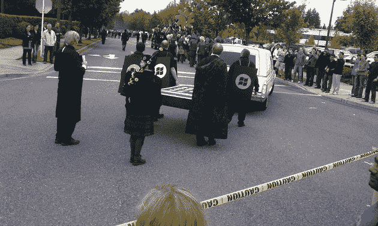
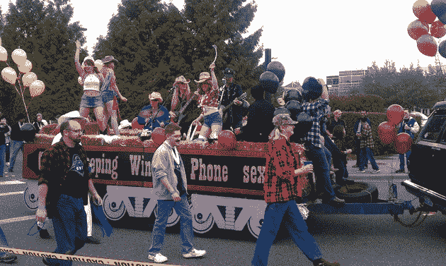
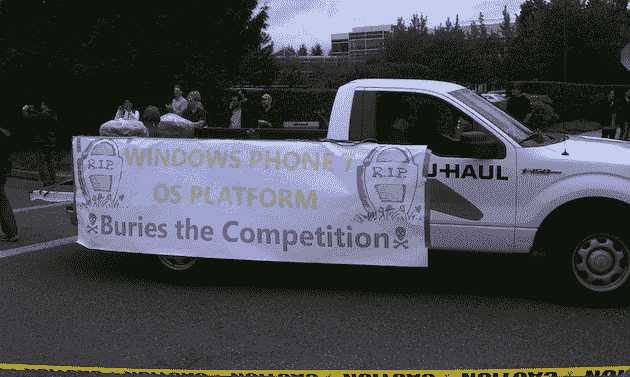
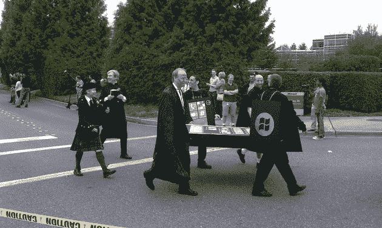
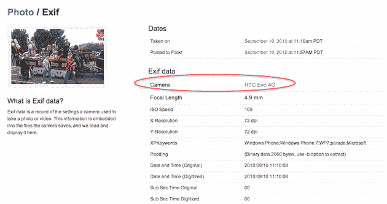

# 安卓在微软 iPhone 送葬队伍中的位置在哪里？拍照 

> 原文：<https://web.archive.org/web/https://techcrunch.com/2010/09/10/windows-phone-7-funeral/>

# 安卓在微软 iPhone 送葬队伍中的位置在哪里？拍照

微软是一家似乎并不太关心说些稀奇古怪的事情的公司，这些事情可能会也可能不会导致该公司不得不搬起石头砸自己的脚。这是从[顶端](https://web.archive.org/web/20221208175144/http://www.youtube.com/watch?v=So7qrFO_p44&feature=player_embedded)往下发生的。但即使对他们来说，这也很大胆。

今天，为了庆祝 Windows Phone 7 正式投入生产，微软员工[在华盛顿州雷蒙德市的总部举行了](https://web.archive.org/web/20221208175144/http://www.neowin.net/news/microsoft-workers-celebrated-windows-phone-7-rtm-with-iphone-hearses)游行。很好，庆祝大量辛勤工作的游行，对吗？嗯，不仅仅是这样。游行中还出现了 iPhone 和黑莓手机的灵车和棺材。是的，微软已经将自己标榜为下一个“iPhone 杀手”——他们甚至不需要等待媒体来做这件事。

接下来的几个月将会很有趣。

今天的假葬礼[是在微软首席运营官凯文特纳 7 月份的评论](https://web.archive.org/web/20221208175144/https://beta.techcrunch.com/2010/07/14/iphone-4-microsoft/)之后，“*看起来 iPhone 4 可能是他们的 Vista，我对此没有意见。*“是啊，那[到目前为止效果如何](https://web.archive.org/web/20221208175144/https://beta.techcrunch.com/2010/09/10/iphone-4-antenna-case-2/)？

然而，游行的真正亮点可能是当每个人都开始播放迈克尔杰克逊的“颤栗”音乐视频时。舞蹈本身很棒(查看下面的视频)，但更好的可能是背景中听起来像首席执行官史蒂夫·鲍尔默疯狂的声音——众所周知他经常这样做。

同样有趣的是，在这整个磨难中，Android 无处可寻。嗯，除非你算上微软员工“卡尔 J”，他拍下了整个事件，并把照片放到了他的 Flickr 页面上。他的相机？[一台运行安卓](https://web.archive.org/web/20221208175144/http://www.flickr.com/photos/trioculus/4977034309/meta/)的 EVO 4G。

还有，这张图是怎么回事？赢得电话性爱？杀手级应用？

【YouTube = http://www . YouTube . com/watch？v=ZQTemf043tw&w=630]

*【照片:Flickr/*