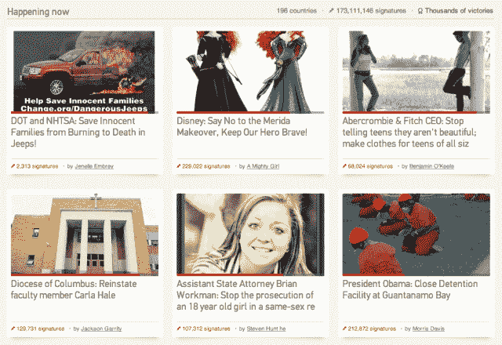

# 拥有来自 Omidyar 的 1500 万美元和 3500 多万用户，Change.org 希望证明具有社会意识的初创公司能够吸引大量的人

> 原文：<https://web.archive.org/web/https://techcrunch.com/2013/05/21/with-15m-from-omidyar-and-35m-users-change-org-wants-to-prove-socially-minded-business-can-attract-big-numbers/>

Change.org 于 2007 年作为一个非营利和基于项目捐赠的社交网络成立。多年来，这个初出茅庐的社交行动平台增长缓慢，但在去年，这种情况发生了巨大变化。Change.org 从 2012 年初的 600 万用户增长到今天的 3500 多万用户，并因此成为同类公司中规模最大、发展最快的公司之一。

事实上，这种增长已经导致 Change.org 在其六年的历史中进行了第一轮外部融资。该公司今天早上宣布，它已经获得了由易贝创始人皮埃尔·奥米迪亚和他的妻子帕姆创建的慈善投资公司奥米迪亚网络领导的 1500 万美元的巨额投资。

该公司还支持了像 Meetup T3 和 Kiva.org T5 这样的平台，将在 Change.org 持有少数(非控股)股份，即使没有传统流动性事件的承诺——因为该公司已经明确表示不会出售或 IPO。

由于之前的天使投资，这轮投资的其他投资者使这家初创公司的总资本达到了 2000 万美元左右，其中包括总部位于旧金山的新“使命一致”基金起义。

Change.org 的独特之处(以及对投资者的吸引力)在于，与许多其他类似的使命驱动型公司不同，这家初创公司绝对是盈利性的，并被认证为 B 公司。这与 Rally.org 等网站采取的方法类似，尽管这与令人兴奋的非营利初创公司浪潮背道而驰，例如备受关注的 Watsi，这是 Y Combinator 的第一个非营利孵化项目。

Change.org 创始人兼首席执行官本·拉特雷告诉我们，成为一家盈利性公司，同时宣布他的公司永远不会上市或寻求收购，都不是轻率做出的决定。至少在后一种情况下，不是为了简单地吸引注意力。Rattray 和公司的使命是向初创公司、投资者(以及全世界)证明，建立一个有社会意识、以使命为导向的企业而不是非营利组织是可能的。这是一个可以产生真正影响的业务，但也可以赚钱，并聘请得起与 Facebooks 和谷歌一样水平的人才。

一段时间以来，这一直是非营利组织和使命驱动型组织不得不与之搏斗的耻辱。虽然新一代人在 Twitter、脸书和 Reddit 的社交活动中成长起来，并希望在赚钱的同时有所作为，但不可能两件事都做的看法仍然存在。

“如果我们要制造真正的工具来帮助人们创造变化，我们需要创造收入，”创始人说。“尽管我的许多朋友告诉我，不寻求传统的风险投资是疯狂的，但这并不意味着投资不重要——我仍然知道，如果我们想快速发展，建立一个以创新为重点的企业，并创造你在盈利世界中看到的规模，我们需要使命驱动的资本来帮助我们实现这一目标”

现在它已经拥有 3500 万用户，Change.org 希望鼓励更多的社会企业投资者，并帮助宣传第三种创造流动性的替代方法。无论是股票回购还是某种形式的股息，使命驱动的企业都需要一种方法，让他们保持独立，而不寻求一次性的流动性事件。

当然，这位创始人继续说道，这种社会企业业务是长期的，15 到 20 年，这超出了大多数风险资本家的能力范围。“我毫不怀疑这将会改变，最终会有更多的投资者开始支持有社会意识的企业，”拉特雷说，“但这种支持可能不会来自现有的基金；相反，它可能来自大型基金会等来源。”

无论如何，通过专注于快速、扩大规模和创造收入(该公司 2012 年的收入达到 1500 万美元)，这位创始人表示，该公司已经努力向大型科技公司提供类似的薪酬，即使它无法在股权方面提供同样的福利。相反，它使用了一个不同的钩子:加入我们，你实际上可以帮助改变世界。

不管对你有没有吸引力，这个钩子已经见证了公司在过去的一年里在超过 18 个国家拥有超过 170 名员工。但是，拉特雷告诉我们，即使 Change.org 最终搁浅，关键是要向其他初创公司和投资者展示，在这个领域有机会创造大型、可持续的企业，提供社会和财务回报。

当被问及是什么在去年年初将 Change.org 推向了临界点，导致了 3500 万用户(其中近一半是国际用户)时，这位创始人归功于简单。他说，该公司不是试图满足每个人的所有要求，而是专注于请愿；换句话说，让用户更容易创建和签署数字请愿书。

虽然这听起来可能太简单，或者就像它只是鼓励“懒惰的点击行动主义”而不是真正的行动主义([Liz 指出](https://web.archive.org/web/20221005200442/http://allthingsd.com/20130521/change-org-raises-15m-from-omidyar-network-while-committing-to-never-sell-or-ipo/))，Rattray 说关键是将其请愿技术嵌入到社交社区中。

这位创始人说，Twitter 和脸书在过去五年中成为非常有效的宣传和社区组织工具，但它们不是为了驾驭真正的、持续的社会运动而建立的。通过在社交社区中嵌入请愿书，让人们了解当地正在发生的运动或活动，并突出最有效的活动，Change.org 可以不仅仅是一个简单的“在线请愿网站”

怀疑论者可能会对这种说法嗤之以鼻，但 SurveyMonkey，现在是一家价值 10 亿美元的公司，可能会对调查做出同样的评价。对于 Change.org 来说，当 3500 万人使用这个网站时，这真的无关紧要，不是吗？

