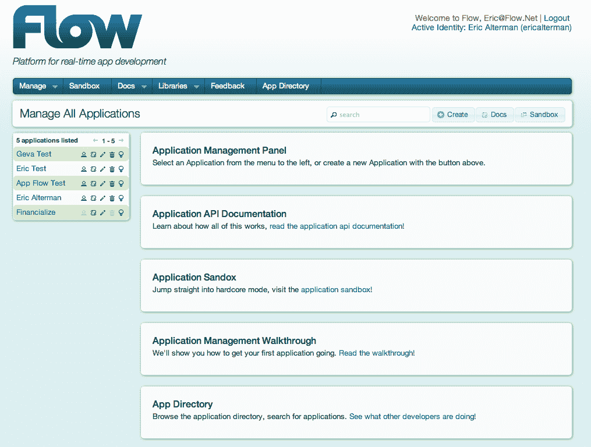
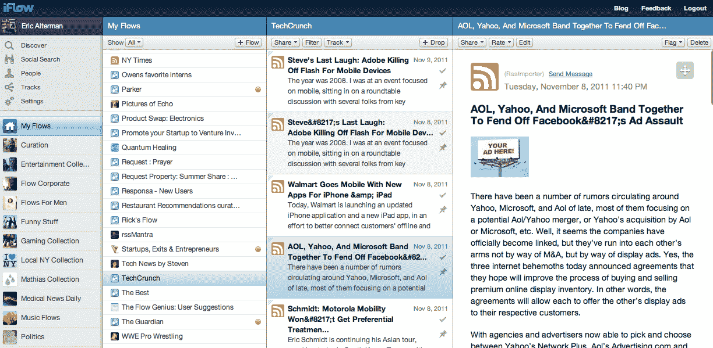

# 通过筹集 300 万美元，Flow 旨在通过 Data TechCrunch 连接世界各地的应用程序

> 原文：<https://web.archive.org/web/http://techcrunch.com/2011/11/10/with-3-million-raised-flow-aims-to-connect-the-worlds-apps-through-data/>

埃里克·奥尔特曼是典型的连续技术企业家。他创立了一系列相当多元化的软件、电信和半导体公司，包括 Kickapps、[，2010 年被 Kit digital 收购](https://web.archive.org/web/20230203083339/https://techcrunch.com/2011/01/31/exclusive-kit-digital-acquires-kickapps-kewego-and-kyte-for-77-2-million/)、MeshNetworks、[，2005 年被摩托罗拉收购](https://web.archive.org/web/20230203083339/http://www.theregister.co.uk/2004/11/17/motorola_buys_meshnetworks/)、Triton Network Systems(2000 年首次公开募股)、TeraNex、SkyCross 等等。1997 年，他共同创立了一个加速器，资助和发展基于军事承包商授权技术的公司，如洛克希德、ITT 和雷神。

2004 年，奥尔特曼创建了一个视频分享平台，他说这个平台在 YouTube 出现之前本质上就是 YouTube。尽管这家初创公司不太具备实现规模的条件，但这位企业家表示，该公司的“失败”(加上 YouTube 的出现)给了他一个宝贵的见解，让他知道如何(以及如何不)建立一个可以服务成千上万客户的 SaaS 平台，扩大规模，并成为整个空间的交钥匙解决方案。

随着大数据在这些日子里风靡一时，去年，他将目光转向了下一件大事:应用数据和数据互操作性，目标是让开发人员共享和交换世界上不断增长的网络和移动应用程序集合每天创建的海量数据。

今天，Alterman 和联合创始人 Tom Luczak 宣布正式宣布他们的新公司 [Flow Corporation](https://web.archive.org/web/20230203083339/http://flow.net/) ，以及其同名 Flow platform 的测试版——实时数据平台即服务(PaaS)和内容监管平台。一方面，该技术是应用程序开发者的数据交换，另一方面，它是消费者和企业的现成仪表板，允许他们创建和管理任何主题的信息流——就像一个备用的 RSS 阅读器。

换句话说，Flow platform 使开发人员能够利用现成的应用数据后端(包括流处理和聚合)，以期提高效率并降低为其应用实施实时数据系统的成本。使用 Flow platform，开发人员可以在获得许可的基础上，实时连接和共享来自 web、移动和企业应用程序的数据。

例如:一个专注于餐馆的移动应用程序可能会显示人们正在寻找附近吃最好的选择的好地方，但通过 Flow，该餐馆的开发者将能够从附近商店、优惠券交易或当地活动的其他应用程序中提取(并呈现)补充数据。通过建立基础设施，允许应用程序相互交流并为用户提供大量上下文信息，Alterman 希望 Flow 可以开始打破数据孤岛，并改变开发人员利用和服务实时数据的方式。

这位创始人表示，通过社交功能连接应用程序是未来数据的重要第一步，但在更基础和更强大的层面上连接应用程序是下一步。

另一方面，对于消费者和企业客户来说，iFlow.com 是拼图的另一块，它为日常网络用户提供了发现、创建、管理和共享任何主题的实时信息的能力——以一种过滤的和有关联的方式。比如下一代 RSS。(下面是 iFlow 的消费者 UI 示例图。)

例如，与 Twitter 和脸书相比，iFlow 允许用户关注想法而不是个人，比我们在社交网络上看到的实时信息流更进一步，将它应用于任何和所有来源的丰富数据。

消费者平台是使用 Flow 的 API 构建的，实际上是一种实时流处理功能的示例，开发人员可以在构建 web 和移动应用程序时加以利用。

至于下一步，奥尔特曼表示，他希望为开发者(和消费者)提供通过流量市场买卖实时数据订阅的机会，这将使内容所有者能够控制商业规则和货币化数据流——从产品评论到专有研究。

这家初创公司最近还完成了一轮分两部分的 300 万美元种子资金，来自 Cloud Capital Partners、BH Ventures、Blantyre Partners、Kappa East、Redstonne LLC 和 [Trident Capital](https://web.archive.org/web/20230203083339/http://www.crunchbase.com/financial-organization/trident-capital) 的 Venetia Kontogouris，该公司将利用这笔资金继续推出新功能和开发其数据市场。

对于有兴趣提前了解这个数据平台的读者，Flow 将向前 50 名发送电子邮件至“EarlyAccess@flow.net”并在主题行中添加“TechCrunch invite”的读者提供测试邀请。