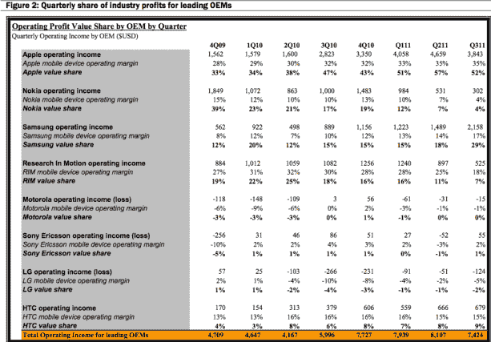

# 随着 4S 成为三大巨头之首，苹果攫取了 52%的行业利润；发放巨额奖金 

> 原文：<https://web.archive.org/web/http://techcrunch.com/2011/11/05/with-4s-now-tops-among-big-3-apple-grabs-52-of-industry-profits-doles-out-huge-bonuses/>

正如你可能已经听说的，[最近](https://web.archive.org/web/20230204202313/https://techcrunch.com/2011/11/03/android-still-most-popular-os-ios-holds-steady-in-second-place/)有很多关于 Android 移动操作系统的报道。[感谢 Nielsen](https://web.archive.org/web/20230204202313/http://blog.nielsen.com/nielsenwire/?p=29786) ，我们知道，Android 再次成为移动操作系统的领导者，现在占美国智能手机市场份额的 43%，高于 7 月份的 39%；而苹果的 iOS 同期保持在 28%，远远落后于第二。

当然，苹果正在进行一点点垂直整合，尽管他们在移动软件市场份额上远远落后于谷歌，但 28%的智能手机用户使用 iPhones，这使他们再次成为第一大制造商。硬件明显倾向于苹果。

因此，虽然 iPhone 在 2011 年第三季度的手机出货量中只占相对较小的 4.2%，但苹果现在似乎占据了该行业一半以上的利润。没错。[根据 Canaccord Genuity 分析师 Mike Walkley](https://web.archive.org/web/20230204202313/http://allthingsd.com/20111104/apple-headed-for-60-percent-of-handset-industry-operating-profits/) 的说法，在全球八大手机厂商中，苹果拥有超过 52%的总运营收入。虽然这看起来令人印象深刻，但这个数字比第二季度的 57%有所下降。

相比之下，三星在顶级厂商中占有 29%的利润，高于上个季度的 18%，而 HTC 占 9%，RIM 占 7%，诺基亚占 4%。尽管苹果在八大供应商的运营利润中占 52%的份额令人印象深刻，尽管 iPhones 的出货量相对较小，但三星的迅速崛起无疑值得注意。

根据 Walkley 的说法，三星获得了 11 个百分点的市场份额，这在很大程度上要归功于 Android Galaxy S II，而 RIM 和诺基亚继续下滑。当然，当大多数人抱怨 RIM 的未来时，至少诺基亚正在尝试 Windows Phone，[希望它在美国市场的尝试能够扭转](https://web.archive.org/web/20230204202313/https://techcrunch.com/2011/10/29/nokia-vs-the-industry-a-look-at-the-global-battle-over-mobile-advertising-infographic/)的颓势。

尽管如此，该分析师(和公司)发现，苹果的新 iPhone 4S 是美国电话电报公司、斯普林特和威瑞森(美国三大运营商)最畅销的手机，iPhone 4——尽管其下一款正在销售——仍然是这些运营商的最畅销机型。正如 9to5Mac 所说的那样，随着手机越来越旧，利润率似乎越来越高。随着这些手机越来越受欢迎，Walkley 预测苹果可能会在 2011 年第四季度售出多达 2900 万部 iPhone 手机。

这还不是全部，[正如这一系列 SEC 文件显示的那样](https://web.archive.org/web/20230204202313/http://investor.apple.com/sec.cfm)，苹果的高管们现在正在收获一个强劲财年的回报(该公司在这一财年的收入突破了 1000 亿美元大关)。该公司向七名高管奖励了 100 万股股票，这些高管将看到那些留在公司直到 2016 年的人钱包鼓鼓的。最近晋升的互联网软件和服务 Eddy Cue 以限制性股票单位的形式获得了 100，000 股股票。Cue 25%的股份将于 2014 年 9 月转为可自由交易的股票，其余股份将于 2016 年 9 月归属。

其余六名高管每人获得 150，000 股限制性股票，其中 50%在 2013 年 6 月授予，其余在 2016 年 3 月授予。根据苹果股票的当前价格，这相当于获得 15 万股股票的高管每人获得约 6000 万美元的薪酬。(其中包括:iOS 软件高级副总裁斯科特·福斯特尔、硬件工程高级副总裁鲍勃·曼斯菲尔德、高级副总裁兼首席财务官皮特·奥本海默、全球产品营销高级副总裁菲尔·席勒、高级副总裁兼总法律顾问 Bruce Sewell 和运营高级副总裁 Jeff Williams。)

虽然这些新的文件中没有提到苹果的新任首席执行官蒂姆·库克，[在他被任命为首席执行官时](https://web.archive.org/web/20230204202313/http://www.macrumors.com/2011/08/26/apple-awards-tim-cook-1000000-shares-of-stock-as-ceo-bonus/)他获得了 100 万股股票，其中 50%在 2016 年 8 月归属，剩余部分在 2021 年 8 月归属(如果库克仍然是苹果的员工)。

因此，虽然谷歌在移动软件领域继续崛起，但似乎由于苹果的硬件以及 iPhone 4(现在是 4S)在全球的主导地位，苹果及其高管都在赚钱。

感谢[阿利斯泰尔·伊斯雷尔提供的图片](https://web.archive.org/web/20230204202313/http://www.flickr.com/photos/alistair_israel/2056761663/sizes/m/in/photostream/)