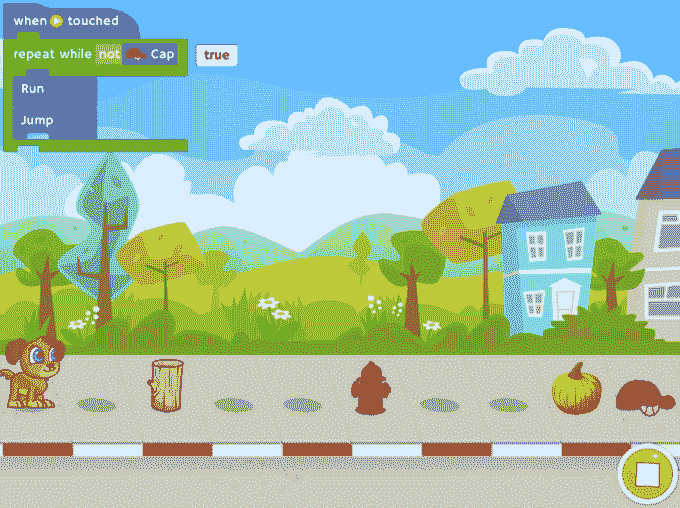

# 已经有 500 万用户，Tynker 开始移动帮助孩子们学习在 iPad 上编程 TechCrunch

> 原文：<https://web.archive.org/web/https://techcrunch.com/2014/03/12/with-5m-users-already-on-board-tynker-goes-mobile-to-help-kids-learn-to-code-on-the-ipad/>

从历史上看，美国教育系统一直在努力让年轻人对 stem 相关领域感兴趣并参与其中，特别是计算机科学，据《时代》杂志报道，在过去二十年里，计算机科学的参与率实际上一直在稳步下降。幸运的是，改革之风已经开始席卷教育领域，家长、教育者甚至山姆大叔已经开始向学校施压，要求在课程中加入计算机科学和工程概念，并在早期教育中引入这些概念。

此外，新一代的创业公司和应用程序制造商已经开始接过衣钵，并致力于激发年轻人对技术的兴趣，发展他们的编程技能。这一新兴类别中最受欢迎的应用之一是由硅谷一家同名教育初创公司开发的 [Tynker](https://web.archive.org/web/20221221125045/http://www.tynker.com/) ，该公司旨在让孩子们更容易(也更有趣)地进行编程和工程设计，而不管他们之前的经验如何。

受 Scratch 的启发，Tynker 利用 Javascript、HTML5 和其他开放网络标准来教育所有年龄段的孩子代码行背后的基本思维过程，Scratch 是一种编程语言，是麻省理工学院为孩子们开发的免费编码教育网站。作为一系列企业家 Srinivas Mandyam、Kelvin Chong 和 Krishna Vedati 的产品，Tynker 于 2012 年开始运营，但此后发展迅速。

如今，这家初创公司的学习平台被 8000 多所学校使用，并帮助了超过 600 万名儿童开始编程。为了支持这种早期增长，Tynker 去年从 NEA、Felicis Ventures、NewSchools Venture Fund、GSV 顾问公司和 500 Startups 等风险公司以及一系列天使投资者那里筹集了 325 万美元的种子资金。

Tynker 专为课堂和家庭学习而设计，允许教师和家长通过其网站为孩子注册，使学生能够访问其基于网络的课程和学习内容目录，从游戏和练习到互动教程和测验。为了鼓励参与，Tynker 一直致力于围绕计算机科学教育创造一个有趣的、类似游戏的环境，例如，让孩子们通过自定进度的课程、互动视频和指导教程来学习。

Tynker 为学校免费提供课程，而家长可以花 30 到 50 美元购买课程，其中包括指导教程和练习，并让孩子们能够进入不同的级别，并随着他们的进步获得徽章。到目前为止，Tynker 学习内容的主要访问点是通过其网站。但在过去的一年里，该团队一直致力于将其平台引入移动设备，本周该公司终于宣布推出其首个 iPad 应用程序。

该应用程序现已上线，由苹果公司推出，旨在通过平板电脑优化的沉浸式游戏体验来扩展 Tynker 的视觉编程体验，让孩子们在旅途中和“飞行模式”下继续学习。该公司表示，其新应用的目的是让其平台面向更广泛的年龄层——让一年级的孩子也能使用它——同时让学校更容易向更广泛的受众和年龄范围推出该平台。

iPad 应用程序包括基于故事的谜题和游戏，标题包括“小狗冒险”、“迷失在太空”和“速写赛车”，该公司表示，这些游戏旨在以有趣、互动和游戏化的方式引入排序、重复和条件逻辑等编程概念。使用 iPad 的触摸界面，学生们拖放视觉块来构建程序，在实现目标的过程中解决视觉代码块，比如使用逻辑和“循环变化”来帮助一只迷路的小狗找到回家的路。

在发布时，Tynker 的 iPad 应用程序包括 130 多个谜题，旨在帮助孩子们了解如何识别模式，发展算法思维和计算机绘图技能，调试程序，以及如何将问题分解为更小的连续步骤。

《迷失太空》和《速写赛车》分别售价 1.99 美元和 2.99 美元，其中包括额外的 120 个关卡和概念。展望未来，这家初创公司表示，它将开始在应用程序中提供额外的“冒险”供购买，允许学习道路上走得更远的学生访问更高级的谜题和学习概念。

更多信息，请点击这里和[应用商店这里](https://web.archive.org/web/20221221125045/https://itunes.apple.com/us/app/tynker-learn-programming-visual/id805869467?ls=1&mt=8)找到 [Tynker。](https://web.archive.org/web/20221221125045/http://www.tynker.com/)

