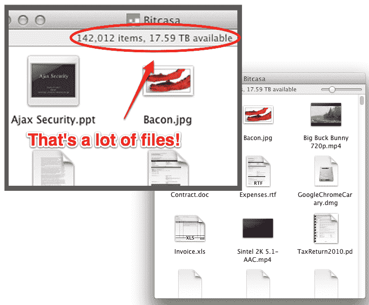

# 有了 Bitcasa，整个云就是你的硬盘，每月只需 10 美元 TechCrunch

> 原文：<https://web.archive.org/web/https://techcrunch.com/2011/09/12/with-bitcasa-the-entire-cloud-is-your-hard-drive-for-only-10-per-month/>

云现在是你的硬盘。不仅仅是几十千兆字节、兆兆字节甚至千兆字节，而是所有的无限存储空间，每月只需 10 美元。这是新的 TechCrunch Disrupt 决赛选手 [Bitcasa](https://web.archive.org/web/20230205024926/http://www.bitcasa.com/) 令人难以置信的承诺。

该公司正在推出一种新的云存储、同步和共享服务，轻松击败其竞争对手，包括硬盘制造商和 DropBox 和 SkyDrive 等在线服务。事实上，除了价格和无限的存储空间，这项服务最具颠覆性的一点是它与你的设备完全集成。你看不到它，它不是你桌面上的一个图标，你不能将文件或文件夹拖放到它里面。取而代之的是，当你在电脑上保存一个文件的时候，你把它写到云端。云*是*你的硬盘，而你实际的硬盘只是缓存。

使用云来存储文件或在设备之间同步文件的想法并不新鲜。Dropbox、SkyDrive、Google Docs、亚马逊和无数其他公司提供在线存储已经有一段时间了。此外，像 Mozy、Carbonite 和 Backblaze 这样的公司使用云来备份你的文件。其他服务，如 Megaupload 或 YouSendIt，围绕着通过云共享文件。

但是 Bitcasa 不像那些服务。它不会移动文件。它不会同步*文件。它处理比特和字节，数字数据的 1 和 0。*

当你保存一个文件时，Bitcasa 会把这些 1 和 0 写到它在云中的服务器端基础设施中。它对文件本身一无所知，真的。它看不到文件的标题，也不知道它的内容。它不知道文件是谁写的。而且因为数据是在客户端加密的，Bitcasa 甚至不知道自己存储的是什么。

所以，如果你想让你的 80gb MP3 或者 1tb 的电影(主要是通过 torrenting 获得的，淘气的你！)，说吧。即使 RIAA 和美国电影协会手里拿着传票来敲 Bitcasa 的门，Bitcasa 所拥有的也只是一堆无法解密的加密比特。

如果你仍然很难接受这个想法，可以这样想:你的数据不是依赖于你电脑(或者很快，你的手机)中容易出错的有限硬盘，而是存储在成千上万的硬盘上，并根据需要传输给你。为了处理“离线”问题，您最常用的文件会智能地缓存在您的计算机上，允许您在云关闭时工作，这种情况很少见，也允许您在没有互联网连接时工作，这种情况更常见。

通过 Bitcasa 共享文件也很简单:只需复制并粘贴文件或文件夹的链接(一个 URL，右击即可获得)并通过电子邮件、即时消息或其他服务发送给某人。他们点击链接，将文件直接发送到他们的桌面上。

还有定价！到底怎么这么便宜？

实际上，这是最简单的部分。Bitcasa 首席执行官托尼·高达解释说，每月 10 美元仍然给公司带来很大的利润。事实是，您 60%的数据都是重复的。例如，如果你有一个 MP3 文件，其他人可能也有同样的文件。他说，每个人往往只有大约 25 GB 的独特的个人数据。Bitcasa 使用专利的重复数据删除算法、压缩技术和加密技术来降低成本*(非常非常低，但这是它的秘方)，*这就是它如此实惠的原因。Bitcasa 还解释说，一种免费增值模式正在形成，免费存储空间并不无限。

这项服务听起来好得令人难以置信，留给我们的问题仍然需要回答。真的管用吗？它会让你的电脑变慢吗？它能扩展吗？该公司肯定它已经准备好了，但我们需要看到它才会相信。

Bitcasa 目前拥有 20 项技术专利，并计划在未来增加更多专利。它还将提供在后台运行的移动应用程序，在移动设备上做它今天在桌面上做的事情。它还将支持其他功能，如实时视频转码，因此您的电影可以传输到任何设备，无需您进行任何手动操作。还有更多的东西在工作中，但这些现在都被严格保密。

Bitcasa 的创始人包括首席执行官托尼·高达、乔尔·安德鲁和 T4，他们的工作经历包括在万事达卡、威瑞信、Classmates.com 和 Mozy 等公司工作过。Bitcasa 总共从 Andreeson Horowitz、First Round Capital 和 Pelion Venture Partners 筹集了 130 万美元。

Bitcasa 在有限的测试阶段将是免费的。你可以在这里注册访问[。](https://web.archive.org/web/20230205024926/http://www.bitcasa.com/)

***披露:CrunchFund 是 Bitcasa 的投资人。***

专家评委:[艾琳·李](https://web.archive.org/web/20230205024926/http://www.crunchbase.com/person/aileen-lee)(凯鹏华盈、珀金斯、考菲尔德&拜尔斯)[达斯汀·莫斯科维茨](https://web.archive.org/web/20230205024926/http://www.crunchbase.com/person/dustin-moskovitz)(阿萨纳)[迈克尔·帕瑞克](https://web.archive.org/web/20230205024926/http://www.crunchbase.com/person/michael-parekh) (MPi 资本)[约书亚·沙赫特](https://web.archive.org/web/20230205024926/http://www.crunchbase.com/person/joshua-schachter)(吉格)

听起来棒极了。秘制酱料是什么？

答:我们有 20 项专利。最有趣的预测功能–在您需要之前就知道您需要什么。用户不必做任何不同的事情。

DM:谁需要这个的市场调查？(已经在使用在线服务的人)

答:实际上是关于管理您的数据。您再也不用担心管理数据的问题了。

艾尔:如何与苹果、亚马逊、谷歌竞争？

答:我们只关注存储。我们跨平台。例如，苹果的产品只能与苹果产品一起使用。

JS:你能播放没有缓存的电影吗？

答:如果有带宽支持的话。但是我们的缓存非常智能。另外，人们高估了他们拥有的数据量。

MP:使用限制？

每个用户都有自己的帐户，并且可以与其他用户共享链接(文件、文件夹)。但不能在整个互联网上共享文件。