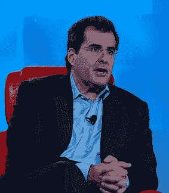

# 新闻集团的切宁不在了，FIM 会怎么样？TechCrunch

> 原文：<https://web.archive.org/web/https://techcrunch.com/2009/02/23/with-chernin-out-at-news-corp-what-happens-to-fim/>

# 新闻集团的切宁不在了，FIM 会怎么样？

长期担任新闻集团总裁和首席运营官的彼得·切宁，在就其合同进行的旷日持久的谈判未能达成一致后，将离开公司。上一财年，切尔宁的薪酬为 2880 万美元，甚至比鲁珀特·默多克的税后薪酬还多 130 万美元。在过去的 20 年里，切宁帮助默多克建立并管理他庞大的媒体帝国，他的离开无疑会给公司的未来带来各种各样的问题。他目前的合同将于 6 月 30 日到期，届时他将离职。

例如，福克斯互动媒体公司(Fox Interactive Media)将会发生什么？默多克帝国的这个特殊角落是新闻集团保留其所有网络业务的地方:MySpace、Photobucket、IGN、Scout，Chernin 是其最大的支持者和内部赞助商。FIM 的领导人 Peter Levinshon 被认为是 Chernin 阵营的成员。尽管切宁和默多克曾携手合作，但他们也非常对立，两人之间一直存在竞争。新闻集团的高管经常会认同这样或那样的老板。例如，MySpace 的首席执行官克里斯·德沃夫(Chris DeWolfe)就被认为是默多克的人。

随着切宁的离去，也许这是一个再一次审视 FIM 和它的作用的好时机。它最初的目的几乎是作为互联网创业公司的内部 M&A 基金。但是现在这些企业已经成长起来了。除了贡献了 FIM 绝大部分收入和利润的 MySpace，并不清楚 FIM 到底有什么意义。Photobucket 很容易成为 MySpace 的一部分。其他一些业务可能会被整合到其他运营部门，或者被出售。运行 FIM 和所有那些昂贵的助手的开销也可以减少。投资者当然希望看到 MySpace 成为一个独立的业务，而不是不得不放弃根据整个 FIM 数据对其业绩的估计。

让事情变得复杂的是，MySpace 创始人德沃夫和汤姆·安德森的雇佣合同将于今年晚些时候续签(据报道，他们每人每年赚 1500 万美元)。德沃夫是想将自己的控制权扩大到新闻集团内部的新领地，还是会试图避免接手看似无用的业务？或者也许 FIM 只是保持现状:新闻集团内部的一个时代错误。

(图片由[提供)什么算什么](https://web.archive.org/web/20230130140510/http://www.flickr.com/photos/whatcounts/522130662/)。