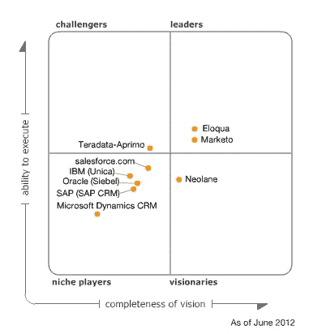

# 通过收购 ExactTarget，Salesforce.com 花费了近 35 亿美元进入首席营销官的套房 TechCrunch

> 原文：<https://web.archive.org/web/https://techcrunch.com/2013/06/04/with-exacttarget-acquisition-salesforce-com-has-spent-close-to-3-5-billion-to-get-into-the-chief-marketing-officers-suite/>

# 通过收购 ExactTarget，Salesforce.com 已经花费了近 35 亿美元进入首席营销官的套房

今天，Salesforce.com 以 25 亿美元收购了 ExactTarget，从而增加了其营销能力。这是该公司迄今为止最大的一次收购，仅次于去年以 6.89 亿美元收购的[巴迪媒体](https://web.archive.org/web/20230121232522/https://techcrunch.com/2012/06/04/salesforce-lines-up-against-oracle-on-social-push-buys-buddy-media-for-689m/)。2011 年，该公司以 2.76 亿美元的现金加额外股票收购了社交监控平台 [Radian6](https://web.archive.org/web/20230121232522/https://techcrunch.com/2011/03/30/salesforce-buys-social-media-monitoring-company-radian6-for-326-million/) 。

35 亿美元的收购表明，Salesforce.com 大举进军营销部门的成本很高。

ExactTarget 让 Salesforce.com 涉足电子邮件营销业务。该公司还提供社交和移动营销能力，以及营销自动化平台。

在这笔交易之前，Salesforce.com 上个月[宣布](https://web.archive.org/web/20230121232522/https://techcrunch.com/2013/04/23/salesforce-social-com/)收购[Social.com](https://web.archive.org/web/20230121232522/http://social.com/)，这与它通过收购 Buddy Media 获得的社交媒体广告活动能力截然不同。更重要的是，Social.com 从客户的 CRM 环境中提取数据来策划有针对性的活动。Radian 6 的预期是，公司也可以通过其 CRM 数据查看社交流。通过 ExactTarget，Salesforce.com 增加了一个可以与 Social.com 合作的电子邮件营销平台。

Salesforce.com 缺乏真正的营销自动化平台。ExactTarget 确实将营销自动化列为一项能力，但它并不属于该领域的领导者，至少根据 Gartner 的魔力象限是这样的。

如果 Salesforce.com 确实希望深入推进铅管理，它将需要要么大力投资于自身的发展，要么收购一家公司，这将带来另一个沉重的价格标签。上个月， [Marketo](https://web.archive.org/web/20230121232522/https://techcrunch.com/2013/05/17/big-data-visualization-goes-public-tableau-software-raises-254m-as-shares-pop-58-while-marketo-raises-85m/) ，一家营销自动化的领导者，成功地进行了首次公开募股。它以每股 13 美元开盘。如今，该公司股价在 22 美元左右，市值约为 8.12 亿美元。该领域的另一个领导者 Eloqua 去年底以 8.71 亿美元的价格卖给了甲骨文。

通过收购 Heroku 和开发 AppExchange，Salesforce.com 已经建立了开发应用生态系统的能力。它的 CRM 平台现在是[行业领导者](https://web.archive.org/web/20230121232522/https://techcrunch.com/2013/04/11/mobile-crm-apps-to-grow-500-by-2014-as-market-turns-with-decline-in-pc-shipments/)。扩展到营销套件符合其核心优势。问题是，吸引权力越来越大的首席营销官的成本会有多高。