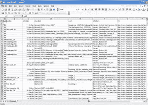

# 有了 FriendCSV，数据偷偷溜出脸书的后门

> 原文：<https://web.archive.org/web/https://techcrunch.com/2007/10/23/with-friendcsv-data-sneaks-out-facebooks-back-door/>

# 有了 FriendCSV，数据偷偷溜出了脸书的后门

正如[我们之前建议](https://web.archive.org/web/20230223125502/https://techcrunch.com/2007/10/09/facebook-versus-the-web/)的那样，许多专有系统都有一个潜在的问题——比如[脸书](https://web.archive.org/web/20230223125502/http://www.crunchbase.com/company/facebook)——因为它们内部的信息往往会被截留。信息流入，但不容易流出。

对于那些希望将存储在社交网络中的高度个人化的数据转移到其他应用程序以供其他用途的用户来说，这可能会非常令人沮丧。事实上，据报道，谷歌已经计划通过结束这种挫败感并提供一个更加开放的社交网络平台来与脸书竞争。

然而，人们很容易忽略脸书实际上允许数据流出其系统的方式。昨晚发给我们的一份名为 [FriendCSV](https://web.archive.org/web/20230223125502/http://apps.facebook.com/friendcsv/) 的申请在这方面起到了提醒作用。虽然脸书应用程序开发人员可能不会感到惊讶，但 FriendCSV 可以提取你朋友的大量信息，并将其存储在逗号分隔值(CSV)文件中，然后可以加载到 Excel 等电子表格程序中。

无论您的朋友是否安装了该程序，都可以提取他们的以下信息:用户 ID、姓名、性别、生日、关于信息、当前位置、家乡、个人资料 URL、肖像 URL、高中、教育程度、工作经历和隶属关系。FriendCSV 的 [开发者](https://web.archive.org/web/20230223125502/http://bigsight.org/bensinclair)表示，他们可以提取比这 13 个字段更多的信息；联系信息(如电子邮件地址)显然是脸书阻止用户提取的唯一类型的个人资料信息。

开发人员只知道其他几个脸书应用程序能提取这样的信息:[生日导出器](https://web.archive.org/web/20230223125502/http://www.facebook.com/apps/application.php?id=2433563224&b&ref=pd)，它将生日转储到谷歌日历，[生日转储到 iCal 导出器](https://web.archive.org/web/20230223125502/http://www.facebook.com/apps/application.php?id=2444662219&b&ref=pd)，它对 iCal 做同样的事情。另一个应用据称可以将你所有朋友的相册导出到一个 ZIP 文件中，但目前无法运行。