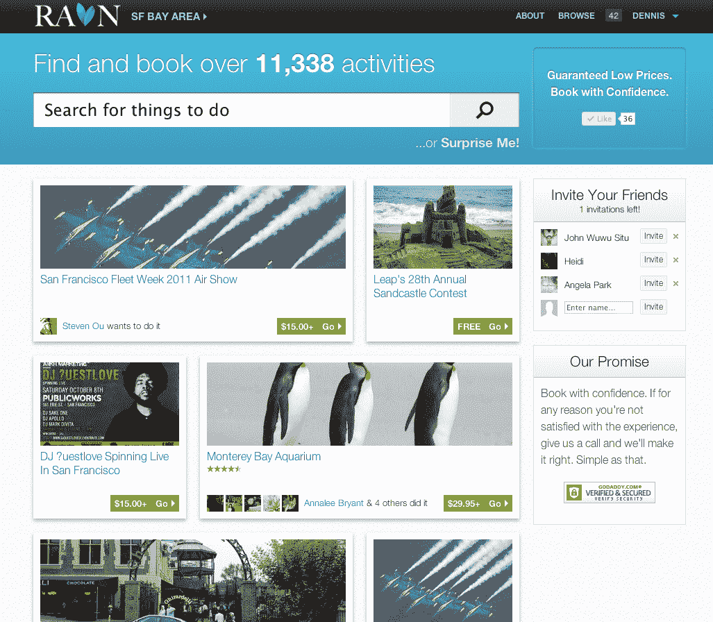

# 有了这笔资金，RAVN 测试版推出了针对当地活动的搜索和预订引擎 TechCrunch

> 原文：<https://web.archive.org/web/http://techcrunch.com/2011/10/26/with-funding-in-tow-ravn-beta-launches-its-search-and-booking-engine-for-local-activities/>

去年 11 月，由 i/o Ventures 支持的 [Skyara](https://web.archive.org/web/20230203064045/http://www.skyara.com/) 推出了一个基本上是 Airbnb 的体验平台，因为它允许那些有能力提供美食之旅、啤酒品尝或个性化瑜伽等酷体验的人与那些想尝试这些体验的人联系起来。Skyara 是一个将提供者和寻欢者联系起来的平台。

从那以后，创始人 Jonathan Wu、Dennis Liu 和 Steven Ou 一直在这个平台上默默工作，添加、迭代和调整。通常情况下，开发过程导致了早期的转向，该团队正在正式将 Skyara 转变为一款新产品，名为[RAVN](https://web.archive.org/web/20230203064045/http://ravn.com/)——今天将在私下测试中发布。(邀请如下。)不幸的是，对于早期 Skyara 用户来说，该团队将在不久的将来关闭或重定向 Skyara。

但是，没有外部投资的帮助，这种转变是不可能实现的。RAVN 背后的团队筹集了一轮种子资金，由希尔斯文资本牵头，使其能够在过去几个月里秘密开发新产品。

除了“如此乌鸦”(抱歉，我不得不这么做)，RAVN 还带来了什么？简单地说，RAVN 是一个搜索和预订引擎。换句话说，如果你对活动、旅游、事件、课程或休闲服务感兴趣，RAVN 旨在让你轻松找到这些经历并在线预订。

RAVN 目前拥有超过 13，000 项活动的市场，分布在湾区、纽约州、洛杉机和芝加哥，该团队在未来几个月内正在扩展到夏威夷州、华盛顿州、DC 和拉斯韦加斯。

例如，如果你有兴趣在纳帕规划一次葡萄酒之旅，用户可以比较不同品酒会的价格，或者计划去纳帕 22 个免费葡萄园中的一个。或者，也许你正在寻找一个周四晚上的瑜伽课程，这样用户就可以导航到 RAVN，根据你的能力找到评级最高、位置最便利的工作室。用户可以提前预订，以便在课堂上保留一个位置。

正如那些精明的读者可能正在收集的那样，RAVN 是从 Skyara 开始的过程的自然演变:创始人希望创造一个新的体验市场，类似于 Etsy 为工艺爱好者所做的那样。目标受众是任何想知道“这个周末有什么活动”的人对于那些为约会寻找创意的人来说，想要快速浏览想法并在不拿起电话的情况下开始行动，RAVN 将是一个有价值的目的地。

当然，RAVN 将(在某些情况下)与其他本地探索网站如 Loku、Sosh、Gogobot 等竞争，但 RAVN 希望建立一个平台，使所有本地活动形成闭环。换句话说:RAVN 将允许用户发现活动、计划、联系和安排朋友、直接预订——所有这些都是为了摆脱基于位置的每日交易垂直模式。

为此，RAVN 将允许当地企业在其平台上创建一个商业页面，接受在线预订，无需任何事先编程知识。RAVN 页面可以免费注册和测试，一旦客户通过企业页面预订了一项活动，初创公司就会转发客户的信息，这样所有企业需要做的就是在客户到达预定时间时完成服务。就是这样。

这家初创公司还向 TechCrunch 读者分发了 200 份测试版邀请函。要开始测试这个平台，只需[找到 RAVN](https://web.archive.org/web/20230203064045/http://ravn.com/) 并输入代码“TECHCRUNCH”。

然后回来让我们知道你的想法。

【T2