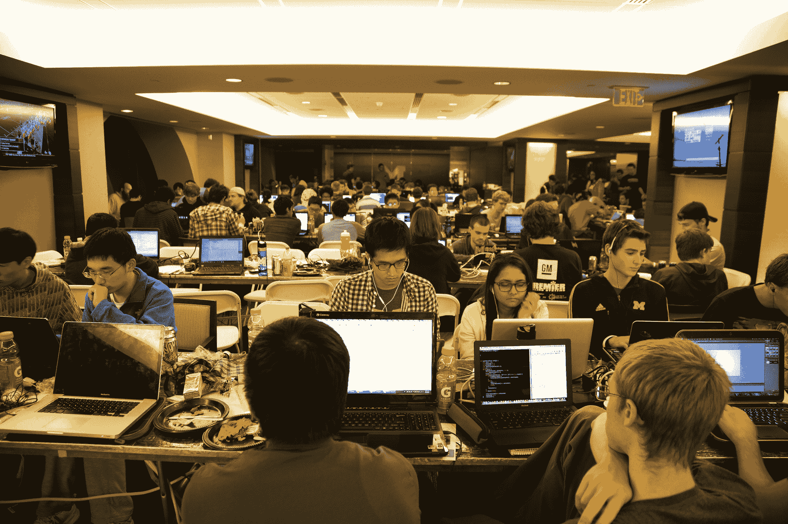

# 随着黑客马拉松登上舞台，计算机科学家 TechCrunch 的转型即将到来

> 原文：<https://web.archive.org/web/https://techcrunch.com/2014/02/15/with-hackathons-taking-center-stage-the-coming-transformation-of-the-computer-scientist/>

2011 年秋天，当戴夫·方特诺特从南佛罗里达的家搬到密歇根大学时，他带来了每个大一学生都需要的标准装备——衣服、鞋子、书和一个背包。不过，有一件东西不见了。

“我没有自己的笔记本电脑，”他说。

这并没有阻止他几周后在[黑客马拉松](https://web.archive.org/web/20230129102114/http://www.hacka2thon.com/)参加他的第一次黑客马拉松，在那里他建立了他的第一个网站。这一经历点燃了他的热情，在接下来的两年里，Fontenot 创立了 [MHacks，并将其发展成为美国最大的黑客马拉松之一](https://web.archive.org/web/20230129102114/http://www.mhacks.org/)，上个月举办了【1,000 多名学生从中西部和美国来到密歇根州，参加一个周末的编程活动。“hellyeah，”正如 Fontenot 巧妙地说。

下学期，预计将首次有超过 10，000 名学生参加 10 个大型黑客马拉松之一，该学科在 2012 年仅毕业了大约 16，000 名学生。这可能意味着，在接下来的几个学期里，大多数计算机专业的学生都会在毕业前参加黑客马拉松。

然而，黑客马拉松只是即将到来的计算机科学教育变革的一部分。计算机科学曾经是令许多本科生懊恼的理论学科，现在越来越多的学生开始寻找像黑客马拉松、开源项目和创业公司这样的渠道来学习行业所需的应用技能，并得到工作机会来证明这一点。

然而，这种为新工程师重建管道的做法对软件开发人员教育的未来提出了深刻的问题。大学和学位项目的恰当角色是什么？作为这些项目核心的创客文化应该如何与研究型大学的传统教育理念相结合？在准入，特别是女性和代表性不足的少数族裔的准入仍然是一个非常突出的问题的时候，组织者如何才能确保项目降低而不是提高新参与者的壁垒？

## **改变文化**

戴夫·方特诺特的决定性时刻之一是 [PennApps，这是美国第一个也是最大的学生运营的黑客马拉松](https://web.archive.org/web/20230129102114/http://2014s.pennapps.com/)。他听说组织者付钱让其他学校的学生参加，所以他努力招募他的密歇根朋友加入他的行列，最终说服其中大约 25 人跋涉到费城。环境和气氛令人振奋。“我们回来后，一半的人把他们的专业转到了计算机科学，”方特诺特回忆道。

2010 年秋季创办 PennApps 黑客马拉松的阿列克谢·科米萨鲁克(Alexey Komissarouk)认为，这种兴奋感的一部分是利用自己的技能进行创作的能力。“他们学习制作，而不是做作业，”他谈到参加这些活动的学生时说。

显然是有需求的。这学期，预计全国将会有 10 场甚至更多的学生超级黑客马拉松，比上学期的 3 场有所增加，而且他们的增长速度可能会加快。为了帮助这种增长，Komissarouk 上个月帮助组织了[黑客大会](https://web.archive.org/web/20230129102114/http://hackcon.io/)，教学生组织者如何举办有效的黑客马拉松。即便如此，研讨会上的发言人 Fontenot 指出，“福音传播的速度比我们能够衡量的事件要快。”

计算机科学专业的学生传统上有几种不同的职业道路，包括公司软件开发和学术研究。自从这门学科形成以来，理论工作和应用工作之间的分歧一直是计算机科学课程发展的关键战场。

计算机科学在学术界是一个相对年轻的学科，它是在第二次世界大战接近尾声时出现的用于导弹瞄准的计算机技术的产物。早期的大部分教育是非正式的，或者附属于其他学术项目，如数学或电子工程。从 20 世纪 60 年代开始，随着计算机科学的正式部门和分支的兴起，发展速度变得更加迅猛。

很明显，在早期，计算机科学有着巨大的潜力，但人们对这门学科的现状深表担忧。对于当时的研究人员来说，问题是计算机科学是否应该被视为一门技术和应用学科，或者它是否应该开发一套连贯的抽象概念，使其在学术上具有合法性。

辩论没有持续很久。在斯坦福等大学的压力下，这门学科很快向理论方向发展。这可以从[68 课程的发展中看出，1968 年](https://web.archive.org/web/20230129102114/http://www.csse.monash.edu.au/~gopal/Research/Annals.pdf)颁布了一套模型计算机科学程序。计算机科学教育侧重于数学和数据结构，软件开发的学分有限。这个方向仍然支撑着美国许多顶尖的计算机科学项目。

然而，自从近 50 年前这一里程碑式的课程发布以来，雇主们已经完全改变了他们的招聘标准。他们越来越希望工程师从第一天起就准备好开发软件，并瞄准已经有丰富软件经验的毕业生。这在初创公司中尤为严重，许多公司缺乏指导和培训基础设施，无法让新毕业生跟上步伐。

很明显，这些黑客马拉松几乎完全由学生运营，填补了他们对构建新产品的热情和他们课程对理论构建的强调之间的空白。

丰特诺特认为，“人们将意识到这不仅仅是一种爱好，而是一场教育革命。”他强调，在黑客马拉松上开发的技能不仅仅是纯粹的编程，还包括产品设计和团队工作，这些技能传统上被排除在计算机科学工作之外。

然而，Komissarouk 警告说，这些变化需要更多地被视为传统计算机科学教育的补充，而不是替代。“黑客马拉松是对 CS 课程的合理调整。宾大的国际关系系有一个庞大的模拟联合国项目，我们的创意写作项目有一个写作项目，但是我们的计算机科学课程里只有一群博士在谈论高级研究。这很酷，但这不是许多学生大学毕业后要做的事情，也不是他们大多数人来 CS 的原因。”

2013 年 9 月 21 日，在密歇根州安阿伯的大房子里，黑客们在 2013 年 MHacks 黑客马拉松上进行黑客攻击。(Joseph Xu，密歇根工程通信与营销，版权所有。经许可使用。)

## **通过开源项目学习**

然而，黑客马拉松只是开发新产品的一种方式。雇主和学生越来越多地将开源项目视为发展新毕业生关键技能的可行手段，并灌输长期发展的心态。

自 2005 年以来，谷歌已经提供了它的[代码之夏](https://web.archive.org/web/20230129102114/https://developers.google.com/open-source/soc/?csw=1)，在世界范围内安排了大约 7500 名学生参与著名的开源项目。但是不仅仅是大公司关注开源学生的潜力，初创公司也是如此。

Quinn Slack 和 Beyang Liu 创建了 [Sourcegraph](https://web.archive.org/web/20230129102114/https://sourcegraph.com/) 来帮助开发者找到跨代码库的代码使用示例。他们认为学生在扩展公司的开发知识及其在开源社区中的作用方面发挥着关键作用。上个月，他们宣布选择 [10 名开源研究员](https://web.archive.org/web/20230129102114/https://sourcegraph.com/blog/sosf-1-kickoff)，从事一系列项目，从 MIDI 输入库到政治分析家的数据分析工具。他们希望很快选出第二批研究员。

“在开源领域工作让学生体验真实世界的代码，教会他们如何在软件项目中与其他人合作，并建立他们作为程序员的声誉。这可能会非常有趣，”Slack 在给我的邮件中写道。“通过参与开源，学生们看到了一些最优秀、最聪明、最有激情的程序员实际上是如何做事的。”

对于斯坦福大学计算机科学本科生、Sourcegraph 开源项目首任研究员 Julia Lee 来说，她很欣赏这些项目更加复杂，更加贴近现实生活中的软件开发。

“很多斯坦福计算机科学课程都有最终项目，但项目往往比许多开源项目要小。”她也喜欢定义自己项目的灵活性。“在开发一款应用程序的过程中，我正在自学 Android 开发，斯坦福大学的公共卫生研究人员将在今年晚些时候使用这款应用程序。”

> 黑客马拉松正在扼杀招聘会，尤其是工程学校的招聘会。[招聘人员]想要的是能真正做点什么的人。

## **招聘**

对于像 Sourcegraph 这样的公司来说，让斯坦福大学、伯克利大学和其他学校的一些顶尖软件工程毕业生提前接触也没有什么帮助。事实上，我交谈过的每个人都同意，招聘开发人员将在这个新世界发生根本性的变化。

在这一点上，MHacks 的 Fontenot 说得很清楚。“有一点非常具体，黑客马拉松正在扼杀招聘会，尤其是工程学校的招聘会。[招聘人员]想要的是能够真正创造东西的人，“通过黑客马拉松或其他项目展示这种能力，会给候选人带来“巨大的竞争优势。”来自 PennApps 的 Komissarouk 认为，黑客马拉松正在成为一种类似棒球小联盟的“T0”农场团队。

两人看到风投和其他招聘人员涌入黑客马拉松寻找最优秀的人才。丰特诺特特别提到了安德森·霍洛维茨在这些活动中的知名度。“我对(参与者)开始找工作的地方做了一个调查，接近大多数人说 A16z 的网站是他们去过的主要地方，”丰特诺特说。“他们非常有效，因为他们从自己的投资组合中带来了许多穿着 16z 时装的顶级创始人和工程师，这给人留下了很好的印象。”

丰特诺特认为，黑客马拉松已经开始取代公司的面试过程。“对公司来说，一切都与关系有关。这就像精英管理，你把你最好的工程师带到(这些黑客马拉松)，他实际上必须帮助指导和帮助团队解决一些大问题。你不需要面试候选人，关键时刻你就能看到他们。你不需要评价他们，因为你的工程师正在体验这个人。”

## **接入和加速**

这些活动的一个好处是它们的民主化性质——任何人都可以注册一个黑客马拉松或从事一个开源项目，并从他们的工作中获得荣誉。

但是 Komissarouk 指出了这里的准入问题。“一方面，黑客马拉松变得越来越受欢迎是件好事。事实上，越来越多的工程师认识到他们的职业是一个创造者，CS 不仅仅是家庭作业和工作，这很好。另一方面，随着优秀黑客的门槛提高，黑客马拉松对我们想要吸引的那类人来说变得更加排外和可怕。”

事实上，尽管过去的学生只需要毕业并申请一家公司(也许有一个小的班级项目组合)，但今天的学生对他们有着明显更高的期望。例如，许多初创公司使用 GitHub 来跟踪潜在员工的代码活动。这可能会让招聘过程变得更加透明，但也提高了对学生的要求，他们必须在第一次上算法课之前就积极地贡献代码。

Fontenot 和其他黑客马拉松组织者敏锐地意识到了这些问题，并积极努力扩大参与 CS 的学生基础。“随着你变得越来越大，你会变得更加多样化，”他指出。

Slack of Sourcegraph 认为这些变化是一个积极的发展，让学生有能力加快他们的学习。“今天的 CS 学生将成为技术和开源社区的未来领导者，所以如果有什么的话，我们只是帮助他们提前几年到达那里。”

这种加速已经可以在 MHacks 中看到，七个最高奖项中有两个授予了高中生。事实上，Fontenot 认为，如果你今天想进入大学，参加黑客马拉松是一个特别强的方法。

“在密歇根，我们向招生办公室发送了 50 多名高中生的名字，因为他们都希望有下 10 个马克·扎克伯格，”并将相应地审查他们的申请。

但是这种加速是有潜在代价的。如果学生需要在大学之前就开始展示他们的工程才能，那就排除了大量在青春期甚至没有机会接触电脑的学生。虽然这类项目的开放性和灵活性对学生来说确实是积极的，但他们与招聘联系得越多，这些项目就越会展示招聘潜力，而不是提供进一步教育的机会。

## **结论**

像今天的许多职业一样，软件开发正在为教育和身份识别制定新的规则。曾经，麻省理工学院或斯坦福大学的学位是进入硅谷大公司的敲门砖，从那里开始，一个创业或管理角色。

围绕着黑客马拉松和开源项目的新文化将会颠覆这种强行推进的方式。越来越多的学生在职业生涯的早期接触创业公司，他们正在开发产品，而不是编写代码样本。随着对教育的持续关注，这里有机会解决工程师短缺的问题，甚至可能扩大参与设计下一个伟大创业公司的人的范围。

上图:2013 年 9 月 20 日，在密歇根州安阿伯的克里斯勒竞技场举行的 2013 年 MHacks 黑客马拉松开幕式。【作者 Joseph Xu，[密歇根工程通信&营销](www.engin.umich.edu)，版权所有，经许可使用】