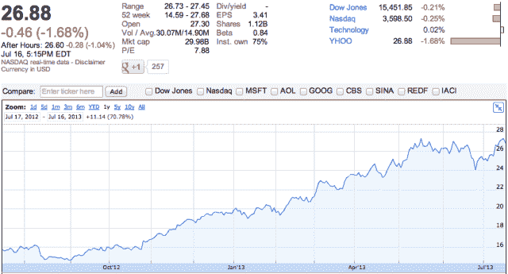

# 凭借其 50 亿美元的股票回购计划，雅虎仍有大量现金用于收购 

> 原文：<https://web.archive.org/web/https://techcrunch.com/2013/07/16/with-its-5-billion-share-buyback-program-yahoo-still-has-a-big-pile-of-cash-for-acquisitions/>

# 凭借其 50 亿美元的股票回购计划，雅虎仍有大量现金用于收购

雅虎刚刚发布了其喜忧参半的 Q2 收益，几句话可能就给出了所有人都在等待的答案——是的，雅虎仍然有充足的现金来进行更多的收购。该公司的股票回购计划就是证据。“在 2013 年第二季度，雅虎以 6.53 亿美元回购了 2500 万股股票，”人们可以在[的新闻稿](https://web.archive.org/web/20220930171442/http://finance.yahoo.com/news/yahoo-reports-second-quarter-2013-200500159.html)中读到。这些是一个更大的 50 亿美元计划的一部分。这些股票随时可以重新发行和出售。

回到 2012 年 9 月，玛丽莎·梅耶尔(Marissa Mayer)决定以 76 亿美元的价格出售雅虎在阿里巴巴的 40%股份。留出 36.5 亿美元用于再投资雅虎股票，证明该公司对自己的未来充满信心。

“我们很高兴地宣布，截至今天，我们基本上完成了向股东返还 36.5 亿美元阿里巴巴集团收益的承诺，回购了总计 1.9 亿股股票，”首席财务官肯·戈德曼在今天的财报中写道。

但该公司现在将走得更远。它获得了美国证券交易委员会 50 亿美元的股票回购授权，并计划充分利用这一授权。换句话说，关于雅虎现金在[11 亿美元收购 Tumblr](https://web.archive.org/web/20220930171442/https://beta.techcrunch.com/2013/05/20/its-official-yahoo-is-buying-tumblr-for-1-1b-promises-to-keep-it-independent/)后消失的报道被大大夸大了。

对于那些不熟悉股票回购计划的人来说，股票可以被取消或在以后重新发行。如果重新发行，这对公司来说是一个巨大的胜利，因为现有股票没有被稀释，新股票只是保持相同的股票编号，就像什么也没发生一样。

它们也是其他优势。例如，这表明雅虎非常自信，或多或少地说，没有比自己的股票更好的投资了。它略微提高了现有股票的价格，因为流通股减少了。

在过去的 12 个月里，[雅虎股票](https://web.archive.org/web/20220930171442/http://www.google.com/finance?cid=658890)一直表现良好。2012 年 7 月 16 日的股价为 15.65 英镑，今天的股价为 26.88 英镑，仅一年时间就上涨了 71.8%，令人难以置信。这比谷歌、苹果或易贝要好。

雅虎的股票回购计划到目前为止已经取得了回报，该公司可能会花费超过 36.5 亿美元进行收购，因为其投资组合的价值今天更高了。只要股票涨了，就是好策略。

因此，今天的收益教会了企业家和风投一件事:收购狂潮可以继续。