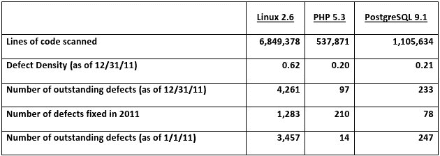

# 有了这么多眼球，所有的臭虫都是肤浅的

> 原文：<https://web.archive.org/web/https://techcrunch.com/2012/02/23/with-many-eyeballs-all-bugs-are-shallow/>

在他的开创性著作《大教堂和集市》中，埃里克·雷蒙德提出了“只要有足够的眼球，所有的臭虫都是肤浅的”的观点他称这个为“T2”莱纳斯定律“T3”，以纪念 Linux 的创建者莱纳斯·托瓦尔兹。这听起来似乎是一个不言自明的声明，但正如维基百科页面指出的，这个概念有其诋毁者。迈克尔·霍华德和大卫·勒布朗在他们 2003 年的书《编写安全代码》中声称，“大多数人只是不知道该找什么。”

今天，Coverity Scan 项目的一份新的[报告指出，很多人*都*知道应该寻找什么，开源软件至少可以与之相提并论——如果不是更好的话！—关于软件缺陷的专有软件。Coverity Scan 项目评估了选定的开源项目和一些匿名的专有代码库，以确定“难以发现但可能导致崩溃的缺陷”。这些结果加强了莱纳斯定律。](https://web.archive.org/web/20221126230259/http://softwareintegrity.coverity.com/coverity-scan-2011-open-source-integrity-report-registration.html)

应美国国土安全部的要求，Coverity 的扫描项目始于 2006 年。DHS 注意到越来越多的开源项目被采用，并希望确保代码的整体安全性和质量。从那以后，covery 每年都在不同的开源项目上运行他们的 Scan 项目，包括 Linux 内核，并发布一份他们发现的报告。

Scan 项目的基本分析是缺陷密度，它是“通过将发现的缺陷数除以代码行中的代码库大小来计算的”。使用缺陷密度的优势在于它解释了软件代码的不同大小，这使得不同大小的项目之间的缺陷密度数字可以直接比较。”发现的缺陷仅限于 Coverity 静态分析扫描套件的“高影响”和“中影响”，包括空指针取消引用、未初始化变量、内存损坏、错误处理、非法内存访问等。

根据 Coverity，在整个软件行业中，平均缺陷密度为 1.0。从 Coverity 的发现中可以看出，Linux 2.6 内核、PHP 5.3 和 PostgreSQL 9.1 都有非常小的缺陷密度。该报告提供了一些很好的数字分析，并特别研究了为什么 Linux 内核比扫描中包括的其他开源项目具有更高的缺陷密度:

> 分解每个软件组件中的缺陷密度，内核具有更高的缺陷密度。这很可能是因为每个修复都必须与破坏现有代码稳定的风险进行权衡——这就是“在您更改代码的那个区域之前，有些修复不应该进行”的原则。此外，内核开发人员可能不愿意仅仅为了满足静态分析结果而更改根据经验已知在该领域稳定的代码。他们可能会等到代码出于其他目的而被修改时，才将缺陷修复合并到新代码中。另一方面，与其他组件(如驱动程序)相比，内核是被归类为高风险的缺陷数量最少的组件之一。这可能是由于与设备驱动程序相比，内核的重要性和广泛使用，其中许多只对 Linux 全球用户群的一小部分感兴趣。

运行扫描并报告数字会很容易，但这并不是完整的故事。我很高兴看到 Coverity 实际上调查了结果。

coverity 2011 年的报告是他们第一次直接比较开源软件和专有软件。鉴于 Coverity 扫描中包含的专有代码来自匿名公司，我询问了这些应用程序来自哪些行业的一些细节，以及这些项目可能有多成熟和复杂。据扫描主管 Zack Samocha 称，这些应用来自“金融服务、电信、医疗设备、航空航天和国防、工业自动化、汽车”等领域。大多数应用程序已经开发了 5-10 年，并且“是嵌入到一些世界上最著名的设备和关键系统中的成熟应用程序。例如，运行 MRI 机器的软件、运行关键电力基础设施/电网的软件、用于高频交易应用和股票交易所的软件等。”

从报告来看:

> 在我们的样本中，专有代码库的平均代码库大小是 750 万行代码，远远大于我们分析中包含的开源软件的平均代码库大小。因此，为了进行更直接的比较，我们将私有代码的缺陷密度与类似大小的开源代码库进行了对比。Coverity 用户专有代码库的平均缺陷密度是. 64，比软件行业的平均缺陷密度 1.0 要好。我们还发现，对于类似规模的代码库，开源代码的质量与专有代码的质量相当。例如，Linux 2.6 有将近 700 万行代码，缺陷密度为 0.62，这与它的专有代码库大致相同。

Samocha 观察到“值得注意的是，安全关键型行业(汽车、医疗、航空航天、工业、电力/能源)的缺陷密度低于非安全关键型行业(电子、电信、金融服务、软件和互联网)。”

该报告的要点很清楚:

> 开源代码的质量与专有代码的质量相当，尤其是在代码库大小相似的情况下。

> 通过采用开发测试作为其开发工作流程的一部分来对软件质量做出承诺的组织，正如所分析的开源和专有代码库所展示的，收获了高代码质量的好处，并随着时间的推移继续看到质量的改进。

正如我所说，莱纳斯定律在许多方面似乎是不言自明的:生活和呼吸开源软件的人很久以前就知道这句话的真实性。Coverity 的分析提供了一点客观的验证，这是好事。现在我们只需要有人更新一下维基百科上关于莱纳斯定律的条目，引用这份报告作为对其诋毁者的反驳！

图片来源: [IXS_1916](https://web.archive.org/web/20221126230259/http://www.flickr.com/photos/acme/2628554102/) 作者:acme