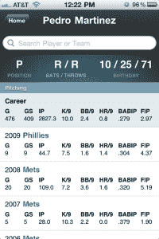

# 随着 Moneyball 在影院上映和 10 月份的临近，棒球爱好者们有了一个移动应用 

> 原文：<https://web.archive.org/web/http://techcrunch.com/2011/09/26/with-moneyball-in-theaters-and-october-closing-in-baseball-geeks-get-a-mobile-app/>

对于棒球迷来说，这个神奇的月份即将到来。十月:当我们最喜欢的球队去佛罗里达打高尔夫球，或者跌倒、受伤、呜咽着悄悄退出季后赛的时候，我们只能看着，感到恼火。对大多数人来说，这是一个烦躁的时刻，但我们大多数人永远不会错过。

棒球迷可能注意到的另一件事是:[money ball](https://web.archive.org/web/20230203131116/http://en.wikipedia.org/wiki/Moneyball)——这本书写的是奥克兰运动家队的总经理比利·比恩，以及他使用 sabermetrics 和其他新奇的方法来跟踪哪些球员被低估，等等。—已被拍成电影，正在全国影院上映。对于那些不熟悉以上任何一项的人来说，棒球迷感兴趣的原因是什么？Moneyball 强调了当时正在进行的团队和组织用来评估球员的指标和方法的重新构想。多亏了 Moneyball 和 Bill James 及其 sabermetrics 的崛起，极客们终于能够在俱乐部里获得一席之地。

我还没有看过 Moneyball，但可以肯定的是，它在我本周要做的事情的清单上。因此，本着一场势均力敌的外卡比赛、逐渐逼近的季后赛和 Moneyball 的发布，这里有一个很酷的 iOS 新应用程序，名为 [Baseball Mobile](https://web.archive.org/web/20230203131116/http://itunes.apple.com/us/app/baseball-mobile/id459470073?mt=8) ，简而言之，这是一种在 iOS 设备上获取棒球统计数据的快速而简单的方法。现在，统计爱好者可以移动办公了。有权威。

我对这个应用程序感到兴奋的原因是什么？它是以休闲爱好者和高级统计极客的想法创建的，这意味着它包括传统的统计(安打、打点、击球率等。)以及追溯到 19 世纪 70 年代的每个球员和球队的 [sabermetric](https://web.archive.org/web/20230203131116/http://en.wikipedia.org/wiki/Sabermetric) 统计数据(OPS、FIP、wOPS+)。2011 赛季每天都会更新，今年的季后赛也会更新。

 棒球手机的数据也全部存储在应用程序中，这意味着无论你是在飞机上还是在忍受 AT & T 的服务，你都可以立即打开新页面并运行搜索查询。

当然，网上有大量的网站提供丰富的棒球统计数据，但对于普通的棒球迷来说，很难找到这些网站，而且其中许多网站并没有针对移动设备进行优化。另外，谁想拥有另一个 ESPN 应用程序？使用一个独立开发商制作的东西很好，这个开发商与迪斯尼拥有的体育媒体死亡之星没有任何关系。

该应用程序是普通粉丝、奇幻爱好者、统计爱好者和球员自己轻松浏览当前和历史统计数据的好方法，也是赢得托尼酒吧赌注的好方法，托尼认为他知道卡尔·亚斯特尔泽姆斯基在 67 赛季的所有统计数据。

嘿，就连克利夫兰印第安人队的经理曼尼·阿克塔(Manny Acta)似乎也喜欢这个应用程序:

https://twitter.com/#!/Mactriber _ 11/status/113388606084755456

显然希斯·贝尔也是如此。

[比尔·詹姆斯的每日比赛](https://web.archive.org/web/20230203131116/http://itunes.apple.com/us/app/bill-james-daily-match-ups/id422976717?mt=8)是另一个有一些类似用例的应用程序，但棒球移动版胜出是因为它将以你最喜欢的格式呈现统计数据，以球队或球员为基础，并且当你选择新球队的统计数据时，应用程序不会有摩擦，因为所有信息都在应用程序中。用户还可以在常规统计和 sabermetric 统计之间切换，只需滑动玩家的个人资料，而不必返回主页面。相当酷。

至于这个应用是谁负责的？Mike Gilberg 是第一次开发 iOS，所以用户可能会注意到这个设计并不完美。还有很多改进的空间，但这并不意味着这不是一个对即将进入季后赛的棒球迷来说不可怕的入门应用。

吉尔伯格也曾在纽约大都会队担任球童，并在该组织的运营部门工作，构建和应用高级统计数据——其中一些数据已经成为这个非常棒的移动应用程序。因此，吉尔伯格在应用程序开发经验上的不足，可以通过他对令人讨厌的棒球统计世界的熟悉来弥补。如果有什么运动是以数据为中心的，那就是棒球。

棒球迷们，来看看吧，让我们知道你们的想法。哦，安卓也在路上了。