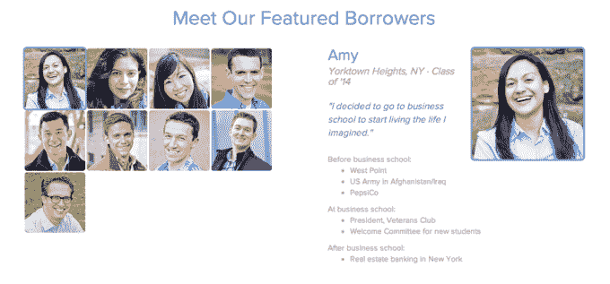
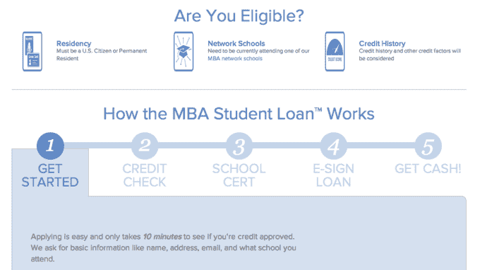

# P2P 借贷平台 CommonBond 筹集了超过 1 亿美元，扩展到 100 个项目，帮助研究生减少债务 

> 原文：<https://web.archive.org/web/https://techcrunch.com/2014/03/21/with-over-100m-raised-p2p-lending-platform-commonbond-expands-to-100-programs-to-help-grad-students-reduce-debt/>

总部位于纽约市的 CommonBond 于 2012 年末推出了 T2，旨在将个人贷款和众包的力量引入学生债务危机。随着美国学生债务超过 1 万亿美元，大学毕业生发现自己今天在补贴教育方面处境尴尬。向山姆大叔借钱意味着求助于联邦贷款及其高固定利率，而私人市场的大玩家似乎满足于维持现状。

像 CommonBond 这样的公司是为了应对学生贷款危机而出现的，它们利用 LendingClub 和 Prosper 这样的点对点贷款平台的人气，给学生借款人更好的震动。通过将借款人与校友直接联系起来，以及建立一个更大的网络来回馈母校的毕业生，并看到稳定的回报，CommonBond 正成为一个越来越有吸引力的替代选择。

这家初创公司[去年 9 月从 Tribeca Venture Partners、Social+Capital Partners、Vikram Pandit 等公司筹集了超过 1 亿美元的股权和债务融资](https://web.archive.org/web/20221221125045/http://www.finsmes.com/2013/09/commonbond-raises-100m-equity-debt-financing.html)，这是 2012 年启动的 350 万美元的基础。CommonBond 最初的目标是 MBA 项目，旨在帮助毕业生整合他们的研究生和本科生贷款，并以低于他们从山姆大叔那里获得的固定利率为这些贷款进行再融资。

凭借其在银行的资本，CommonBond 一直在寻求扩大覆盖面，本周它做到了这一点，将整合和再融资项目带到了法律、医学和工程项目的毕业生，以及范德比尔特大学、圣路易斯华盛顿大学和德克萨斯大学的 MBA 项目。根据联合创始人兼首席执行官大卫·克莱因的说法，这种扩张意味着 CommonBond 现在涵盖的学位项目数量是原来的四倍——在短短 15 个月内，研究生学位项目的总数从 25 个增加到 100 多个。

凭借其新的债务和股权资本以及新的研究生项目，该公司计划在 2014 年为借款人节省超过 1000 万美元，并预计今年将有超过 1000 名新借款人加入其行列。考虑到法学院毕业生的平均债务一直徘徊在 11 万美元左右，医学院毕业生的平均债务接近 16 万美元，拥有研究生学位的人有大量需求，研究生贷款市场与本科生贷款市场一样继续膨胀。

在这种情况下，人们可以看到 CommonBond 贷款公式的吸引力，该公式现在允许背负学生贷款债务的毕业生将本科生和研究生贷款合并为一笔 10 年期固定利率贷款，并通过自动转账以 5.99%的利率进行再融资。该公司声称，根据这一公式，它可以为借款人节省超过 1.7 万美元的还款费用，这不仅是因为利率较低，还因为该公司努力避免其他平台上可能出现的额外费用，例如申请费、发起费或预付款罚款。

此外，该公司还为寻求减少月供的借款人推出了一种新的 15 年期固定利率贷款，该贷款将通过自动转账以 6.49%的再融资利率向借款人提供。

但除了较低的固定贷款和再融资利率，CommonBond 还希望通过围绕贷款流程创建一个社区来吸引学生借款人和校友。这家创业公司通过遍布全国几十个城市的学生、毕业生、校友和专业人士组成的社区，组织网络和社交活动，帮助借贷双方的个人以 3d 方式实时了解彼此，并可能提供辅助好处，例如帮助学生找到研究生就业。

CommonBond 还坚持一项社会使命，这使其成为越来越多的将“社会公益”融入公司理念的创业公司，例如 Warby Parker 和 TOMS，在其平台上全额资助的每一个学位，都会资助一名贫困学生(一整年)的教育。像 TOMS 一样，CommonBond 希望将“一对一”模式引入教育和金融领域，允许借款人在自己的教育视野之外推动社会公益。

更多信息，请点击此处查看 CommonBond 主页。

