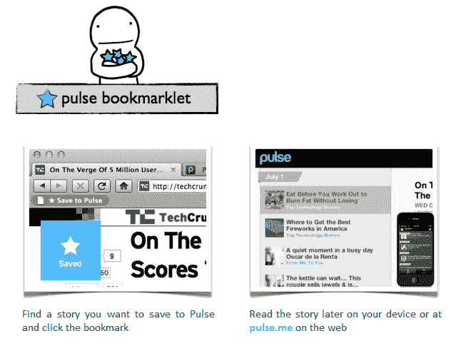

# 通过“保存到 Pulse”Bookmarklet 和 Chrome 扩展，Pulse 进入了 Instapaper 的地盘 

> 原文：<https://web.archive.org/web/http://techcrunch.com/2011/08/29/with-save-to-pulse-bookmarklet-and-chrome-extension-pulse-enters-instapapers-turf/>

# 通过“保存到 Pulse”书签和 Chrome 扩展，Pulse 进入了 Instapaper 的地盘

[Alphonso Labs](https://web.archive.org/web/20230203060241/http://www.crunchbase.com/company/alphonso-labs) ，这是一家支持 [Pulse](https://web.archive.org/web/20230203060241/http://www.pulse.me/) 的羽翼未丰的公司，这是一款[的漂亮的社交新闻阅读器](https://web.archive.org/web/20230203060241/https://techcrunch.com/2011/03/25/pulse-updates-iphone-and-android-apps-with-social-feeds-improved-sharing-more-sources/)，适用于约[500 万人使用的 iPhone、iPad 和 Android 设备](https://web.archive.org/web/20230203060241/https://techcrunch.com/2011/08/02/pulse-espn-5-million/)，旨在对简单的书签工具 [Instapaper](https://web.archive.org/web/20230203060241/http://www.crunchbase.com/company/instapaper) (以及一系列其他书签和“稍后阅读”应用程序)构成挑战。

这家初创公司今天推出了一款 [bookmarklet](https://web.archive.org/web/20230203060241/http://www.pulse.me/bookmarklet) 和一款 [Chrome 插件](https://web.archive.org/web/20230203060241/https://chrome.google.com/webstore/detail/imnghiiajfangdaolekmphkaohhcnklj)，用户只需点击一下鼠标就可以“将故事保存到 Pulse”。有人告诉我，其他浏览器的扩展“正在进行中”。

当然，保存到 Pulse 意味着你可以将你在网上找到的有趣故事加入书签，以便以后在你的 Android 或 iPhone 手机或 iPad 上阅读。

在这一点上没有其他的花哨功能，但它是一个干净的功能书签应用程序。

这显然也是 Instapaper 所做的事情(我可能会补充说，相当优雅地添加到 Pulse 服务中)，但最重要的是，这是一个受欢迎的补充，可能不会对 Instapaper 的使用产生太大影响——实际上，我看到自己在一起使用两者。

就像 Safari 的新“阅读列表”功能一样，[没有一个会杀死另一个。正如 Instapaper 的创造者 Marco Arment 曾经在《T21》中写道的那样，这个市场足够大，足以让多种现代书签服务蓬勃发展。](https://web.archive.org/web/20230203060241/http://siliconfilter.com/safaris-new-reading-lists-are-glorified-bookmarks-not-instapaper-killers/)

