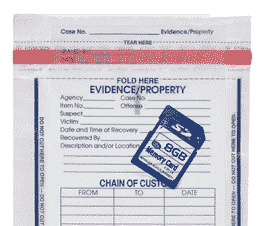

# 警官的“胸部摄像头”捕捉到了枪击事件，开创了技术先例 

> 原文：<https://web.archive.org/web/http://techcrunch.com/2011/10/03/with-shooting-caught-on-officers-chest-cam-tech-precedent-to-be-set/>

越来越多的摄像机记录街道上和工作中的活动，这带来了一系列有趣的新问题。我在我的[监督社会](https://web.archive.org/web/20230203132927/https://techcrunch.com/2011/06/17/surveillant-society/)岗位上检查了几个，而[刚刚出现了一个](https://web.archive.org/web/20230203132927/http://www.sfgate.com/cgi-bin/article.cgi?f=/c/a/2011/10/03/MNGR1LBKEQ.DTL)，这可能为科技在刑事案件中的应用开创了一个严肃的先例。

9 月 25 日，一名奥克兰警察拦下一辆汽车，嫌犯下车逃跑。警察追赶他，在一场搏斗中，嫌疑犯被击毙。指控，嫌疑人和官员的名字，没有透露，但据说嫌疑人携带枪支。

这将是另一个具有致命结局的可悲的典型升级，除了这名警察在某个时候打开了他的“胸部摄像头”，这是警务领域相对较新的发展，一个翻盖式口袋摄像头(在这种情况下是一个 [Vievu](https://web.archive.org/web/20230203132927/http://www.vievu.com/) 型号)附在制服上，并在特定情况下打开。鉴于此案的利害关系，这个摄像头的出现引发了一些潜在的重大法律问题。虽然有些比技术相关的更合法，但花一分钟看看技术进步如何塑造刑法是值得的。

首先，警官需要在什么时候启动摄像头？该部门有规则规定何时应该、不应该或必须打开相机，但不这样做(无辜或故意)很容易解释，并且不属于“拦截和逮捕”的事件可能需要记录。在监控社会中，我注意到，在这种情况下，摄像机不可避免的结局是一直记录，在拍摄过程中循环播放，事实上 dash 和安全摄像机(不受尺寸限制)已经做到了这一点。在这种情况下，不管警官的行为如何，录像都会被记录下来，以后再收集。不幸的是，电池和存储的限制暂时阻止了这个简单的解决方案。与此同时，关于记录的规定应该是公开信息(我确信他们已经公开了)，任何人在遇到官员时都应该能够要求打开摄像头。

 **二、素材是如何处理的？**也就是说，谁能接触到这些录像，如何保护它们不被篡改？答案很可能是说，它必须像任何其他物证一样被处理:装袋、登记、集中安全保存；已经有很多这方面的规定，尽管它们并不总是得到尊重。与实物证据不同，相机上的镜头有可能被复制，这意味着它可以在不影响原件的情况下给别人。SFGate 询问是否应该向媒体提供该视频，但我认为在正在进行的调查中，没有任何理由应该这样做(或者说，为什么它应该与武器或嫌疑人身份区别对待)。

**涉案官员在陈述前可以观看录像吗？主流意见似乎是不，这是不可接受的，我同意。犯罪的证人或参与者的陈述必须凭记忆。由法官和陪审团决定真实程度；如果嫌疑人(或官员)意识到他们的行为被录像，他们的陈述很可能会改变以反映这一点。此外，如果他们真的看到视频，它会进一步改变。警察遭遇的记录对该部门和对被告一样重要。当然，录像会被拿来作为证据，相关人员会有机会在交叉询问或其他提示时解释他们的行为。**

该官员的律师指出，一些部门实际上已经肯定地回答了上述问题，工会推动在发表声明前审查录像的能力。但是，她说，“就这些视频而言，很难有一个严格的规则。每种情况和每名军官都有很大不同。”不幸的是，一个严格的规则是必要的，执行和遵守的细微差别必须在法庭上解决。

这种技术决策应该在什么层面上立法？不可避免的侵犯公民权利行为可能会一直上诉到米兰达最高法院，但不同的资源、选区和警务战略可能会使这种高级别的限制不切实际。我要说的是，最高法院关于新技术应用公民权利的一些决定是必要的，但法规必须在州一级制定，然后更具体地在部门一级制定，在那里它们需要尽可能简单和透明，并可能添加到警察在登记和逮捕时的标准声明中。“这次相遇的视频将会在法庭上被用来指控你和我。”

我们都知道技术在日常生活中如何影响我们，但法律制度是一个行动缓慢得多的生物，即使发生重大事件(如购买数百台摄像机安装在官员身上)，其后果可能在多年内都不会被完全感受到，即使如此，它们也可能被视为悲剧或不公正的一部分。作为问责制的理论来源，这些相机是无价的，但像往常一样，我们更有可能通过公布犯罪行为而不是确认道德行为来了解这一点。

[via [Reddit](https://web.archive.org/web/20230203132927/http://www.reddit.com/r/technology/comments/kzj5y/oakland_officer_wore_a_cityissued_camera_on_his/)