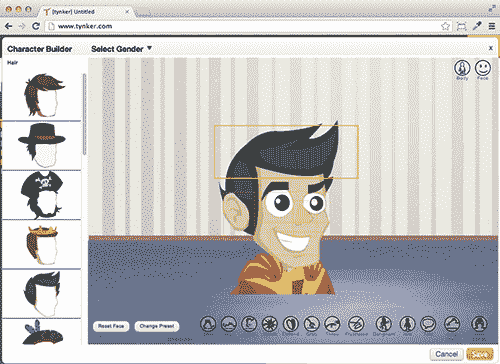
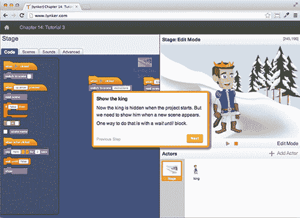

# 有了 Tynker 的新服务，孩子们可以在家学习编程 

> 原文：<https://web.archive.org/web/http://techcrunch.com/2013/08/06/with-tynkers-new-service-kids-can-learn-to-code-at-home/>

总部位于山景城的初创公司 Tynker T1 专注于教授所有年龄段的儿童学习如何编程的基础知识，如今随着今天首次推出的 Tynker for Home T3，该公司正将其服务扩展到学校以外。这个新系统类似于[今年早些时候推出的针对教师和教室的平台](https://web.archive.org/web/20230131002117/https://techcrunch.com/2013/04/11/backed-by-3-5-million-from-nea-500-startups-felicis-others-tynker-launches-its-visual-learn-to-code-platform-for-children/)。Tynker for Schools，正如之前的套件所称，提供基于网络的软件和针对小学生和中学生的课程。新的家庭版是为同样的人群设计的。

同样像学校版一样，Tynker for Home 利用了孩子们对计算机的兴趣，但更具体地说，是游戏、视频和其他更多视觉内容。Tynker 没有试图马上教授编程语言的实际语法，而是通过首先降低体验的复杂性并从一些有趣的事情开始来吸引学生进入开发人员的思维模式——构建一个像公主或僵尸这样的动画角色，然后孩子们可以通过使用各种视觉编程“语言”来教他们走路、移动和执行其他任务。

同样的计划包括动画故事的创作和自定进度的学习，现在可以提供给那些想在家里向孩子介绍编程基础的父母。

这种扩张发生在当今就业市场的关键时刻，失业迫在眉睫，城市陷入绝望，尽管包括信息技术在内的其他行业在 T2 飞速发展。作为一名居住在 Tynker 以外的学校早期测试市场(当然是旧金山湾区)的家长，我被告诫说，学校选择有些重要，但家庭教育才是真正推动孩子成功的因素。我希望那是真的。(这是因为我在学校网站上搜寻任何技术驱动倡议的线索。)

**更新:Tynker 的创始人 Krishna Vedati 指出，学校版现在已经在所有 50 个州都有所存在。这不是上述评论的重点，但以防我的表述不清楚:Tynker 对学校是免费的，但这并不意味着大多数美国孩子都可以使用。细读他提供的大(部分)名单，许多使用 Tynker 的学校似乎是私立的，包括几十所“天主教”和“基督教”学校，例如，或者那些名字暗示了它们的非公立或最少特许性质的学校(181“学院”，“25“预备”等)。).*

有了家里的 Tynker，无论孩子是否在学校接受过任何信息技术教育，父母都可以将自学课程、谜题、教程、测验、任务、视频等带到个人电脑上。该公司还与几本 O'Reilly 编程书籍(包括著名的“失踪手册”系列中的一些)的作者 Dave McFarland 合作，创建了 Tynker 的“编程入门”课程材料。

Tynker 可能并不完美——随着课程的深入，它变得越来越复杂和“古怪”,这可能会失去那些对数学和逻辑没有天生倾向的孩子。尽管你作为父母有着崇高的目标，但你可能仍然不得不强迫(或贿赂——这很酷，对吗？)你的孩子来做这项工作。

廷克不自由。但如果与远离硅谷的私立学校教育、夏令营或专业导师的成本相比，每个学生 50 美元的计划是足够负担得起的，这通常是真正的父母为孩子提供正式编程课程的唯一途径。(另一个反对观点是，科技行业在某种程度上是一个[精英统治](https://web.archive.org/web/20230131002117/http://www.marketplace.org/topics/tech/bart-strike-reveals-tech-transit-worker-divide)，任何人都可以努力工作并取得成功。一些孩子——和父母——不得不更加努力工作，以实现公平竞争。)

话虽如此，Tynker 也面临着一些免费产品，特别是麻省理工学院的[Scratch](https://web.archive.org/web/20230131002117/https://techcrunch.com/2013/05/10/kids-programming-tool-scratch-now-runs-in-the-browser/)(Tynker 与此类似，并支持从其进口)，以及免费和付费的工具、服务、网站、产品，以及更多类似于来自 [Kuato Studios](https://web.archive.org/web/20230131002117/http://www.kuatostudios.com/) 、 [Hopscotch](https://web.archive.org/web/20230131002117/https://itunes.apple.com/us/app/hopscotch-hd/id617098629?mt=8) 、Code.org【plural sight】、 [Light-Bot](https://web.archive.org/web/20230131002117/https://techcrunch.com/2013/06/26/light-bot-teaches-computer-science-with-a-cute-little-robot-and-some-symbol-based-programming/) 、 [UQ 生活](https://web.archive.org/web/20230131002117/https://techcrunch.com/2013/04/30/uq-life/)，甚至还有那个[《我的世界》树莓派](https://web.archive.org/web/20230131002117/https://techcrunch.com/2012/11/27/minecraft-raspberry-pi-edition-to-help-kids-learn-to-code-while-they-build/)的东西

但是，与其说我们选择的教育工具不够多，不如说我们选择的教育工具太多。

2700 多所小学和中学采用了 Tynker for Schools，惠及 23000 名学生。这家商店在这里开门营业。