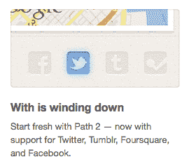

# “再见，同。路径二你好。”Morin 将用户迁移到新应用

> 原文：<https://web.archive.org/web/https://techcrunch.com/2011/12/16/with-winds-down/>

# “再见，同。路径二你好。”Morin 将用户迁移到新应用

根据来自 Path 的推文、电子邮件和[博客帖子，戴夫·莫兰和 Path 的第二个独立应用](https://web.archive.org/web/20230302221111/http://blog.path.com/post/14337734328/with-and-path-hitched)[与](https://web.archive.org/web/20230302221111/http://with.me/)“正在收尾”。邮件解释道，“现在直接从 Path 发推文告诉你和谁在一起”。受鼓励的迁移标志着 Path 的单一功能体验实验的结束。

**更新**:来自 With 的一条[推文](https://web.archive.org/web/20230302221111/http://twitter.com/#!/withme/status/148122008520110080)证实它将在今天的某个时候停止运行。

http://twitter.com/#!/with me/status/148122008520110080

Path 的博客文章称“经过长期友好的共存，两个应用程序合二为一了。这对搭档已经选定了一个名字:路径 2。”在发布 6 个月之后，随着{\\ F8 }的结束,{\\ F9 }再次引发了独立应用与综合应用的争论。公司必须决定他们的应用程序是否应该提供许多功能，但将它们隐藏在菜单中，或者提供对一个功能的快速访问。

Path 最近发布了更全面的 2.0 更新，这使得该应用的用户群增长了 30 倍。Path 2.0 没有强迫用户浪费主屏幕空间并选择他们首先想要做的事情，而是简单地集成了的功能。除了标记你“和谁在一起”，你还可以分享你的睡眠习惯、音乐，以及现在的标准内容，如照片和位置。

莫林的前雇主脸书正朝着相反的方向前进。今年夏天，它发布了基于其收购的 Beluga 的独立 Messenger 应用程序，我们听说它仍在开发 6 月份泄露的独立手机照片应用程序。我认为这是一个滑坡，你得到的不是肿胀，而是骨折的体验。

我喜欢全面的应用程序，让我从一个用例跳到另一个用例，而不必退出到主屏幕，所以我很高兴看到 go。通常情况下，应用程序之间的功能是高度相关的，通过菜单节省一次额外的点击似乎并不能保证下载和更新一个额外的应用程序。《日落时分》还将让 Path 的团队专注于打造一种不同于脸书和 Twitter 的独特体验，在这两个平台上，你可以分享很多东西，但仅限于你最亲密的朋友。
T3