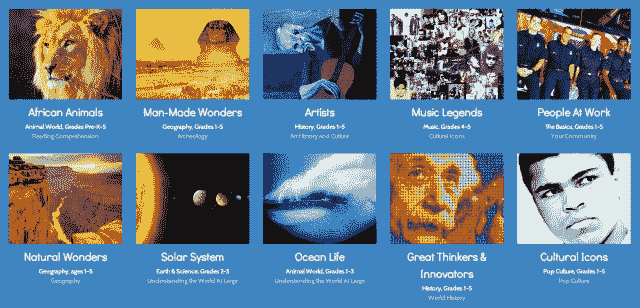

# Wonderville 推出面向儿童的交互式内容库和虚拟教室网络 

> 原文：<https://web.archive.org/web/https://techcrunch.com/2013/04/27/wonderville-launches-an-interactive-content-library-and-virtual-classroom-network-for-kids/>

去年 7 月，一群来自 eToys、易贝、芝麻街、Discovery 和迪士尼的资深高管公布了他们雄心勃勃的计划,为孩子们创建一所升级版的可汗学院。但是，这个名为 [Wonderville](https://web.archive.org/web/20221209035436/http://wonderville.com/) 的学习平台不是一个简单的端口，而是旨在通过聚合来自各种第三方来源的教育内容，扩展可汗的“翻转课堂”方法。

Wonderville 使用 iTunes、亚马逊、YouTube 等网站的电子书、电视节目、视频和移动应用程序，创建了它所谓的“智能画廊”，其中包括数字内容，如测验、应用程序、事实集等，旨在反映孩子们在课堂上学习的内容。内容包括一些有趣的话题(如大脚怪)，以保持孩子们的兴趣，由 Wonderville 的教师团队审查，以确保质量和年龄适当。

经过九个月的开发，Wonderville 正式推出了新的改进试点计划。新的 Wonderville 侧重于幼儿园到五年级(而不是以前侧重于更广泛的范围)，允许家长和教师通过纳入共同的核心内容来改进他们的课程。Wonderville 还扩大了其范围，希望成为一个平台，使教师和教室能够连接、合作和共享媒体，同时提供对学习内容智能画廊的访问。

这家初创公司利用来自 1000 多名教师的输入创建了数百个智能画廊，现在包括超过 10，000 个视频、图像、测验和奖励，并支持 K-5 的通用核心州标准。教师可以从他们的同行提供的 2700 个课程计划中进行构建，就像其他教育技术创业公司一样， [BetterLesson](https://web.archive.org/web/20221209035436/https://beta.techcrunch.com/2012/11/21/betterlesson-receives-3-5m-from-the-bill-melinda-gates-foundation-to-bring-the-magic-of-great-teaching-online/) 、 [LearnZillion](https://web.archive.org/web/20221209035436/https://beta.techcrunch.com/2013/04/15/learnzillion-lands-7m-from-dcm-oreilly-newschools-more-to-help-schools-adopt-the-common-core/) 和 [TeachersPayTeachers](https://web.archive.org/web/20221209035436/https://beta.techcrunch.com/2012/09/30/how-technology-is-empowering-teachers-minting-millionaires-and-improving-education/) ，其中每一个都旨在为教育工作者找到更好的方法来发现、分享和定制共同的核心课程计划。

这些初创公司都在争先恐后地充实自己的课程计划和共享工具库。例如，LearnZillion 拥有 12 万名注册教师，覆盖 150 多万名学生，而 TeachersPayTeachers 向 5000 多名教师发放了 2000 多万美元，用于廉价分享他们的教案。

然而，与其竞争对手相比，其竞争对手更关注 K-12 教师和内容，Wonderville 已将其重点缩小到年轻人群，并可能从这种方式的“专业化”中受益。Wonderville 创始人马克·伊斯特伍德告诉我们，全国 50 多所学校的教师正在参与其试点项目，25 家公司和机构正在为其众包内容模式做出贡献。

不过，这家初创公司也渴望将其价值主张扩展到交互式教育内容图书馆之外，允许教师在其内容基础上创建虚拟教室，与白板、移动设备和个人电脑协同工作。伊斯特伍德说，今天，30%的美国教室使用交互式白板，预计这一数字在未来几年将增长到 65%。

由于最近加入了面向内容开发者的[智能生态系统网络](https://web.archive.org/web/20221209035436/https://smarttech.com/About+SMART/About+SMART/Working+with+SMART/Join+our+ecosystem)，这家初创公司现在每月能够通过在交互式白板上填充 Wonderville 内容来接触 100 多万名教师。

【T2

对教师来说，另一个吸引力是他们可以使用这些虚拟教室为每个学生创建个性化的学习“房间”，或者使用它们来上传课堂图片、视频和消息。反过来，教师可以选择 Wonderville 的一个互动测验或游戏，将其分配给学生带回家，或在课堂上放在白板上，以测试学生对特定主题的掌握程度。家长和教师可以通过该平台跟踪学生的发展，同时让他们参与到从大脚怪和太空探索到流行文化和亚伯拉罕·林肯的各种讨论中。

创始人还告诉我们，Wonderville 坚定不移地决定向教师免费提供其学习平台(以及未来的产品)。他说，基础产品对家庭来说也是免费的，而父母可以参加 Wonderville 的订阅计划，以利用附加功能，并帮助指导他们的孩子沿着他们的学习道路前进。这也是 Wonderville 开始赚钱的地方——如果父母想帮助他们的孩子取得成功，他们必须付费。

如今，Wonderville 有 10 名员工，已经获得私人融资，但是，由于它希望加强其分销合作伙伴关系(特别是通过专注于 iTunes)，这家初创公司将在今年夏天筹集首轮融资。

更多信息，请点击在家中找到 [Wonderville。](https://web.archive.org/web/20221209035436/http://wonderville.com/)