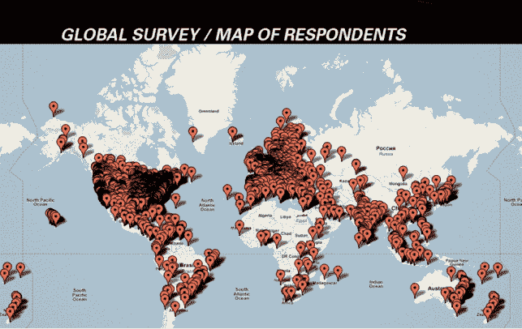

# WordPress 现在为美国 22%的新活跃网站提供支持

> 原文：<https://web.archive.org/web/http://techcrunch.com/2011/08/19/wordpress-now-powers-22-percent-of-new-active-websites-in-the-us/>

# WordPress 现在为美国 22%的新活跃网站提供支持

博客软件 WordPress 今天宣布了一些令人印象深刻的增长数据。WordPress 目前为全球 100 万个顶级网站中的 14.7%提供支持，高于 8.5%。美国每 100 个新活跃域名中有 22 个在运行 WordPress。这些统计数据适用于 WordPress.com 和 WordPress.org 站点。

你也可以看看创始人马特·莫楞威格上周在旧金山[世界夏令营](https://web.archive.org/web/20230225144501/http://2011.sf.wordcamp.org/)上的演讲。7 月，WordPress.com 博客突破了 5000 万大关。当时，WordPress 透露，每个月有 2.87 亿人在 WordPress 博客上点击 25 亿次。

在他的演讲中，Mullenweg 说 WordPress 现在有 15，000 个插件，已经有 2 亿次插件下载。WordPress 3.2 在前两天就有 50 万次下载，代表了博客平台历史上最快的升级速度。

今天，WordPress 还发布了一项用户和开发者调查的结果，该调查得到了来自全球用户的 18000 多份回复。Mullenweg 说，6800 名个体经营者个人负责超过 170000 个网站，每小时收费中位数为 50 美元。

