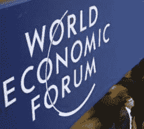

# 世界经济论坛宣布新一批年轻的全球领袖(马克·扎克伯格、查德·赫利、凯文·罗斯等等)

> 原文：<https://web.archive.org/web/https://techcrunch.com/2009/02/25/world-economic-forum-announces-new-batch-of-young-global-leaders-mark-zuckerberg-chad-hurley-kevin-rose-and-more/>

# 世界经济论坛宣布新一批全球年轻领袖(马克·扎克伯格、查德·赫利、凯文·罗斯等)

[世界经济论坛](https://web.archive.org/web/20230122061222/http://www.weforum.org/)刚刚公布了年度全球青年领袖名单，表彰“200 至 300 名来自世界各地的杰出青年领袖，表彰他们的专业成就、对社会的承诺以及为塑造世界未来做出贡献的潜力”。

获奖名单中，除了酷玩乐队的克里斯·马汀和 F1 传奇人物迈克尔·舒马赫等名人，还包括许多来自科技和互联网行业的人，所以下面是一些你可能知道的名字:

[马克·扎克伯格](https://web.archive.org/web/20230122061222/http://www.crunchbase.com/person/mark-zuckerberg)—[创始人兼首席执行官脸书](https://web.archive.org/web/20230122061222/http://www.crunchbase.com/company/facebook)
凯文·罗斯—[Digg](https://web.archive.org/web/20230122061222/http://www.crunchbase.com/company/digg)
[查德·赫利](https://web.archive.org/web/20230122061222/http://www.crunchbase.com/person/chad-hurley)—[YouTube](https://web.archive.org/web/20230122061222/http://www.crunchbase.com/company/youtube)
[乔希·西尔弗曼](https://web.archive.org/web/20230122061222/http://www.crunchbase.com/person/josh-silverman)—[Skype](https://web.archive.org/web/20230122061222/http://www.crunchbase.com/company/skype)
[迈克尔·伯奇](https://web.archive.org/web/20230122061222/http://www.crunchbase.com/person/michael-birch)—[Bebo](https://web.archive.org/web/20230122061222/http://www.crunchbase.com/company/bebo)
创始人兼首席执行官 戴尔 Infosys Technologies
[银行和资本市场副总裁 Habib Haddad](https://web.archive.org/web/20230122061222/http://www.crunchbase.com/person/habib-haddad)—[Yamli](https://web.archive.org/web/20230122061222/http://www.crunchbase.com/company/yamli)
的联合创始人 Josh Spear——underflow 的创始合伙人

完整列表，点击[此处](https://web.archive.org/web/20230122061222/http://www.weforum.org/docs/ygl/YGL_Honorees_2009.pdf) (PDF)。

【http://viewer.docstoc.com/
[世界经济论坛 2009 年全球青年领袖获奖者](https://web.archive.org/web/20230122061222/http://www.docstoc.com/docs/4476535/World-Economic-Forum-Young-Global-Leader-Honorees-2009)——获取更多[商业计划](https://web.archive.org/web/20230122061222/http://www.docstoc.com/documents/business/)

从近 5000 名候选人中挑选出来的 2009 年全球青年领袖是由约旦哈希姆王国拉尼亚·阿卜杜拉女王陛下领导的遴选委员会选出的，该委员会由 31 位杰出的国际媒体领袖组成。

最近公布的活跃 ygl 名单包括谢尔盖布林(Sergey Brin)和拉里佩奇(Larry Page)、托尼法德尔(Tony Fadell)、马克贝尼奥夫(Marc Benioff)、约翰·巴特利(Federated Media)、彼得·泰尔(Clarium Capital)、吉米·多纳尔·威尔士(Wikipedia)、乌代海姆卡(Uday Khemka)、塔里克克里姆(Jolicloud)、菲利普贾斯特斯(Philipp Justus)、莱拉易卜拉欣(Lila Ibrahim)、埃丝特杜弗洛(Esther Duflo)和克里斯汀福布斯(Kristin Forbes)、马云(阿里巴巴)、豪尔赫布兰科(Jorge Blanco)、比尔阮(Bill Nguyen)、泰罗奥詹佩拉(Tero Ojanpera)和雪莉·桑德伯格(脸书)。