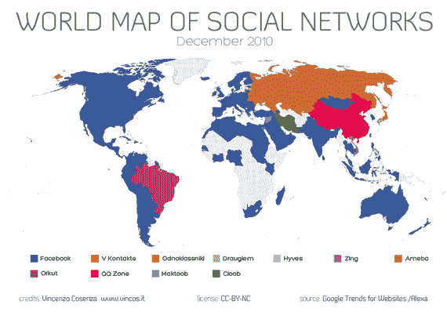
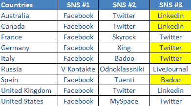
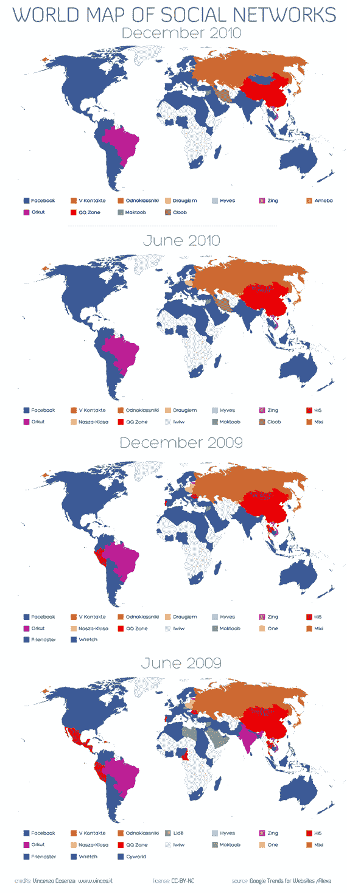

# 社交网络的世界地图显示脸书日益增长的统治地位 TechCrunch

> 原文：<https://web.archive.org/web/http://techcrunch.com/2010/12/10/world-map-of-social-networks-shows-facebooks-ever-increasing-dominance/>

# 社交网络的世界地图显示了脸书日益增长的统治地位

如果你对我们生活在脸书的[时代这个事实有任何怀疑，看看文森佐·科森扎最新版的](https://web.archive.org/web/20230205003656/https://techcrunch.com/2010/04/25/the-age-of-facebook/)[社交网络世界地图](https://web.archive.org/web/20230205003656/http://www.vincos.it/world-map-of-social-networks/)。

根据本月 Alexa & Google 网站流量数据趋势，Cosenza 认为[脸书](https://web.archive.org/web/20230205003656/http://www.crunchbase.com/company/facebook)在过去几个月已经成功超越了一些当地现有的社交网络，尤其是在欧洲。

根据他的分析，该网站现在是 132 个国家中 115 个国家的市场领导者。

其他正在崛起的社交网络: [LinkedIn](https://web.archive.org/web/20230205003656/http://www.crunchbase.com/company/linkedin) 和 [Twitter](https://web.archive.org/web/20230205003656/http://www.crunchbase.com/company/twitter) 。

回到脸书，当你看到从 2009 年 6 月开始，随着时间的推移[这个网站是如何以及在哪里取得长足进步的时候，事情变得更加有趣。](https://web.archive.org/web/20230205003656/https://techcrunch.com/2009/12/21/world-map-social-networks/)

事实上，有什么能阻止脸书的强大势力吗？