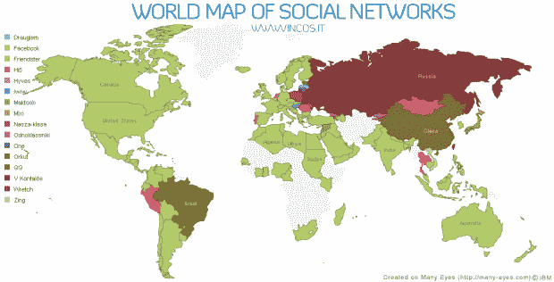

# 社交网络的世界地图显示了脸书的崛起

> 原文：<https://web.archive.org/web/https://techcrunch.com/2009/12/21/world-map-social-networks/>

# 社交网络世界地图显示脸书的崛起

 
(点击查看大图，互动小工具如下)

意大利作家、博主和摄影师 [Vincenzo Cosenza](https://web.archive.org/web/20221208231958/http://www.vincos.it/about-2/) 第二次在地图上展示了[全球最受欢迎的社交网络](https://web.archive.org/web/20221208231958/http://www.vincos.it/world-map-of-social-networks/)，这是基于 Alexa &谷歌网站趋势测量的最新流量数据(2009 年 12 月)得出的。

第一部，我们在 2009 年 6 月[特别报道过](https://web.archive.org/web/20221208231958/http://www.beta.techcrunch.com/2009/06/07/a-map-of-social-network-dominance/)，已经描绘了一幅脸书[从西方手中接管世界的画面，但是第二部更加清晰地展示了它无情的殖民统治。](https://web.archive.org/web/20221208231958/http://facebook.com/)

拥有超过 3 . 5 亿用户的脸书是世界英语地区社交网络无可争议的领导者，并且在拉丁美洲、欧洲和非洲也取得了长足的进步。仅根据 Alexa 的数据，脸书甚至已经接管了印度的 Orkut，而 Orkut 在印度一直是一个雄心勃勃的公司。然而，谷歌的社交网络仍然是巴西访问量最大的。

脸书克隆人已经能够抵抗并阻止脸书成为俄国的领袖。值得注意的是，Vkontakte 主要由[数字天空技术](https://web.archive.org/web/20221208231958/http://www.crunchbase.com/financial-organization/digital-sky-technologies)所有，该公司还拥有在脸书的[大量股份，因此你可以看到它们在未来如何潜在地融合在一起。](https://web.archive.org/web/20221208231958/http://www.beta.techcrunch.com/2009/12/17/dst-facebook/)

脸书也接管了它曾经领先的大部分领土，并且只能阻止社交网络在秘鲁、葡萄牙、罗马尼亚、泰国和蒙古的统治地位。与此同时， [QQ](https://web.archive.org/web/20221208231958/http://www.qq.com/) 在中国仍然领先于所有其他公司，中国的互联网用户数量预计将在 2013 年翻一番，达到惊人的 8.4 亿。

地图上看不到的地方: [MySpace](https://web.archive.org/web/20221208231958/http://myspace.com/) (只在关岛上领先)。