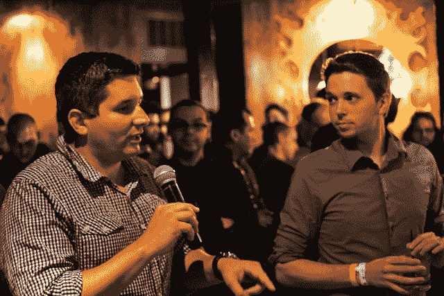
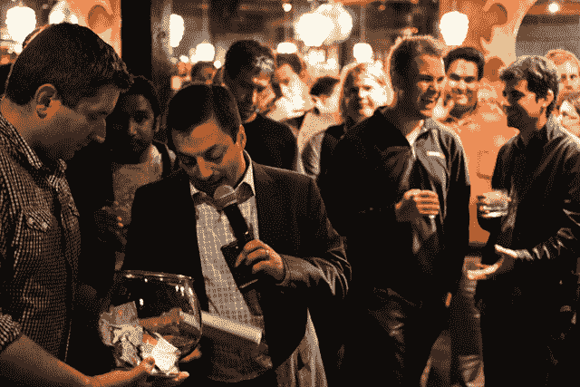
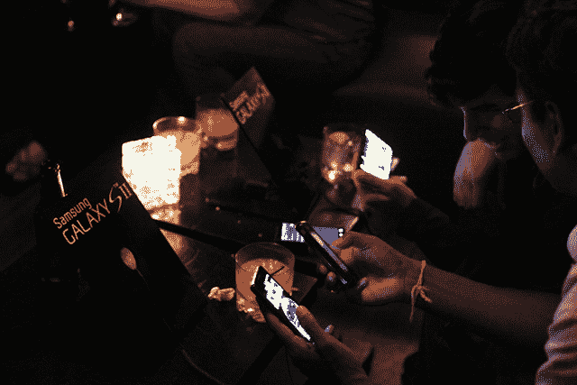
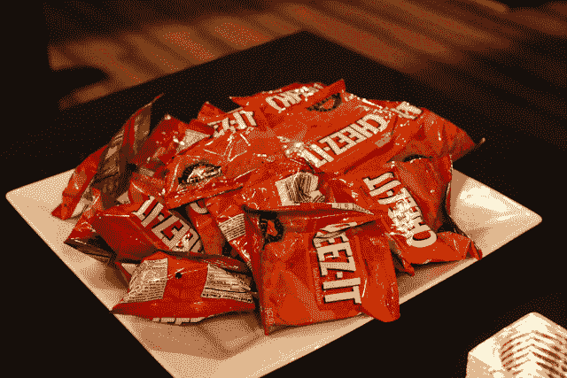

# 总结:来自我们第一次 TC 小工具/移动会议的照片 TechCrunch

> 原文：<https://web.archive.org/web/http://techcrunch.com/2011/09/16/wrap-it-up-photos-from-our-first-tc-gadgetsmobile-meet-up/>

# 总结:来自我们第一次 TC 小工具/移动会议的照片

我们已经有很长一段时间没有正式的小工具/手机见面会了，我很自豪地说，这次由三星赞助的见面会取得了巨大的成功。我们有喝得太多的人，吃得太多奶酪的人(遗憾的是，没有开胃菜，所以我们凑合着吃了[黑客马拉松](https://web.archive.org/web/20230204123902/https://techcrunch.com/search/Hackathon) grub)，还有赢得大奖的人，包括三星 Galaxy S II 手机、三星平板电脑和其他好东西。

我们希望将来有更多这样的事情，你们可以在自己的家乡以自己独特的方式与 TC G/M 的作者见面并打招呼。感谢你让这部电影获得巨大成功，旧金山，我们很快会再见的。

以下是我们拍摄的一些精彩镜头；一收到三星的回复，我们就会用他们自己的照片更新这篇文章。全幅图片可以在 [TechCrunch Flickr 页面](https://web.archive.org/web/20230204123902/http://www.flickr.com/photos/techcrunch/sets/72157627684901438/)找到。

