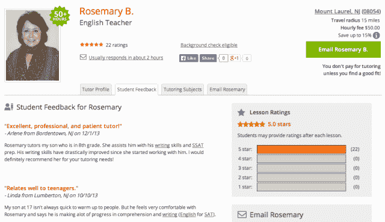

# 在销售额飙升至 1 亿美元以上后，辅导市场 WyzAnt 从 Accel 获得了 2100 万美元，用于全球化和移动化 

> 原文：<https://web.archive.org/web/https://techcrunch.com/2013/12/16/wyzant-lands-21-5m-from-accel-to-take-its-tutoring-marketplace-global-and-mobile/>

为本地服务建立一个在线市场是一件棘手的事情，尤其是在大规模的情况下。随着市场扩展到新的城市，招募稳定的服务提供商、在当地市场提供深度覆盖以及保持服务质量(和客户的信任)都需要时间。然而，对于本地服务提供商来说，转移到网上对企业来说是一件好事，可以降低成本，获得新的客户群。

虽然产品和业务越来越多地转移到网上，但 Mike Weishuhn 和 Andrew Geant 在 2005 年创立了 WyzAnt，将在线市场引入服务提供商仍然主要在线下生活的市场:家教。如今，怀赞特正效仿优步、埃齐和安吉的名单等名字，建立一家全国性公司，作为一个超本地市场，为学生提供一种便捷的方式，找到并联系一系列学科的导师。

从华盛顿特区及其周边的大学校园开始，通过传单和 Craigslist 为其新的辅导服务做广告，WyzAnt 开始建立一个稳定的本地辅导老师和客户群，并慢慢扩展到新的市场。如今，WyzAnt 已悄然成为美国最大的在线辅导平台之一，为 50 万名导师和超过 100 万名学生提供服务。到目前为止，创始人已经将业务发展到超过 1 亿美元的总销售额，自推出以来年增长率为 120%。

在抵制外部投资近八年以保持精简后，WyzAnt 的创始人正在寻求将他们的辅导业务扩展到新的市场并加强他们的团队。为了做到这一点，WyzAnt 正在进行其第一笔资本——来自 Accel Partners 的 2150 万美元 A 轮融资。因此，Accel 合伙人瑞安·斯威尼(Ryan Sweeney)和约翰·洛克(John Locke)将加入这家初创公司的董事会。

虽然看到像这样的首轮融资来自一个支持者有点不寻常，但这是 Accel 有点熟悉的市场，它也支持 Etsy 和 99 Designs 等在线市场。这也标志着该公司今年在在线教育领域的第二次重大投资，此前该公司与视频教育平台 Lynda.com 的 Spectrum Equity 共同投资了 1.03 亿美元。

怀赞特和 Lynda.com 在许多方面有着相似的经历，他们都是自举式的在线企业，多年来，成功地将简单的商业模式有机地转化为数百万的收入。例如，在从 Accel 获得资金之前，Lynda.com 在 17 年里没有接受外部资本，建立了一个庞大的高质量教学内容稳定平台，并利用简单的订阅模式不仅实现了盈利，而且在 2012 年实现了 1 亿美元的年收入。

另一方面，WyzAnt 通过让任何州的学生都能轻松联系到高质量的本地导师，成功地在日益拥挤的市场中生存下来。WyzAnt 没有专注于 sat 或某个特定的科目，而是采取了一种广泛的方法，如 Etsy 或亚马逊，提供超过 240 个科目的辅导，从 K-12 到大学，从备考到算术。

WyzAnt 联合创始人兼首席执行官 Andrew Geant 表示，其服务的关键是提供足够多的导师和足够多的科目，使该平台能够将学生与“正确的”导师联系起来。当现在有如此多的服务可供家长和学生选择时，在辅导中建立信任和忠诚度的最佳方式是保持高质量，并提供比街道上的辅导学校更好的匹配。

像 Yelp 一样，客户可以在 WyzAnt 上搜索当地的导师，根据价格、评级和距离过滤结果。搜索结果包括每位导师的照片和简介，包括对其背景和关注领域的简短简历式描述。简介也很像 Yelp，也包括基于星级的评级和学生反馈，使学生很容易快速了解他们的同龄人在说什么以及他们的优势和劣势。

Geant 说，今天，WyzAnt 已经积累了超过 850，000 条家教评级和评论，尽管与 Yelp 的评论和评级牛栏相比很小，但这使它成为家教行业透明度方面的领先者之一。在大多数情况下，学生是根据(家庭)朋友、指导顾问和学校的建议与导师联系的，但 WyzAnt 的系统让家长和学生在这一问题上有所选择，并有能力对这一过程拥有更多自主权，而不是听天由命。

另一方面，WyzAnt 为家教提供了一种挖掘新客户群的方式，同时将他们的小型家教服务转移到网上，带来更多的收入。像许多其他市场一样，WyzAnt 通过从每笔交易中抽取一部分来创收，抽取的百分比基于浮动比例，取决于导师使用 WyzAnt 的频率。此外，通过提供个人资料、支付处理和一些基本的 CRM 工具，该公司希望成为导师经营业务、推销自己和管理通常繁琐的运营问题(如安排和收取付款)的简单方式。

然而，凭借其新的 2150 万美元，WyzAnt 正在寻求加强其为导师提供的服务，目前正在测试数字工具，这些工具将允许导师与学生在线互动，例如通过视频聊天。从一开始，该公司就专注于现场、一对一和面对面的辅导，但即使其超本地覆盖范围扩大，也不是美国的每个农村前哨都有他们在街区附近寻找的优质导师。

因此，WyzAnt 希望增加对那些没有导师的学生的支持，同时让学生和教师更容易聊天、相互发送消息、共享课程材料和内容等。到目前为止，WyzAnt 还不提供视频支持，但创始人说它正在工作中。同样，虽然该平台可以通过移动网络使用，但该公司尚未提供原生移动应用程序。

有了新的资金，WyzAnt 计划在 2014 年上半年推出第一批本地移动应用，随着营销、业务开发和工程人员的增加，它开始计划向国际市场扩张。在这方面，它走的路与 Lynda.com 相似，后者也开始扩大其全球足迹，这在一定程度上也得到了 Accel 的支持和资金。

未来一年，WyzAnt 计划招聘 50 名新员工，特别是在芝加哥(该公司总部所在地)，并将继续扩大其“资源”部分，为学生提供一系列补充教育内容，如问答论坛、课程计划、视频和博客帖子。

辅导是一个拥挤的市场，随着 WyzAnt 扩大其平台，它将发现自己不仅要与现有的辅导服务竞争，还要与其他在线教育提供商竞争。其中一些人可能是未来的合作伙伴，但许多人不会。

最终，各种市场都会受到网络效应的影响，因此，随着对在线辅导资源需求的增加以及来自 TakeLessons 等垂直服务[的竞争，WyzAnt 发现自己陷入了一场军备竞赛和土地争夺战——这场竞赛已经夺走了不少初创公司(比如 Tutorspree](https://web.archive.org/web/20221207044324/https://beta.techcrunch.com/2013/01/31/music-lessons-marketplace-takelessons-grabs-4m-from-pinterest-exec-softtech-others-to-expand-into-new-verticals/)[，T3)。但是有了 2150 万美元，跑道变得更长了。](https://web.archive.org/web/20221207044324/http://pando.com/2013/09/08/after-difficult-fundraise-yc-alum-tutorspree-shuts-down/)