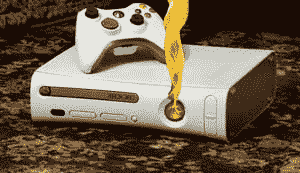

# Xbox 360 引起屋火；你和你的家人安全吗？

> 原文：<https://web.archive.org/web/https://techcrunch.com/2008/04/19/xbox-360-causes-house-fire-are-you-and-your-family-safe/>

# Xbox 360 引起屋火；你和你的家人安全吗？

 我希望你能原谅这个迎合大众的标题。

开一个关于大家都知道 Xbox 360 容易过热的玩笑是很容易的，但这将是笨拙的。相反，只是事实:阿肯色州的一台 Xbox 360 着火了，差点烧毁了一栋房子。更糟糕的是，火灾发生时，主人不在家，也没人在放这首歌。

由于火灾问题，微软确实从最初的 Xbox 上召回了电源线，但这次 Xbox 360 火灾无关。微软今天没有关于 fire 的消息，但是我们希望在周一能听到一些消息。