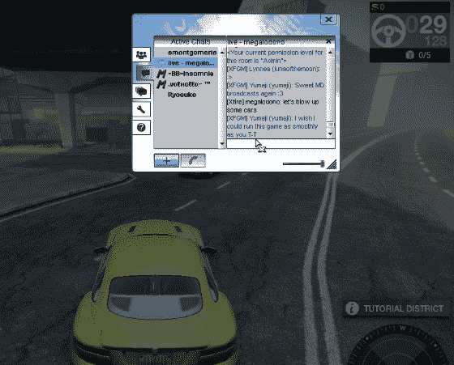

# Xfire 再次单飞，从英特尔投资 TechCrunch 获得 400 万美元

> 原文：<https://web.archive.org/web/https://techcrunch.com/2011/10/06/xfire-to-fly-solo-again-raises-4-million-from-intel-capital/>

# Xfire 再次单飞，从英特尔投资获得 400 万美元

独家-[Xfire](https://web.archive.org/web/20230205001355/http://www.xfire.com/)运营着一个有 1900 万游戏玩家使用的社交服务，已经从英特尔投资和不知名的天使投资者那里筹集了[400 万美元](https://web.archive.org/web/20230205001355/http://www.crunchbase.com/company/xfire)的新资金。

作为注资的结果，Xfire 正在切断与 Titan Gaming 的关系，Titan Gaming 是一年多前从 Viacom 收购了 Xfire 的公司。

Xfire 和 Titan 将从此彼此独立运行。

除了分拆和融资消息，Xfire 还宣布了三位新高管加入其领导团队；泰坦游戏公司的联合创始人[马克·多诺万](https://web.archive.org/web/20230205001355/http://www.linkedin.com/in/markdono)将担任总裁，[贾斯顿·布罗姆尔](https://web.archive.org/web/20230205001355/http://www.linkedin.com/in/justonbrommel)担任 CMO，[秋·拉德克](https://web.archive.org/web/20230205001355/http://www.linkedin.com/pub/autumn-radtke/6/21/183)担任业务发展总监。

Xfire 提供了一个专门针对游戏玩家的社交交流平台，具有群发文本和语音聊天等功能，以及用户生成的内容共享工具，如截图、视频和游戏直播。

新上任的 Xfire 总裁马克·多诺万将这项服务定位为“游戏玩家的脸书与 Skype 的相遇”。很 meta！

无论如何，该公司表示，它支持一个活跃的生态系统，目前包括“数百家游戏发行商合作伙伴”和超过 1，900 万最终用户。

英特尔投资加入了以下早期投资者对 Xfire 的支持:Tomorrow Ventures、Clearstone Venture Partners 负责人 William Quigley 和 Jim Armstrong、PriceGrabber 联合创始人 Kamran Pourzanjani 和 MP3.com 创始人 Michael Robertson。

多诺万告诉我，Xfire 在成立之初就获得了最多一轮 C 轮融资，随后在维亚康姆拥有该公司期间获得了该公司的“数百万美元”投资。他估计，迄今为止，已经向该公司注入了大约 4400 万美元。

