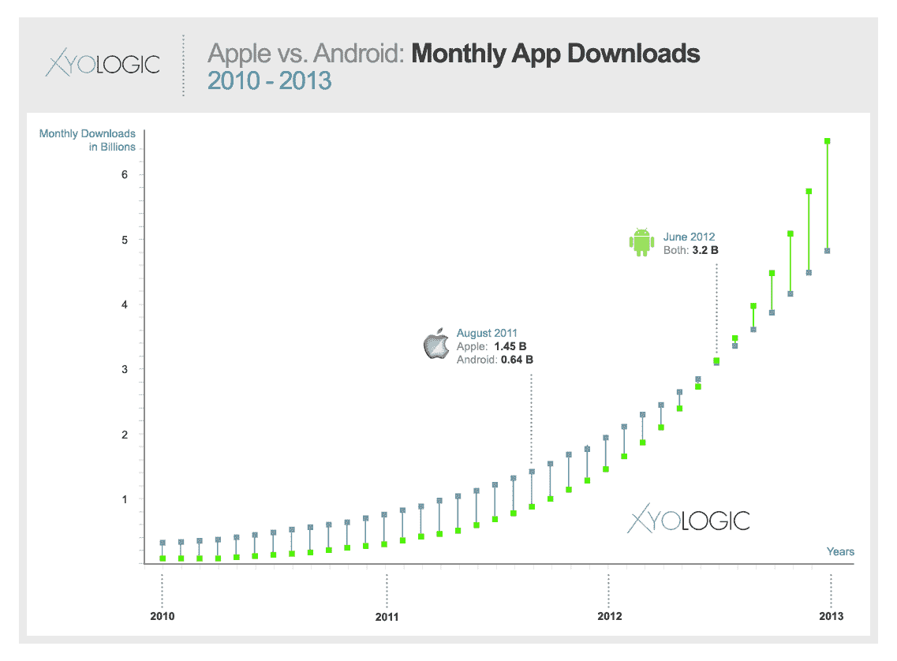
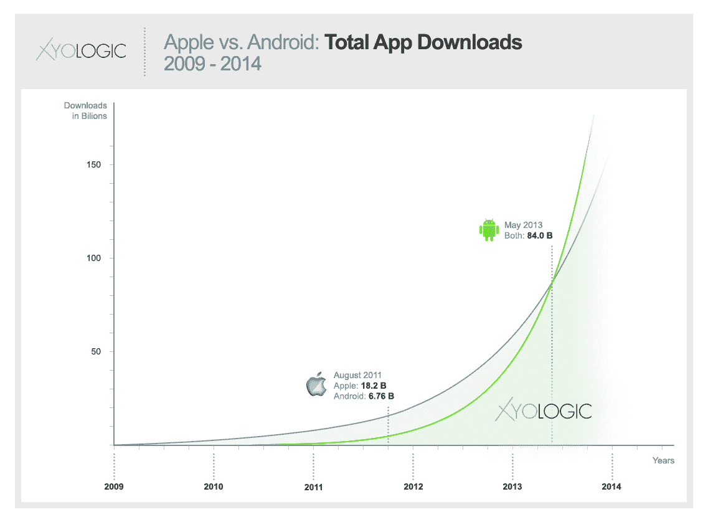
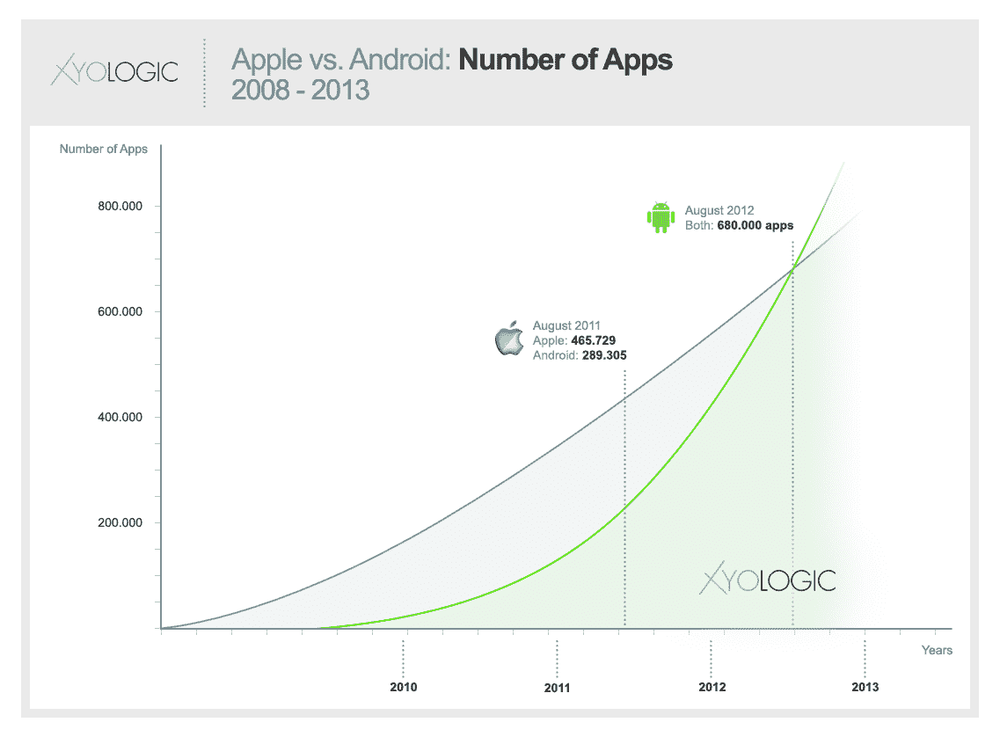

# Xyologic 发布数百份报告，详细介绍全球移动应用趋势 

> 原文：<https://web.archive.org/web/http://techcrunch.com/2011/10/11/xyologic-releases-hundreds-of-reports-detailing-worldwide-mobile-app-trends/>

应用搜索公司 [Xyologic](https://web.archive.org/web/20230203075850/http://xyologic.com/) 今天发布了总共 220 份应用下载报告，详细介绍了全球 29 个国家的 Android、iOS 和 Windows Phone 趋势。这些报告跟踪统计数据，如每个平台/每个国家的下载数量、增长率、国家排名、已发布的付费与免费应用数量、应用收入以及关于应用发布商个人排名的详细信息。

与应用商店排名不同，Xyologic 的报告使用原始下载数量对应用进行排名，而不是使用复杂的算法来提高应用的可发现性。按每月下载量排名也意味着一些最受欢迎的应用程序将在列表中排名靠后，因为他们的大多数安装群已经在手机上安装了该应用程序。例如，这就是为什么脸书在美国 iPhone 免费应用中排名第 18，而游戏制造商 Zynga 排名第 15。

作为这些报告可以帮助发现的一些趋势的例子，Xyologic 提供了一些有趣的信息，如苹果公司在 8 月份的全球应用程序下载量为 14.5 亿，而安卓系统的下载量为 6.4 亿。Xyologic 表示，如果 Android 目前的增长率继续下去，[有望在 2012 年 6 月赶上苹果](https://web.archive.org/web/20230203075850/http://www.xyologic.com/blog/android-vs-apple-on-apps-status-and-outlook/)，届时每个平台的下载量将达到 32 亿次。(见图表)。

在某些国家，Android 的应用程序月下载量已经超过了 iOS，包括捷克共和国、波兰和葡萄牙。然而，这些国家的移动市场尚未完全开发。

Xyologic 还预测，如果目前的趋势继续下去，到 2013 年 5 月，Android 的应用程序总下载量和 2012 年 8 月的应用程序数量将赶上 iOS。(见下图)。

深入研究美国的报告，您可以找到每个平台前 100 名应用发行商的详细信息，包括应用数量(免费和付费)、每月下载量(免费和付费)和估计收入。报告分为多个类别，分别针对热门应用、新应用和应用内购买经济报告。这些软件适用于 29 个国家的每个平台(iPhone、iPad、Android 和 Windows Phone)。

坦率地说，这里有很多的数据需要消化，以至于 Xyologic 声称它希望它的合作伙伴和社区能够发现比它自己更多的东西。这在一定程度上是[公司决定](https://web.archive.org/web/20230203075850/http://www.xyologic.com/blog/xyologic-shares-the-most-in-depth-mobile-app-data-for-free/)免费提供这些应用报告的原因，并将继续每月提供一次。可以，220 举报，4 个平台，每个月，免费。还不错。

如果你在移动行业工作，这个报告宝库绝对值得一看。你可以从[这里](https://web.archive.org/web/20230203075850/http://xyologic.com/app-downloads-reports/08.09.2011)访问它们。