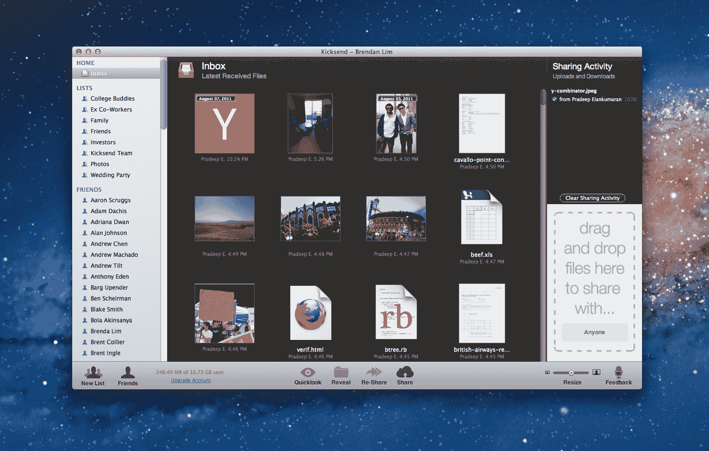

# Y Combinator 支持的 Kicksend 推出测试版，让分享大文件变得轻而易举

> 原文：<https://web.archive.org/web/https://techcrunch.com/2011/08/08/y-combinator-backed-kicksend-launches-in-beta-to-make-sharing-big-files-a-breeze/>

说到文件共享，有很多工具和服务可以帮助你传输大大小小的文件。有一种在电子邮件上屡试不爽的老方法，或者使用像 Skype 这样的 VOIP 服务，或者像 [Dropbox](https://web.archive.org/web/20230131012243/http://www.dropbox.com/) 和[Box.net](https://web.archive.org/web/20230131012243/http://box.net/)这样的云服务，或者基于浏览器的 [Ge.tt](https://web.archive.org/web/20230131012243/http://ge.tt/) ，给像 [WeTransfer](https://web.archive.org/web/20230131012243/https://www.wetransfer.com/) 和 [YouSendIt](https://web.archive.org/web/20230131012243/http://www.yousendit.com/) 这样的老手。然后是新来者，专注于社交和分享的 Minus，[最近获得了 100 万美元的资金](https://web.archive.org/web/20230131012243/https://techcrunch.com/2011/08/02/minus-raises-1-million-from-idg-capital-to-simplify-file-sharing/)和 Sendoid，我们在 3 月份报道过其发布。名单很长，但新的网站不断涌现，因为没有一家企业垄断市场，每种文件共享方法都有其缺点和局限性。

今天，一家名为 [Kicksend](https://web.archive.org/web/20230131012243/http://kicksend.com/) 的初创公司在最近一批 Y Combinator 公司的夏季孵化中推出测试版，旨在让发送和共享大文件变得更加容易，特别是与非技术人员的朋友和家人。有很多文件共享服务，但其中许多使用起来令人困惑，或者有不必要的复杂用户界面，价格昂贵，或者附带太多精美的印刷。即使是 Dropbox，尽管它相对容易使用，也需要一个安装过程——如果你只是想发送几个文件，这可能太复杂了。

电子邮件对于小文件很有用，但是 Gmail 的容量限制在 25 兆字节，比如，你需要去别的地方发送大文件。通过即时消息和 Skype 发送是同步的，这意味着你需要对方在线才能接受转账。因此，Kicksend 试图提供一种更好的方式，让用户自动接收和下载文件，即使他们不在那里按下“接受文件”按钮。

目前，使用 Kicksend 有两种方式:通过网络和桌面应用程序。(手机，拼图中重要的第三块，正在路上，应该很快就能上市。)用户可以注册一个账户，或者用他们的脸书账户登录，查看他们的哪些朋友和家人已经在使用 Kicksend 了。一旦用户登录，他们将遵循一个简单的三步流程来发送文件。只需将文件(任何大小)拖放到 Kicksend 主页的界面/提示中，选择收件人，(收件人只需一个邮箱地址，不必是 Kicksend 用户)，然后，按发送。我认为相当简单。

Kicksend 还让用户可以轻松地创建收件人列表，从而轻松地共享群组文件，并且因为该网站提供了实时功能，用户将在传输开始和完成时看到即时通知(咆哮式)。每个文件也有自己的评论线程，这使得用户可以很容易地进入关于正在发送的特定文件的私人对话。Kicksend 的群组文件共享和列表在概念上与 Google+的圈子类似(当然文件共享除外)。

该网站目前免费提供高达 1GB 的发送带宽，据 Kicksend 的联合创始人帕拉德普·伊兰库马兰和布伦丹·林(Brendan Lim)称，这家初创公司的未来盈利战略包括添加高级功能，用户每月可能会获得 10GB 的容量，以及交付提醒和全套详细的分析。这家初创公司还计划为企业添加一个企业计划，该计划将提供通知、分析以及将某些文件标记为完全“私有”的能力。

到目前为止，仅在口头传播的基础上，Kicksend 已经积累了 15，000 名注册用户，并发送了超过 40，000 份文件。创始人说，在这一点上，照片一直是最受欢迎的共享文件，但随着使用案例的不断多样化，音乐人也一直在使用 Kicksend 传输大型 GarageBand 文件。

Kicksend 的桌面应用程序适用于 Mac 和 Windows，允许用户轻松发送大文件，并自动将文件下载到收件人的电脑上。创始人举了一个例子，有人通过 Kicksend 给你发送了一大批照片，桌面应用程序会自动接收这些文件，并立即在你的硬盘上整理它们——所有这些都通过脸书连接直接链接到你的社交图。

这家初创公司的后端基础设施也针对内容交付进行了优化，因此它可以将任何类型的媒体和数据路由到任何端点；当这家初创公司推出其移动应用程序时，用户将能够在手机上拍照，并立即将图像发送到任何其他设备。

这个网络应用也是无缝的，易于使用，允许用户浏览他或她接收和发送的所有文件。用户界面很简单，而且似乎真的打算让 Kicksend 成为个人日常生活基础设施的一部分，无论是在桌面上还是在网络上。你父母会喜欢的。

Kicksend 目前的投资者包括 Y Combinator、Start Fund、SV Angel 等。

