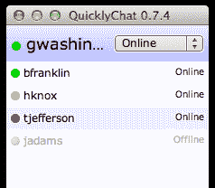

# Y Combinator S12 演示日第 4 批:认识 Vayable、Light Table、viaCycle 和其他

> 原文：<https://web.archive.org/web/https://techcrunch.com/2012/08/21/y-combinator-s12-batch-4/>

我们刚刚结束了 Y Combinator 演示日的第四次会议。这将是我们今天能够涵盖的最后一批创业公司，因为最后一批都是非正式的(即他们还没有启动)。

你可以在这里、[这里](https://web.archive.org/web/20230316161016/https://techcrunch.com/2012/08/21/y-combinator-second-batch/)和[这里](https://web.archive.org/web/20230316161016/https://techcrunch.com/2012/08/21/y-combinator-s12-demo-day-batch-three-getgoing-bigcalc-tracksby-and-more/)阅读我们对前几届会议的报道。

在今天的这个时候，我认为每个人都有点目光呆滞，因为他们已经观看了几十个创业演示，但嘿，仍然有很多好公司，所以我们开始吧:

#### 大学辅导迅速走红

StudyEdge 的创始人承认，推出另一项大学辅导服务听起来并不令人兴奋，但他们表示，他们已经能够建立一个具有脸书式网络效应的平台。该公司创建了包括章节回顾视频、概念视频和练习题在内的内容，然后通过脸书和移动应用交付。学生们还可以互相帮助，用户可以在互动的班级墙上张贴和回答问题——如果你答对了一个问题，你就可以获得因果积分，可以兑换现金或奖品。

该公司表示，目前在三所学校拥有 10，000 名付费用户，今年秋天将扩展到 100 所大学。

#### [统计](https://web.archive.org/web/20230316161016/http://www.statwing.com/):易于使用的数据分析

大多数现有的数据分析工具(特别是 SPSS)是为统计人员设计的。Statwing 开发了一些工具，让营销人员和分析师更容易与数据进行交互，而无需处理晦涩难懂的技术术语。斯塔特温说，这些用户只需要一些核心功能，所以这就是该公司提供的。只需点击几下，用户就可以得到他们想要的图表。这些数据可以用英语会话中的一句话来概括。

[阅读更多关于 Statwing](https://web.archive.org/web/20230316161016/https://techcrunch.com/2012/08/16/how-statwing-makes-it-easier-to-ask-questions-about-data-so-you-dont-have-to-hire-a-statistical-wizard/) 的信息。

#### [Hiptype](https://web.archive.org/web/20230316161016/http://www.hiptype.com/) :谷歌电子书分析

Hiptype 帮助电子书出版商了解他们的读者是谁，以及这些读者如何与他们的内容互动。该公司提供读者的年龄、收入和地理位置等数据，以及一本书从阅读样本到购买、阅读到完成的“漏斗”。还有一个热图显示读者在哪里接触了一本书。

现在，Hiptype 表示，像培生教育、卡普兰和 DK 这样的数百家出版商每月为每本书支付高达 99 美元的费用来使用其分析功能。该公司还计划利用其数据推动书内广告。

[阅读更多关于 Hiptype](https://web.archive.org/web/20230316161016/https://techcrunch.com/2012/07/31/hiptype-launch/) 的内容。

#### 爱情登记处:一个通用的婚礼登记处

RegistryLove 是一个跨多个商店的单一婚礼登记处——毕竟，没有一个商店可能拥有你想要的一切。注册表可以从其他网站导入，也可以通过咨询婚礼礼宾员从头开始创建。该公司从商人或批发商那里进货，并从代销商的收入中赚钱。RegistryLove 表示，自从推出其私人测试版以来，每周用户增长了 42%。

[阅读更多关于 RegistryLove](https://web.archive.org/web/20230316161016/https://techcrunch.com/2012/08/16/yc-backed-wedding-startup-registrylove-lets-couples-register-for-anything/) 的内容。

#### [Virool](https://web.archive.org/web/20230316161016/http://www.virool.com/) :视频广告词

Virool 是一个病毒式视频广告网络，通过在手机、社交网络和博客上做广告来帮助制片人推广他们的内容。该公司的目标是长度超过一分钟的视频，广告商只需在观众观看至少 45 秒时付费。

该公司表示，它正在与 7000 多家广告商合作，包括高露洁这样的大品牌，收入每月都在翻番，7 月份达到 24.6 万美元。

阅读更多关于 Virool 的信息。

#### [循环](https://web.archive.org/web/20230316161016/http://www.circularapp.com/):无限滚动，个性化新闻

Circular 的创始人这样描述这一挑战:“编辑无法规模化，算法无法运作，未来的新闻不会像现在这样。”为了应对这一挑战，该公司根据你关注的人和你感兴趣的话题，提供无限滚动的内容。用户每月已经阅读了 300 万篇故事。

#### [viaCycle](https://web.archive.org/web/20230316161016/http://www.viacycle.com/) :自行车 Zipcar

ViaCycle 希望为自行车共享创建基础设施，类似于 Zipcar 为汽车共享创建的基础设施。该公司已经开发了特殊的硬件，可以通过电话、短信或 viaCycle 移动应用程序来锁定和解锁自行车。(你可以在帖子的顶部看到这些设备。作为开始，viaCycle 正在亚特兰大的乔治亚理工学院进行 40 辆自行车的试验。它还在乔治梅森大学和谷歌的自行车车队推出试点。

阅读更多关于 viaCycle 的信息。

#### [快速点击](https://web.archive.org/web/20230316161016/http://www.quicklychat.com/):协作团队的“一键通”视频

QuicklyChat 希望通过即席视频聊天帮助小型远程团队进行协作。用户安装桌面软件，然后它会跟踪你的活动以及你是否有空说话。它提供红色、黄色或绿色指示灯，向您的同事显示您的在线状态，换句话说，它是 Skype 等 IM 服务中状态显示的自动更新版本。反过来，这应该会让团队成员在需要联系你进行即兴视频聊天时，更容易给你打电话。

这项服务被 200 多家公司使用，这个月聊天的数量每天增长 10%。[阅读更多关于 quick chat](https://web.archive.org/web/20230316161016/https://techcrunch.com/2012/08/13/quicklychat-brings-push-to-talk-video-to-small-remote-teams/)的信息。

#### [Knowmia](https://web.archive.org/web/20230316161016/http://www.knowmia.com/) :众包视频学习

Knowmia 是一个新的教育平台，来自翻转视频的联合创始人。老师们使用这个网站来查找和发布视频课程。该软件管理来自世界各地的视频课程，该公司还计划推出由教师管理的视频“迷你课程”。它目前有来自 900 名教师的 7000 节课。它的流量每周都有 36%的增长。

[阅读更多关于 Knowmia](https://web.archive.org/web/20230316161016/https://techcrunch.com/2012/08/14/knowmia-launch/) 的内容。

#### 比特币基地:你轻松的比特币钱包

比特币基地将自己标榜为“最简单的比特币入门方式”创始人说，问题是纯互联网货币对许多人来说仍然太难使用，而且它主要是基于桌面的。该钱包允许用户用比特币支付和接收付款，只要他们有电子邮件地址，他们也可以从手机上支付。在线商家可以将他们的比特币基地钱包和购物车整合在一起。

#### [Markupwand](https://web.archive.org/web/20230316161016/http://www.markupwand.com/) :将 Photoshop 翻译成代码

Markupwand 希望在试图将设计师的 Photoshop 文件变成现实时，减少所需的时间和金钱。你应该能够上传 Photoshop 文件，并在几分钟内自动接收编写良好的跨平台代码，而不是试图自己编码，或者只是外包工作。创始人说，最终目标是“彻底改变用户界面的制作方式”

[阅读更多关于 Markupwand](https://web.archive.org/web/20230316161016/https://techcrunch.com/2012/08/17/markupwand/) 的信息。

#### [健康实验室](https://web.archive.org/web/20230316161016/http://www.healthylabs.com/):慢性病患者的创业之路

健康实验室希望建立社交网络，慢性病患者可以在这里找到建议和支持。它始于克罗恩病学，一个为克罗恩病和结肠炎患者服务的网站。要加入 Crohnology 和 future Healthy Labs 网络，你需要有一个经过验证的诊断。

Crohnology 首先对 100 名用户进行阿尔法测试，然后允许他们邀请其他人。该网络现在有 1400 多名患者。[阅读更多关于健康实验室的信息](https://web.archive.org/web/20230316161016/https://techcrunch.com/2012/08/20/yc-startup-healthy-labs-wants-to-be-the-go-to-site-for-people-living-with-chronic-illness/)。

#### [Vayable](https://web.archive.org/web/20230316161016/http://www.vayable.com/) :独特旅行体验的市场

Vayable 为旅行者提供了在世界各地购买体验的机会——这有点像体验的 Airbnb。这些体验有多独特？网站上出售的早期作品之一是与一位斐济国王的钓鱼之旅。创始人说，“艺术家、博客作者、国王和市长，甚至田德隆的一个无家可归的人”已经开始在这个网站上建立小企业。而且已经盈利了。

[点击此处了解更多关于 Vayable 的信息。](https://web.archive.org/web/20230316161016/https://techcrunch.com/2011/04/22/vayable-is-a-marketplace-for-unique-travel-experiences/)

#### [品味创造者](https://web.archive.org/web/20230316161016/http://www.tastemaker.com/):让室内设计变得无障碍

Tastemaker 为专业家居设计提供了一个市场。用户可以提交一份“提案请求”,回答关于他们的品味、预算和物流的问题。然后设计师带着创意和固定费用竞标这项工作。你实际得到的是一个时尚设计盒，里面有图纸、油漆样本、平面图和购物清单。

自推出以来的九周内，Tastemaker 表示，用户已经提交了 16 份设计提案，其中 50%的用户已经转化为付费客户——这看起来可能不多，但设计费总计 1 万美元。Tastemaker 也在和一些公司讨论让这项服务成为员工福利。

阅读更多关于 Tastemaker 的信息。

#### [光桌](https://web.archive.org/web/20230316161016/http://www.kickstarter.com/projects/ibdknox/light-table):新的编程环境

Light Table 的创建者克里斯·格兰杰(Chris Granger)表示，开发者目前正在“黑暗中工作，就像戴着眼罩的画家一样。”这就是为什么 Granger 正在构建一个新的软件开发环境，它具有易于访问的文档、即时反馈和受制图表启发的可视化设计等功能。他在 Kickstarter 上从 7000 多名支持者那里筹集了 31.6 万美元，并刚刚推出了光桌游乐场的初始版本[。](https://web.archive.org/web/20230316161016/http://app.kodowa.com/playground)

#### [聪明](https://web.archive.org/web/20230316161016/http://www.getclever.com/):教育数据的 Twilio

Clever 正试图采用 Twilio 的方法来改善教育。它从专有的学校数据库中提取数据，并将其转化为教育应用程序开发人员可以访问的标准 API，如[数学学习平台 DreamBox](https://web.archive.org/web/20230316161016/https://techcrunch.com/2011/12/07/reed-hastings-and-john-doerr-put-11m-in-adaptive-online-math-learning-platform-dreambox/) 。当 Clever 启动时，YC 的保罗·格拉厄姆要求团队在演示日之前进入 40 所学校。事实上，它在第一个月就被 65 所学校采用，现在已经有 1000 所学校安装了。

[阅读更多关于聪明的信息](https://web.archive.org/web/20230316161016/https://techcrunch.com/2012/06/26/clever-launches-twilio-for-ed-data/)。

Josh Constine 和 Kim-Mai Cutler 补充报道。

现在来看看 YC 演示日 TechCrunch 的十大精选，并从其他批次中选出你自己最喜欢的:

*   [首批](https://web.archive.org/web/20230316161016/https://techcrunch.com/2012/08/21/yc-demo-day-s12/) : BufferBox、Kippt、Airbrite、Amicus MicroEval、Vastrm、VoiceGem、9gag、HubChilla、FundersClub、SpinPunch、daily . me、Double Robotics、SmartAsset、Submittable、Plivo Imgfave、Amicus
*   [第二批](https://web.archive.org/web/20230316161016/https://techcrunch.com/2012/08/21/y-combinator-second-batch/) : Flightfox、Mth Sense、Scoutzie、Instacart、Profig、Zapier、Coco Controller、Collections、Keychain Logistics、Parallel Universe、Survata、Sponsorfied、Filepicker.io、Referly、Rentio
*   [第三批](https://web.archive.org/web/20230316161016/https://techcrunch.com/2012/08/21/y-combinator-s12-demo-day-batch-three-getgoing-bigcalc-tracksby-and-more/) : GetGoing、Canopy Labs、Dreamforge、BigCalc、Easel、Kamcord、ReelSurfer、LeanMarket、TomoGuides、DataNitro、Eligible、Grid、HD Trade Services、TapIn、Tracks.by。