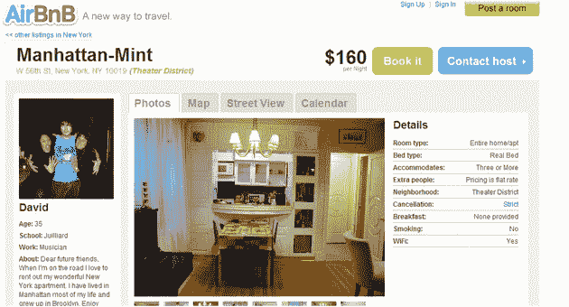

# Y Combinator 的 Airbed And Breakfast 像 AirBnB  一样扩大了房屋租赁的范围

> 原文：<https://web.archive.org/web/https://techcrunch.com/2009/03/04/y-combinators-airbed-and-breakfast-casts-a-wider-net-for-housing-rentals-as-airbnb/>

# Y Combinator 的 Airbed And Breakfast 像 AirBnB 一样提供更广泛的房屋租赁服务

[AirBed and Breakfast](https://web.archive.org/web/20230323052634/http://www.airbnb.com/) ，一个在陌生人的 AirBed 或沙发上租赁空间的在线门户网站，已经重新启动其网站到 [AirBnB](https://web.archive.org/web/20230323052634/http://www.crunchbase.com/company/airbed-breakfast) ，一个类似易贝的所有住宿市场。现在是一家 Y-Combinator 初创公司(该初创公司目前正处于孵化器的冬季阶段)，AirBnB 于去年 8 月以 AirBed 和 Breakfast 的名字[推出](https://web.archive.org/web/20230323052634/https://techcrunch.com/2008/08/11/airbed-and-breakfast-takes-pad-crashing-to-a-whole-new-level/)，它发现用户希望使用该网站不仅仅是在某人的房子里租赁空间，而且正在积极发布公寓、房屋和度假租赁的租赁清单。创始人、旧金山设计师 [Joe Gebbia](https://web.archive.org/web/20230323052634/http://www.crunchbase.com/person/joe-gebbia) 和 [Brian Chesky](https://web.archive.org/web/20230323052634/http://www.crunchbase.com/person/brian-chesky) 以及软件工程师 [Nathan Blecharczyk](https://web.archive.org/web/20230323052634/http://www.crunchbase.com/person/nathan-blecharcyk) 很快意识到增加和多样化的选择对消费者来说更有吸引力，现在正在重新打造他们的网站，以纳入各种当地住宿选择。

切斯基说，开放网站也有金钱上的好处。对于每笔租金，AirBnB 会从旅行者的付款中抽取 7%到 10%的提成(随着住宿租金的上涨，AirBnB 抽取的提成会减少)，还会从卖家的收入中统一抽取 3%的提成。随着房源数量的增加和价格更高的房源数量的增加，AirBnB 的交易数量大幅增加，收入增长了 50 %,并创造了利润。度假租赁可以是一个大生意。最近，[热门度假租赁网站 home away](https://web.archive.org/web/20230323052634/http://www.homeaway.com/)[在一轮风险投资中筹集了 2.5 亿美元](https://web.archive.org/web/20230323052634/https://techcrunch.com/2008/11/10/monster-round-for-homeaway-250-million/)，估值超过 10 亿美元。

该网站仍然允许用户发布充气床垫和沙发清单，这在消费者中仍然很受欢迎。但随着市场的扩大，AirBnB 拥有 2500 个房源和近 1 万名注册用户。虽然 AirBnB 没有计划效仿易贝的拍卖网站模式，但这家初创公司最终会希望直接从企业领域(在这里是酒店和物业管理公司)发布房源，易贝已经能够通过其 marketplace 做到这一点。

既然 AirBnB 正在使其住宿多样化，它也将在租赁领域面临相当多的竞争对手。Vacationrentals.com 和 Free-rental.com[仅是众多可供消费者选择的短租房产列表中心中的几个。但 AirBnB 坚持认为，其以前出租沙发的业务与公寓和度假租赁相结合，价格相对低廉，将使这家初创公司受到欢迎。](https://web.archive.org/web/20230323052634/http://www.crunchbase.com/company/free-rentals)

随着经济衰退对昂贵的旅行计划造成严重破坏，廉价的房屋租赁可能会在消费者中变得更受欢迎。AirBnB 为住酒店提供了相对划算的替代选择。例如，我在市中心看到一套装修精美的一居室公寓，价格为每晚 160 美元。对于整个公寓来说，这是一笔不错的交易。AirBnB 在华盛顿特区和巴黎等城市提供房间和沙发，每晚价格不到 20 美元。

对于正在寻找住宿或度假租赁的读者来说，AirBnB 为从现在起到 3 月 9 日周一预订的任何旅行提供 50 美元的优惠。你所要做的就是在预订时输入“TECHCRUNCH”。

