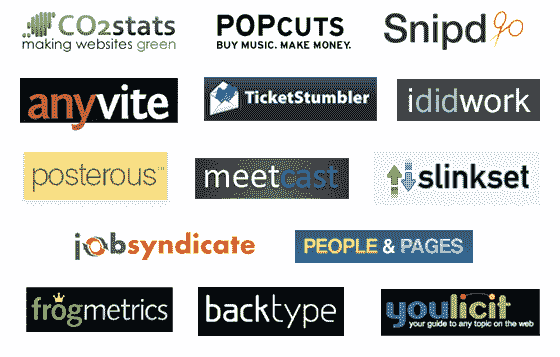

# y Combinator 2008 年夏季演示日 

> 原文：<https://web.archive.org/web/https://techcrunch.com/2008/08/14/y-combinators-demo-day-summer-2008/>

# y Combinator 2008 年夏季演示日

今天下午，来自 Y Combinator 暑期班的 21 家创业公司在波士顿向投资者展示他们的想法和创造。下面是我们没有提到的九家初创公司的描述，它们不想再继续保持隐形模式。请看我们之前对 [Posterous](https://web.archive.org/web/20221006204133/http://www.beta.techcrunch.com/2008/06/28/posterous-beats-tumblr-in-simplicity/) 、 [Anyvite](https://web.archive.org/web/20221006204133/http://www.beta.techcrunch.com/2008/07/01/y-combinators-anyvite-takes-on-evite-keeps-it-simple/) 、 [ididwork](https://web.archive.org/web/20221006204133/http://www.beta.techcrunch.com/2008/08/06/keep-your-boss-informed-with-ididwork/) 、 [Popcuts](https://web.archive.org/web/20221006204133/http://www.beta.techcrunch.com/2008/08/06/y-combinators-popcuts-pays-you-to-find-good-new-music/) 和 [Slinkset](https://web.archive.org/web/20221006204133/http://www.beta.techcrunch.com/2008/07/14/y-combinators-slinkset-launches-hosted-reddits-for-the-masses/) 的报道——它们都是这一批的一部分，并且已经推出。

**ticket stumbler**

[TicketStumbler](https://web.archive.org/web/20221006204133/http://ticketstumbler.com/) 可以描述为体育门票的[皮划艇](https://web.archive.org/web/20221006204133/http://www.kayak.com/)。它聚集了像 StubHub 和 T21 razor gator 这样的网站的门票，使它们可以通过关键字搜索，并允许通过最高价格、可获得的数量、提供商等过滤结果。这个网站是实时的，快速的，并且因为没有拼写“stumbler”而没有“e”而得到额外的分数。

**人物和版面**

虽然尚未推出， [People and Pages](https://web.archive.org/web/20221006204133/http://www.peopleandpages.com/) 的创始人将他们的服务描述为“一个更好的谷歌群体”，尽管截图显示它也是所见即所得网站创建工具的一部分，使其与[谷歌网站](https://web.archive.org/web/20221006204133/http://sites.google.com/)、 [Weebly](https://web.archive.org/web/20221006204133/http://www.weebly.com/) (也是 Y Combinator 的初创公司)和其他网站竞争。群组组织者可以使用人员和页面来管理电子邮件列表，并在一个位置发布到 web。

**MeetCast**

MeetCast 是 WebEx 和 GoToMeeting 的竞争对手(是的，是另一家)，它以易用性(无需下载)和回放(所有会议都被保存和索引以供以后查看)为卖点。创始人将其简单性与 [Tokbox](https://web.archive.org/web/20221006204133/http://www.tokbox.com/) 相提并论。

**二氧化碳状态**

对于固定的月费， [CO2Stats](https://web.archive.org/web/20221006204133/http://www.co2stats.com/) 将测量网站的整体用电量，然后自动为它们购买可再生能源证书，以抵消它们的有效排放量。CO2Stats 由哈佛大学和耶鲁大学的学者创建，已经在超过 25 个国家注册了 2500 多个网站，实现了盈利。请看今天早些时候的[我们的评论](https://web.archive.org/web/20221006204133/http://www.beta.techcrunch.com/2008/08/14/co2stats-compensates-for-your-sites-pollution/)。

 **[you lict](https://web.archive.org/web/20221006204133/http://www.youlicit.com/)是一项为重新启动做准备的服务，它将通过搜索用户生成的内容并根据算法将其编译成主题，而不是依赖人工编辑，来生成类似 [Mahalo](https://web.archive.org/web/20221006204133/http://www.mahalo.com/) 的搜索指南。这些搜索指南本身旨在在更传统的搜索引擎(如谷歌)的结果中显示得更高。

**约伯炼金术士**

Job Alchemist 是两家在线服务公司的母公司: [Startuply](https://web.archive.org/web/20221006204133/http://www.startuply.com/) ，这是一家我们上个月报道过的针对科技初创公司的求职网站[，以及一家名为](https://web.archive.org/web/20221006204133/http://www.beta.techcrunch.com/2008/07/20/startup-job-site-gets-backing-from-y-combinator-relauches-as-startuply/) [JobSyndicate](https://web.archive.org/web/20221006204133/http://www.jobsyndicate.com/) 的新的求职联盟网络，该网络于今天推出。出版商可以将 JobSyndicate 的小工具放在他们的网站上，当访问者点击并被雇佣时，他们可以获得雇主所设定的奖金的一半。

**蛙人**

Frogmetrics 并不是一家纯粹的网络公司:该公司希望在餐馆、商店和其他实体设施中放置触摸屏，用于当场收集客户反馈。这些设备会在销售点询问客户一些关于他们体验的问题，并可以收集客户的联系信息以产生销售线索。对跨物理位置收集的信息进行汇总和分析，以了解趋势和其他统计信息。

**Snipd**

Snipd 似乎是另一种网络注释服务，它允许用户“剪切”页面内容，如图像、视频和文本，与他人分享并保存以备后用。这些截图还被用来生成所谓的页面热图，帮助用户找到页面上的最佳内容。这项服务尚未推出。

**回型**

BackType 是一个评论搜索引擎，它在互联网上搜索博客，并索引用户生成的内容，而不考虑平台(WordPress、mobile Type 等)。这些评论不仅可以用关键词搜索，还可以被作者跟踪，让你跟踪你的朋友在网上说了什么。**