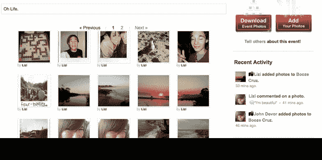

# Y Combinator 的 Divvyshot 推出死亡简单合影分享

> 原文：<https://web.archive.org/web/https://techcrunch.com/2009/03/04/y-combinators-divvyshot-launches-dead-simple-group-photo-sharing/>

# Y Combinator 的 Divvyshot 推出 Dead Simple 集体照分享

Divvyshot 是一家新的 [Y Combinator](https://web.archive.org/web/20230404120448/http://www.ycombinator.com/) 公司，它让群体间分享照片变得非常容易，刚刚在 private alpha 上推出。该网站允许用户群体通过在线画廊和使用将在未来几周内推出的原生客户端合作分享全分辨率照片。目前有 700 个可用的邀请，您可以在这里获取[。](https://web.archive.org/web/20230404120448/http://divvyshot.com/)

Divvyshot 相册可以由多个用户编辑，可以设置为私人(只允许指定的朋友上传照片)或公共(允许任何人上传照片到相册)。所有照片都以相当高的分辨率呈现在网站上，也可以以原始质量下载(您也可以一次下载整个相册。zip 文件)。

一旦该网站的原生客户端发布(它们将适用于 Mac 和 Windows)，用户将能够简单地将他们的照片拖到他们桌面上的指定文件夹中，这些照片将自动上传到在线群组相册和其他每个群组成员的原生客户端。

创始人山姆·奥迪奥说他还没有决定盈利计划，解释说他已经考虑走 SmugMug 路线，对带宽/存储收费。但他也在考虑通过吸引特定的目标人群，然后向他们出售高度相关的定制商品来创造收入。例如，他认为 Divvyshot 可能会吸引女生联谊会的女生，她们可能渴望在密友之间分享照片，但不会在脸书这样的社交网络上分享。Divvyshot 可以通过销售个性化的商品(可能印有女生联谊会的标志)来利用这一人口统计数据。

Divvyshot 看起来不错，似乎工作得很好，但它将不会缺乏竞争。已经有相当多的照片分享网站允许团队协作，像苹果的 MobileMe 这样的服务允许通过桌面客户端分享照片(你甚至可以使用类似 [Dropbox](https://web.archive.org/web/20230404120448/http://www.getdropbox.com/) 的东西)。也就是说，如果它能通过提供更直观(或更便宜)的服务有效地让自己脱颖而出，它也许能开拓出一片天地。

【http://vimeo.com/moogaloop.swf?clip_id=2044353】&server = Vimeo . com&show _ title = 1&show _ byline = 1&show _ portrait = 0&color =&full screen = 1
divvyshot 偷拍高峰 from[Sam O](https://web.archive.org/web/20230404120448/http://vimeo.com/user864471)on[Vimeo](https://web.archive.org/web/20230404120448/http://vimeo.com/)。