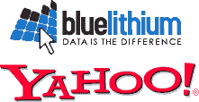

# 雅虎！收购广告网络 blue lithium 

> 原文：<https://web.archive.org/web/https://techcrunch.com/2007/09/04/yahoo-acquires-ad-network-bluelithium/>

# 雅虎！收购广告网络 BlueLithium

托德·特雷西[在 Yodel 轶事上宣布](https://web.archive.org/web/20230207132627/http://yodel.yahoo.com/2007/09/04/yahoo-to-acquire-bluelithium/)雅虎！将以约 3 亿美元现金收购在线全球广告网络 BlueLithium。

根据公告，BlueLithium 是美国第五大广告网络，英国第二大广告网络，每月有 1.45 亿独立访客。

Teresi 认为收购这家拥有 100 多名员工的公司对雅虎的发展至关重要。"世界领先的在线展示广告网络之一."显然，雅虎！相信 BlueLithium 的数据分析和行为定位工具将帮助他们实现这一目标。

雅虎！谷歌收购 DoubleClick 不到 5 个月，微软收购 aQuantive 不到 4 个月，尽管金额更大(分别为 31 亿美元和 60 亿美元)。

BlueLithium 成立于 2004 年，并被 AlwaysOn 评为 2006 年度创新者。详情可在雅虎！s 官方[新闻稿](https://web.archive.org/web/20230207132627/http://yhoo.client.shareholder.com/press/releasedetail.cfm?ReleaseID=262635)。