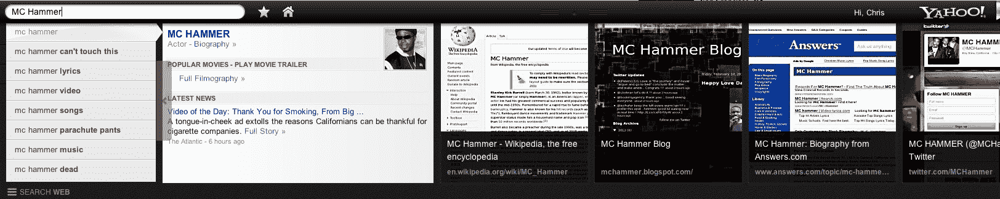
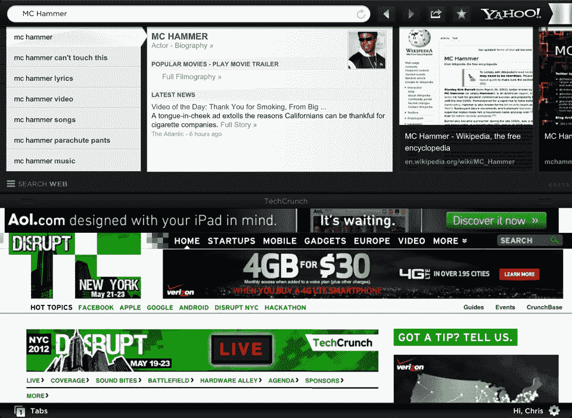

# 雅虎推出 Axis，这是他们新的(令人印象深刻的)桌面和移动搜索体验 

> 原文：<https://web.archive.org/web/https://techcrunch.com/2012/05/23/yahoo-axis-search-browser/>

去年年底，雅虎申请了短语“雅虎轴心”的商标在当时，这份文件提出的问题比答案更多，但六个月后，雅虎终于说出了众所周知的秘密——Axis 既是一款新的面向搜索的网络浏览器插件，也是一款新的 iOS 浏览器应用。

在我谈论实际使用 Axis 是什么感觉之前，让我们首先讨论一下他们为什么要这样做。TechCrunch 采访了雅虎的产品管理总监 Ethan Batraski，他告诉我们他的工作是找出搜索在未来几年的发展趋势。雅虎轴心是他的答案之一。

“没有人在‘如何彻底摆脱搜索结果页面’上有所创新”，Batraski 说。“这就是我们想要做的。”

【T2

这正是他们所做的。一旦您下载、安装并使用您的雅虎凭证登录 Axis(您*有雅虎凭证，不是吗？)，一个小的回条会开始活在你首选的网页浏览器的左下角。目前 Axis 接入了 Chrome、Firefox、Safari 和 Internet Explorer，尽管 Batraski 并没有完全排除雅虎最终发布自己的浏览器的可能性，只要有足够的兴趣。*

这个小黑药丸里面有一个搜索栏，鼠标悬停在上面会使它延伸到浏览器窗口的底部。实际上，点击搜索框，输入一个搜索查询，搜索栏就会扩大到大约占浏览器窗口底部的三分之一，显示雅虎搜索结果的缩略图，很容易浏览。

雅虎的想法是让他们的(或者更准确地说，微软的)搜索引擎在传统浏览器范式之外拥有自己的灵活空间。安装了安讯士后，需要在线查找信息的用户无需离开当前正在查看的页面，导航到不同的页面或打开新标签即可。毫无疑问，这需要一点时间来适应——作为一个 Chrome 的长期用户，在地址栏中输入搜索查询打开一个新标签已经成为第二天性——但这是经过深思熟虑的。

当 Axis 工作时(大部分时间),它工作得非常好。有时，黑色搜索框将无法正确关闭，在其位置留下上一个搜索结果缩略图的部分残余。

也许 Axis 最令人讨厌的事情之一(至少在 Mac 上)是水平滚动搜索结果的缩略图。用户可以用鼠标或点击安装在结果面板左侧或右侧的按钮来点击和拖动它们，但用触控板左右滚动可能会很棘手。它会导致结果一次移动三个结果，这有时意味着您会错过一些结果。这是一个相对次要的争论点(也是一个可能很容易解决的问题)，但是，你仍然有它。

但是桌面上的 Axis 只是等式的一部分——它的另一半在你的 iPhone(或 iPad)上。雅虎还为 iOS 打造了一款独立的浏览器应用，旨在将同样经过改进的搜索体验带到移动领域。

这就是雅虎让我有点神魂颠倒的地方。iOS 应用程序出奇的好——它非常漂亮，运行非常流畅(这主要归功于它的 WebKit 基础),一旦你确定你登录了，你的书签可以在设备之间快速同步。我也承认我对他们的字体选择有点着迷，但是我们不要纠缠于此。

如果有的话，搜索结果的大缩略图在小屏幕上播放得更好。没有钓鱼，以确保你的手指触摸链接恰到好处。也就是说，我不确定它会取代我的股票浏览器应用程序 Axis for the desktop 的伟大之处在于，它适合您决定使用的任何浏览器。不过在 iOS 上，没有办法设置默认浏览器，所以在那里使用 Axis 需要认真努力。

目前，安讯士浏览器应用仍然是 iOS 独占的。总有一天，我们会看到一个版本进入 Android 系统，这并不是完全不可能的，尽管我想谷歌可能不会对另一家试图涉足他们领域的搜索公司太友好。

巴特拉斯基将 Axis 称为一个“实验”，但令我非常高兴的是，这是一个非常好的实验。这足以让一个彻头彻尾的谷歌人皈依吗？可能不会，但有近 7 亿用户仍在使用雅虎，我估计有相当一部分人会在这里找到乐子。