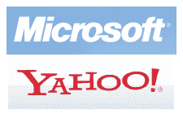

# 雅虎董事会决定公司命运

> 原文：<https://web.archive.org/web/https://techcrunch.com/2008/02/08/yahoo-board-to-determine-fate-of-company-today/>

有消息人士向我们透露，雅虎已经计划在周五召开董事会特别会议，以决定公司的命运。经过一周的紧张谈判，很明显，没有人会对微软上周五提出的每股 31 美元的报价提出竞争性收购。软银，竞标的最后一个真正机会，[今天退出](https://web.archive.org/web/20230220165109/http://www.ft.com/cms/s/0/fffc1006-d5e8-11dc-bbb2-0000779fd2ac.html)，并表示他们不会挑战微软的报价。

只剩下两个选择。原则上接受这个提议，试着在完全没有谈判筹码的情况下提高价格，或者与谷歌达成协议，外包搜索广告，很可能还有搜索本身。

我们听说，董事会基本上是被外部顾问告知接受微软的交易。但我们也听说，雅虎的一批高级管理人员愿意做任何事情来阻止微软的收购，他们正在推动谷歌的交易，并将在会议上陈述他们的情况。

根据我们本周与内部人士和分析师的讨论，很明显，至少可以说，从长远来看，与谷歌的交易对雅虎来说不是一个好的选择。但是花旗集团的马克·马哈尼认为这有 25%的可能性会发生，主要是基于雅虎不惜一切代价保持独立的情绪反应。

**谷歌交易——短期独立/长期噩梦**

如果雅虎将搜索外包给谷歌，雅虎的现金流将立即增加 25%左右，表现为收入增加(每个搜索查询的收入可能从今天的 4 美分跃升至 9 美分)，运营(服务器)和裁员成本节约。我们采访过的一些专家说，这可能会增加约 70 亿美元的即时估值，或每股约 5 美元(不到微软溢价的一半)。

不过，将近三分之一的雅虎员工将被扫地出门。据估计，雅虎在搜索、搜索广告平台以及广告销售和运营领域各有 1500 名左右的员工。所有这些员工都可能被解雇，除非雅虎选择保留其核心算法搜索产品。然而，专家说，好的搜索和广告平台是携手并进的。没有来自搜索广告业务的数据，搜索本身就举步维艰。因此，雅虎很可能会把所有这些工作都交给谷歌，而把所有的搜索和搜索营销外包给谷歌。雅虎今天有 13，000 多名员工(考虑到最近宣布的裁员)，所以每三个人中就有一个会离开。

不过，每个搜索查询 9 美分的收入估计是基于谷歌目前的收入。雅虎可能会为自己争取大部分时间来达成交易。但是，到了续约的时候，雅虎将会失去所有的优势，因为除了谷歌之外，没有其他人可以合作。续约交易就不会这么甜蜜了。

如果他们外包给谷歌，雅虎的搜索量也可能会逐渐下降(就像美国在线的情况一样，T2 在 2002 年将 T3 转移到谷歌搜索，市场份额从 30%下降到不到 5%)。预计随着时间的推移，雅虎也会遭受同样的打击。

雅虎和谷歌之间达成的任何交易都很有可能被美国监管机构拒绝。然而，与此同时，所有最优秀的雅虎搜索员工都将离开公司，去从事更稳定的工作。如果交易被否决，雅虎会发现自己陷入了一场噩梦，失去了数十或数百名最优秀的员工，也没有了谷歌的收入。当然，他们是独立的，但他们的股价可能只是微软出价前一天看到的 19 美元的一小部分。

相当肯定的是，雅虎将继续利用与谷歌交易的威胁，试图将微软的出价每股提高几美元。但是这种威胁并不真实(或者至少，*不应该是*)，双方都知道这一点。

为微软/雅虎做好准备。它正在发生。