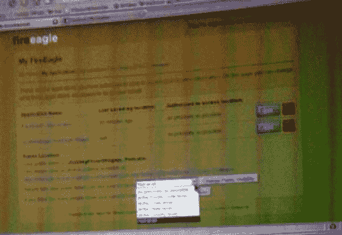
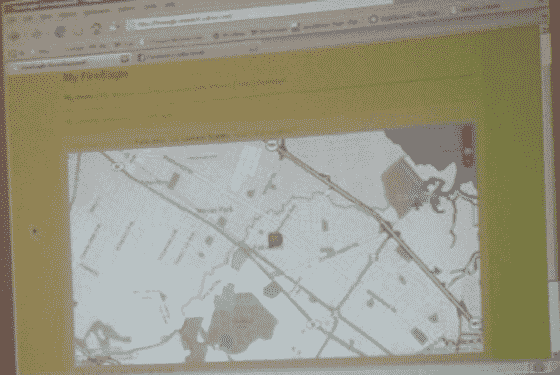

# 雅虎火鹰——地理信息的平台服务

> 原文：<https://web.archive.org/web/https://techcrunch.com/2007/11/04/yahoo-fireeagle-a-platform-service-for-geo-information/>

  雅虎不仅仅是在今晚宣布 [Kickstart](https://web.archive.org/web/20230213025115/https://techcrunch.com/2007/11/04/yahoo-launches-kickstart-a-new-social-network-around-college-students-and-alumni/) 。Salim Ismail 的 [Brickhouse](https://web.archive.org/web/20230213025115/https://techcrunch.com/2007/03/14/salim-ismail-to-head-yahoo-brickhouse/) 今晚宣布了一项非常有用的新平台服务，暂定名为 [FireEagle](https://web.archive.org/web/20230213025115/http://fireeagle.research.yahoo.com/) ，目前正在进行封闭式 alpha 测试。该团队现在正在研究发布名称和最终发布日期——预计将于本月晚些时候开放。

FireEagle 完全基于 Ruby on Rails 构建，最初灵感来自雅虎的 [ZoneTag](https://web.archive.org/web/20230213025115/http://zonetag.research.yahoo.com/) 研究产品。它是一个控制人们位置信息的平台。告诉它(直接或通过构建在 FireEagle API 上的第三方应用程序)您的位置(给出具体的 lat/long，或城市名称，或邮政编码等)。)并且它会记录您的位置。或者，拥有全球定位系统手机(或其他全球定位系统设备)的用户可以将其设置为定期用地理信息更新 FireEagle。

当然，用户可以在任何时候关闭跟踪，也可以进入并删除任何或所有存储的关于他们自己的地理数据。雅虎表示，它将立即从他们的服务器上删除。

然后，其他应用程序可以在您的允许下获取这些数据，并将其直接构建到他们的服务中。

这对于 Flickr 这样的服务来说是完美的，因为 Flickr 仍然很难让用户在照片中添加后期/长信息(使用 FireEagle，Flickr 只需要查看照片上的时间戳，并记录下您当时在 FireEagle 上的位置)。FireEagle 还可以通过与 Plazes 等已有地方博客服务[合作，通过提供和接收用户的地理信息而受益。](https://web.archive.org/web/20230213025115/https://techcrunch.com/2007/05/18/plazes-regroups-learns-from-twitter/)

该服务将有用于添加和获取信息的开放 API。伊斯梅尔说，在过去的几个月里，他们一直与大约 50 名第三方开发者秘密合作，其中许多人将在正式发布日准备好使用 FireEagle 的应用程序。

上周在 Brickhouse 的一次产品演示中，我可以用手机拍几张照片。这个决议不是很好(事实上很糟糕)，但是你可以感觉到这个平台会是什么样子。下面，我还包括了一张脸书申请的照片。

我想我可以有把握地说，有很多开发人员会对 FireEagle 感到非常兴奋。

