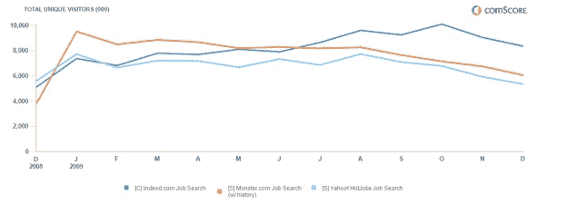

# Monster 以 2.25 亿美元从雅虎收购 HotJobs

> 原文：<https://web.archive.org/web/https://techcrunch.com/2010/02/03/yahoo-hotjobs-monster-225-million/>

# Monster 以 2.25 亿美元从雅虎收购 HotJobs

 雅虎(YHOO)已经[试图卸载 HotJobs](https://web.archive.org/web/20230305215150/http://www.pehub.com/login.php?p=/45262/yahoo-trying-to-sell-hotjobs-yahoo-small-business/) 有一段时间了，它终于与[怪兽](https://web.archive.org/web/20230305215150/http://www.crunchbase.com/company/monster) (MWW)达成交易，将以 2.25 亿美元现金从雅虎手中接管该网站。作为交易的一部分，Monster 将在三年内继续为雅虎的工作列表提供动力。

Hotjobs 和 Monster 都落后于更新的求职网站，比如 Indeed，它在整个网络上搜索工作列表。根据 comScore 的数据，2009 年 12 月，Indeed 的 jog 搜索在美国达到了 840 万人，相比之下，HotJobs 只有 540 万人，Monster 只有 610 万人。也许通过收购，Monster 可以再次坐上头把交椅，尽管这些数字有很多重叠。

对雅虎来说，它摆脱了下滑的资产，提高了现金状况，可以专注于增长领域。雅虎一直在出售或关闭非核心资产，包括最近[以 3.5 亿美元将 Zimbra 出售给 VMWare](https://web.archive.org/web/20230305215150/https://techcrunch.com/2010/01/12/yahoo-sheds-zimbra-vmware-gains-a-foundation-for-web-apps/) ，[关闭其购物 API](https://web.archive.org/web/20230305215150/https://techcrunch.com/2010/01/11/yahoo-shopping-api-deadpool/) ，当然还有[与微软](https://web.archive.org/web/20230305215150/https://techcrunch.com/2009/07/29/microsoft-yahoo-search-deal-the-most-important-facts-and-some-opinion/)达成期待已久的协议，将搜索业务移交给必应。

Monster 最近推出了跨不同产品的 6Sense 语义搜索技术，包括简历和候选人搜索。6Sense 旨在通过使用语义分析和理解相同工作或工作要求的不同描述方式，即使没有精确的关键字匹配，也能提供更相关的结果。怪物需要所有能得到的帮助。今天它宣布第四季度收入为 2 . 13 亿美元，下降了 27 %,净亏损 210 万美元。这一年的收入下降了 32 %,至 9 . 05 亿美元。全年净收入为 1900 万美元，而 2008 年为 1.25 亿美元。