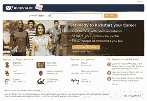

# 雅虎推出 Kickstart，一个围绕大学生和校友的新社交网络

> 原文：<https://web.archive.org/web/https://techcrunch.com/2007/11/04/yahoo-launches-kickstart-a-new-social-network-around-college-students-and-alumni/>

# 雅虎推出 Kickstart，一个围绕大学生和校友的新社交网络

 由[斯科特·盖兹](https://web.archive.org/web/20230320232539/http://www.scottgatz.com/)领导的雅虎高级产品团队，今晚将推出一项名为 [Kickstart](https://web.archive.org/web/20230320232539/http://kickstart.yahoo.com/) 的新服务。

虽然人们会立即将其与脸书进行类比，但这项服务实际上更像 LinkedIn，因为它将特定学院和大学的学生和校友联系起来，并帮助他们在职业层面上建立联系。校友可以帮助学生找到工作(或者可以找到好学生来填补他们工作的任何公司的空缺)，学生可以联系其他人来帮助启动他们的职业生涯。 [Doostang](https://web.archive.org/web/20230320232539/http://doostang.com/) ，一个只接受邀请的工作网络[刚刚筹集了 250 万美元](https://web.archive.org/web/20230320232539/https://techcrunch.com/2007/10/17/dollars-for-doostang/)，也是一个比较点。

新用户注册该服务并添加基本的学院和工作信息(通过选择学院，他们也选择了网络)。用户会自动连接到已经去过或将要去学校的其他人。他们也可以在网络上结交其他朋友。

Gatz 说，一旦网络启动，他们将开始关注活动、留言板和其他功能。最终招聘人员也会被允许进入(Gatz 承诺不会让他们向用户发送垃圾邮件)。

Kickstart 专注于首先让校友注册，并将向在 12 月 31 日之前获得最多校友注册的学院/大学提供 2.5 万美元的奖金。

当我上周看到一个演示时，我喜欢这项服务的一点是，它可以找到一个深度数据库，里面有和我上同一所学校的人。这显然不是一个拍派对和喝酒照片的地方——关键是要建立一个职业网络来帮助你推进事业。对于刚从大学毕业的年轻学生来说，这是一项非常有用的服务。他们可以继续在脸书玩得开心……同时将潜在的专业联系人指向他们的 Kickstart 个人资料。

昨天，我们采访了一些创业公司，他们试图重现脸书大学独有的魔力。Kickstart 不在这些服务之列，但大学生可能会蜂拥而至。

你可以在这里看到 Kickstart [背后的整个团队](https://web.archive.org/web/20230320232539/http://kickstart.yahoo.com/docs/about.php)。