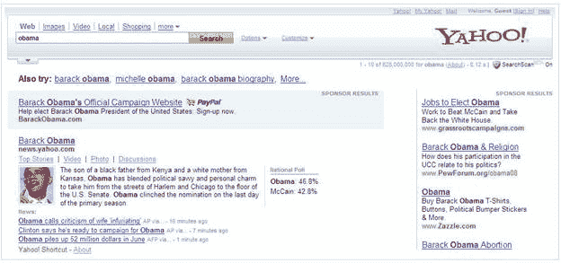

# 雅虎让选举新闻只差一个关键词 

> 原文：<https://web.archive.org/web/https://techcrunch.com/2008/10/03/yahoo-makes-election-news-only-a-keyword-away/>

# 雅虎让选举新闻只差一个关键词

为了迎接即将到来的选举，雅虎正在对其搜索引擎进行一些改变，以帮助简化常见查询并说服人们投票。搜索像“奥巴马”和“麦凯恩”这样的关键词的用户将会看到与候选人相关的小传、民意调查摘要和最近的新闻文章。搜索“总统民意调查”将生成一个民意调查结果列表，用户可以通过在查询中指定一个州来进一步细化搜索。最后，当你搜索与选举相关的词语时，搜索结果页面的角落会有一个“投票”按钮。

看到网站提高对选举的认识总是好的，特别是当它帮助他们真正了解问题的时候。毕竟，[你是要投票的，对吧？](https://web.archive.org/web/20221006215949/http://www.beta.techcrunch.com/2008/10/01/you-are-gonna-vote-right/)。

