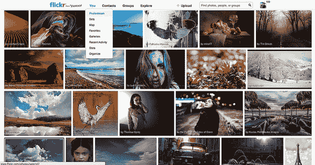
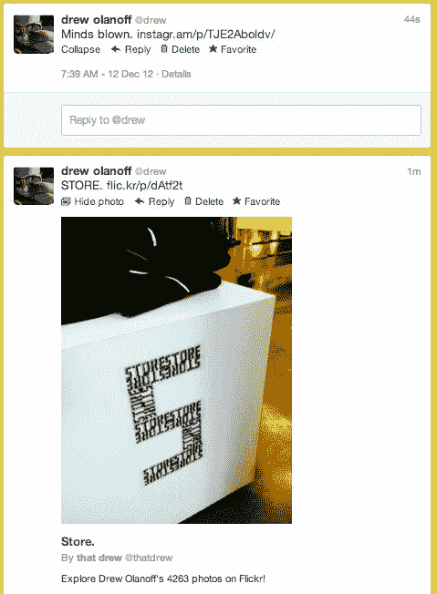
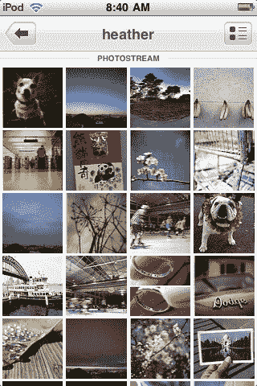

# 雅虎！两天内进行第二次重大升级:iOS 版 Flickr 全面更新，Web 版 TechCrunch 大更新

> 原文：<https://web.archive.org/web/https://techcrunch.com/2012/12/12/yahoo-makes-its-second-major-upgrade-in-two-days-flickr-for-ios-overhauled-major-update-for-web/>

玛丽莎·梅耶尔被任命为雅虎首席执行官后，人们对“拯救”Flickr 的呼声非常高。热情的照片社区的剩余部分一直在等待创新，当他们花时间使用该网站时，他们可以把这些留在身后并感觉良好。今天，该公司发布了 iOS 版的 [Flickr，这是自 2011 年 12 月 21 日以来的首次更新。你没看错，这款应用自去年 12 月以来就没有更新过。](https://web.archive.org/web/20221129121914/https://itunes.apple.com/us/app/flickr/id328407587?mt=8)

对于我们中的一些人来说，我们已经转向了其他照片托管和共享服务，脸书和谷歌等公司已经从 Flickr 强大的照片堡垒中分走了一大块。我个人已经让我的 Flickr Pro 账户失效了，因为没有足够的价值继续使用它。话虽如此，Flickr 的服务上仍然有数量惊人的照片——雅虎[今天宣布](https://web.archive.org/web/20221129121914/http://blog.flickr.net/en/2012/12/12/new-navigation-and-explore/)至今已有超过 80 亿张照片被上传。

回到一月份，我[阐述了雅虎的原因应该彻底收购 Instagram](https://web.archive.org/web/20221129121914/http://thenextweb.com/insider/2012/01/05/3-reasons-why-yahoo-should-buy-instagram-right-now/) ，在它被脸书收购之前。看起来这家公司做得更好，它把事情留在内部，完全重新做了一遍。这也回答了我去年提出的问题，“[我们该如何处理所有这些照片？](https://web.archive.org/web/20221129121914/http://thenextweb.com/media/2011/10/16/calling-all-startups-what-are-we-going-to-do-with-all-of-these-photos/)”

网站本身感觉过时了，功能还达不到其他服务的水平，而且对 Flickr 的发展方向也有点不安。该公司希望这至少能改变部分担忧。这是有道理的，因为在过去的七年里，iPhone 一直是 Flickr 上最受欢迎的“相机”。

下面来看看[全新桌面体验](https://web.archive.org/web/20221129121914/http://blog.flickr.net/en/2012/12/12/new-navigation-and-explore/)，导航更简单:

Twitter 卡支持？不要害怕。没有什么会被[切掉、裁剪或展平不显示](https://web.archive.org/web/20221129121914/https://beta.techcrunch.com/2012/12/09/it-appears-that-instagram-photos-arent-showing-up-in-twitter-streams-at-all/)。Flickr 副总裁布雷特·韦恩说:

> 我们对此的看法很简单，创作内容的创作者有明确的分享意图，这是他们的决定。我们想让照片看起来尽可能好，以利用所有平台。

### Flickr，它在移动设备上应该有的样子

Flickr 的 iOS 改革以及今天推出的网络更新有一点非常明显，那就是该公司在任何地方都追求一致性。当用户在移动设备上时，他们应该有一个舒适和熟悉的体验，类似于他们在网络上的体验，反之亦然。迄今为止，Flickr 还没有兑现这个承诺，但今天的更新无疑将雅虎推向了那个方向。很明显，昨天邮件的升级对雅虎来说是一项重要的任务。

看看 iOS 版 Flickr 的前后(左边是去年的):

 

让我们在这里完全诚实，你在左边看到的应用程序，去年的那个，是一堆垃圾。它一发布，整个社区都知道了，因为它之后再也没有更新过，有些人觉得他们可能再也看不到新版本了。是的，有那么糟。也很慢。

当我昨天在 iPhone 5 上玩新的 Flickr 应用程序时，它的速度快得可笑，可以快速渲染照片，并可以精确地在导航中滑动。这件事做得很好。照片大小不会被裁剪，而是会缩小并在所有流视图中适当显示。将您的设备变成灯箱视图的风景。手感很好，而且很快。

人们在建造这个过程中非常用心，照片创作者在各地都受到了表彰和推广，甚至在这个视频中也是如此:

[Flickr video = 8266282524 secret = b 9 cddc 8d 65 w = 640h = 360]

对我来说，最突出的功能是通过简单的滑动来查看图片流，无论是在别人的流中，还是在你自己的流中。对我来说，这是值得的门票价格和其他照片应用程序缺乏的东西。

照片编辑，无论是高级的还是简单的，都是由 Aviary 提供支持的，这是当前 Flickr 桌面用户所熟悉的。这也是该公司本周的第二笔大交易，之前[是 Twitter 最近照片发布](https://web.archive.org/web/20221129121914/https://beta.techcrunch.com/2012/12/10/twitter-brings-aviary-powered-photo-filters-to-its-android-and-iphone-apps/)的一部分。修改一张照片真的很容易，但我仍然觉得[谷歌的 Snapseed 已经抓住了真正想要的用户体验](https://web.archive.org/web/20221129121914/https://beta.techcrunch.com/2012/12/06/google-launches-snapseeds-powerful-photo-editing-app-for-android-makes-its-ios-version-free/)。

就像在 Flickr 网站上一样，通过新的应用程序，用户可以上传相机胶卷中的照片，将照片添加到群组和场景，给人加标签，并通过 Flickr 的 Foursquare 集成添加地点。

新的有趣的照片区依赖于一系列不同的算法，这很有趣。稍后，我们将通过对 Flickr 副总裁布雷特·韦恩(Brett Wayn)的彻底演练和采访，了解更多这方面的内容。我会告诉你，我问韦恩的第一个问题是“你怎么花了这么长时间？”他的回答是:

> 这对我们来说是一个非常重要的更新。最近一次版本更新已经有一段时间了。我的想法是，我们终于把照片放在前面和中心，旧版本没有显示层丰富。

至少车队对事情的状态是完全诚实的，这一点你不得不欣赏。这是否足以让社区保持快乐，并带来新的人加入进来？我们会看到的。

哦，是的…还有 16 个过滤器，也是由鸟舍提供动力的。

 