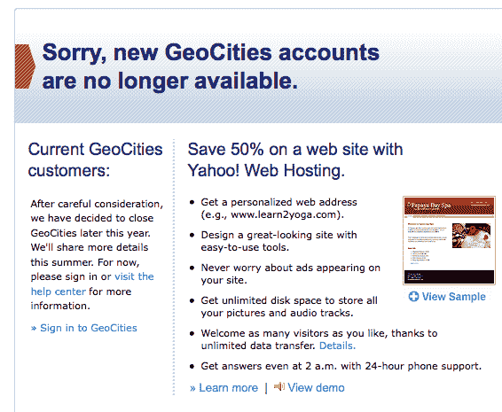
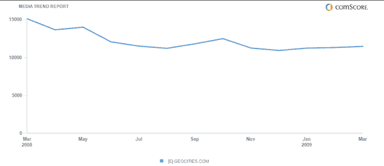
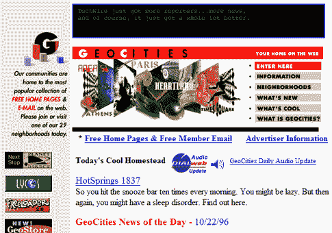

# 雅虎悄悄关闭了 Geocities 

> 原文：<https://web.archive.org/web/https://techcrunch.com/2009/04/23/yahoo-quietly-pulls-the-plug-on-geocities/>

# 雅虎悄悄地拔掉了 Geocities 的插头

不是轰轰烈烈，而是呜咽着。雅虎！被毫不客气地[关闭的](https://web.archive.org/web/20230305214944/http://help.yahoo.com/l/us/yahoo/geocities/geocities-05.html)GeoCities，原来的虚拟主机服务之一被雅虎收购 1999 年为[28.7 亿美元](https://web.archive.org/web/20230305214944/http://news.cnet.com/Yahoo-completes-GeoCities-acquisition/2100-1023_3-226485.html)。(风险投资趣闻:弗雷德·威尔逊的熨斗合伙人是投资者之一)。在雅虎上的一条消息中。该公司表示，将在今年晚些时候关闭免费网络托管服务 Geocities，并且不会接受任何新客户。现有客户仍然可以访问使用 GeoCities，但雅虎！鼓励这些客户升级到雅虎！付费虚拟主机服务。

GeoCities 的流量在过去一年中一直在下降。根据 ComScore 的数据，美国 GeoCities 的独立访客从 2008 年 3 月的 1510 万下降到 3 月的 1150 万，下降了 24%。早在 2006 年 10 月，它就有 1890 万个 uniques。

还有很多其他网站创建和托管服务，包括 WordPress、Blogger 和 Typepad 等博客平台，以及 Ning、Webs、Jimdo、Snapages、Weebly 等网站创建和托管服务。GeoCities 从未真正跟上时代的步伐，但一直是一个不错的浏览量生成器。

作为网络托管网站的先驱之一，GeoCities 为用户提供了个人发布工具，并在其网络平台上创建了“社区”，用户可以创建页面、添加图片、文本、留言簿和网站计数器。早在 MySpace 之前，Geocities 就是一个众所周知的地方，在这里，青少年、大学生以及其他人可以将他们自己花哨的品味强加给世界上的其他人。这是我们在 1996 年发现的一个 GeoCities 主页:为了纪念 GeoCities 和它为网络所做的一切，谁能提出有史以来最差的 Geocities 主页设计，谁就能得到一件 TechCrunch T 恤。

