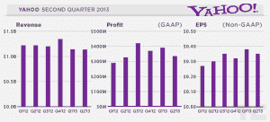
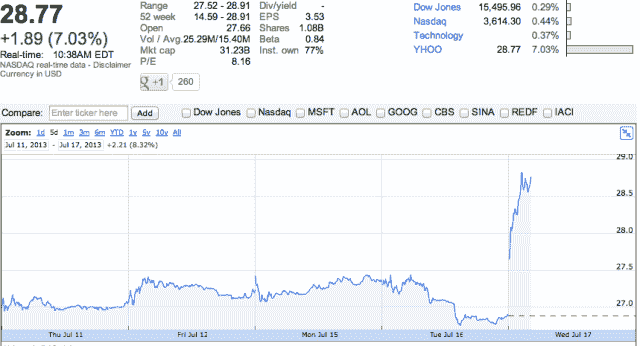

# 收入下降，但雅虎股价上涨 7%，达到五年来的最高水平

> 原文：<https://web.archive.org/web/https://techcrunch.com/2013/07/17/yahoo-shares-five-years-high/>

# 收入下降，但雅虎股价上涨 7%，达到五年来的最高水平

股市开盘后不久，雅虎股票([纳斯达克:YHOO](https://web.archive.org/web/20221127062259/http://www.google.com/finance?cid=658890) )飙升至 28.91 美元，比昨天 26.88 美元的收盘价上涨了 7.55%。更重要的是，它代表了这位硅谷老将的五年高点。然而，雅虎昨天宣布了其在 Q2 T2 的收益，这并不像纳斯达克看起来那么简单。收入同比下降 1%，至 10.7 亿美元，每股收益小幅上升 35 美分。

今天的股票表现更令人惊讶，因为股票在过去的 12 个月里表现得非常好。2012 年 7 月 16 日的股价为 15.65，今天的高点代表了 84.7%的涨幅。自 62 个月前的 2008 年 5 月以来，股价从未达到这一水平。对公司来说，这是一个完全不同的时代。

虽然雅虎超过了分析师对每股收益(30 美分)的预期，但其收入却减少了 1000 万美元。前景令许多投资者失望。2013 年的收入指导为+0.7%，低于该公司在此前的财报中宣布的+1.8%的增幅。换句话说，收入仍然是雅虎的一个主要问题。

但投资者相信玛丽莎·梅耶尔仍能扭转局面。在[担任公司负责人一年后](https://web.archive.org/web/20221127062259/https://beta.techcrunch.com/2013/07/10/after-a-year-of-upgrading-yahoo-ceo-marissa-mayer-to-join-us-at-disrupt-sf/)，她已经采取了重大行动，以 11 亿美元收购了 Tumblr 和许多其他公司，如 Stamped、Qwiki、Astrid、Ghostbird Software、Summly 和 Xobni。

在财务方面，雅虎启动了一项价值 50 亿美元的股票回购计划，提升了股票，证明了公司对自己的未来非常有信心。它对股价的影响甚至可能超过该公司现在出名的收购狂潮。

员工、高管、投资者都相信雅虎能够让事情运转起来。但该公司只缺少一样东西——收入增长。就目前而言，股票市场给了它怀疑的好处，好像雅虎仍然是一家初创公司。但在未来几个季度，要维持这种市场表现，变革是必要的。

