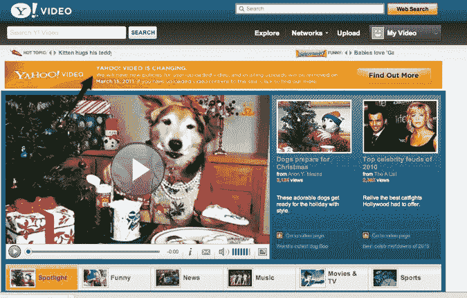

# 雅虎视频不再接受视频上传

> 原文：<https://web.archive.org/web/https://techcrunch.com/2010/12/15/yahoo-video-no-longer-accepts-video-uploads/>

看起来雅虎正在对其类似 YouTube 的视频网站[雅虎视频做出重大改变。](https://web.archive.org/web/20230328203739/http://video.yahoo.com/)根据网站上的通知，雅虎将取消用户上传视频到网站的功能，并将在 2011 年春天从网站上删除所有用户生成的内容。通知上写着:

*2010 年 12 月 15 日将视频上传到雅虎的功能视频被移除，2011 年 3 月 14 日前可用的下载工具被添加到用户的视频档案中，以允许内容检索。用户生成的内容将从 Yahoo！2011 年 3 月 15 日的视频。如果给您带来任何不便，我们深表歉意。*

由于无法与 YouTube 甚至脸书争夺其视频网站的流量，雅虎似乎正在将重心从用户生成的内容上转移。但目前还不清楚雅虎视频会变成什么样。当然，雅虎希望它的照片分享网站 Flickr 能够成为一个受欢迎的视频目的地。Flickr [早在 2008 年就开启了](https://web.archive.org/web/20230328203739/https://techcrunch.com/2008/04/08/flickr-video-launches-a-unique-experience/)上传视频的功能。

不幸的是，雅虎还没有更新解释“什么是雅虎视频”的页面。视频是一个目的地，在这里你可以上传、分享视频，并观看来自雅虎的数百万个视频。查找用户上传的视频，以及来自我们的合作伙伴和其他 Yahoo！属性。

显然，对于雅虎来说，这并不是一个辉煌的一周，它刚刚宣布了公司的一轮裁员。

一位读者给我们发来了这封显然是发给雅虎视频用户的电子邮件:

> 亲爱的雅虎！视频用户，
> 
> 经过慎重考虑，我们将从雅虎删除所有普通用户生成的内容上传功能和用户上传的视频！视频。因此，2011 年 3 月 14 日之后，您的视频、用户资料、评分、收藏夹和播放列表将不再可用。来自雅虎的用户视频内容！2011 年 3 月 14 日之后，仍然嵌入在第三方网站上的视频将不再可播放。
> 
> 在你的个人资料页面上有一个软件工具，可以让你下载你上传到雅虎的视频。2011 年 3 月 14 日之前的视频。您可以通过单击“我的视频”选项卡或访问 http://video.yahoo.com/mypage.来查找您的个人资料
> 
> 一旦你下载了你的视频，你可以选择把它们上传到另一个网站，比如 Flickr，它现在允许视频上传。你可以在这里找到更多:http://www.flickr.com/explore/video.
> 
> 感谢您的理解，感谢您成为雅虎的一员！视频。

如果您对此更改有任何疑问，请访问我们的常见问题部分，或联系客户服务部。

雅虎！视频团队

