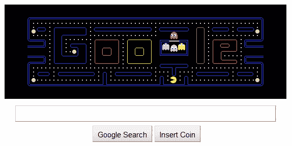

# 你们花了 480 万小时玩谷歌吃豆人 TechCrunch

> 原文：<https://web.archive.org/web/https://techcrunch.com/2010/05/26/yall-spent-4-8-million-hours-playing-google-pac-man/>

# 你们花了 480 万小时玩谷歌吃豆人

干得好，各位。研究公司 Rescuetime 说你们都花了(浪费了？)[自上周](https://web.archive.org/web/20221209104749/http://blog.rescuetime.com/2010/05/24/the-tragic-cost-of-google-pac-man-4-82-million-hours/)[推出](https://web.archive.org/web/20221209104749/http://www.crunchgear.com/2010/05/21/pac-man-greets-google-visitors/)以来，在谷歌主页上玩*吃豆人*的时间已达 480 万小时。如果我们将这些损失的工时转换成美元和美分，那么你可以说美国经济因为吃豆人游戏而损失了略多于 1.2 亿美元。

多亏了这款游戏，谷歌主页的平均访客比平时多花了 36 秒。听起来差不多:我做了一个快速游戏，花了不超过一分钟的时间追鬼。

[CNET](https://web.archive.org/web/20221209104749/http://news.cnet.com/8301-13772_3-20005958-52.html) 提到许多人在*关闭*游戏时遇到麻烦，所以这可能是调查中所占时间的一部分。这让我不禁要问，有多少人会在地址栏中输入 www.google.com，或者点击书签栏上的书签图标？就像，我认为现在正常的事情是简单地从你的浏览器的内置搜索栏搜索？

无论如何，这款游戏将永远在 google.com/pacman 发售。