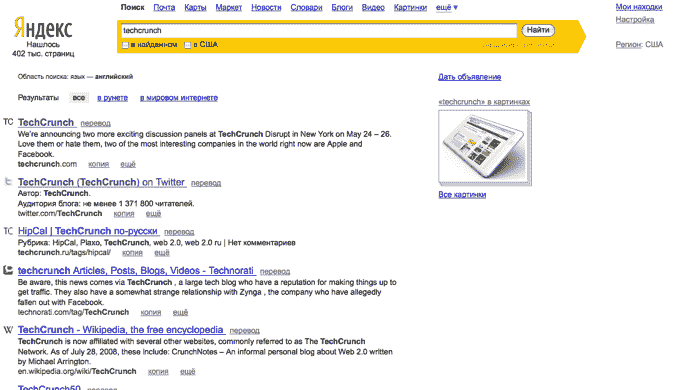

# Yandex 在搜索中添加了外国内容过滤器

> 原文：<https://web.archive.org/web/https://techcrunch.com/2010/05/18/yandex-adds-foreign-content-filter-to-search/>

# Yandex 在搜索中添加了外来内容过滤器

俄罗斯搜索引擎 [Yandex](https://web.archive.org/web/20230326023014/http://yandex.ru/) 现在允许用户只搜索外国网站(非俄罗斯网站)。现在，用户可以点击全球搜索过滤器(如该截图所示)来查看来自国外来源的结果。该公司为测试新的搜索算法而推出的实验性 Yandex.com 门户网站也提供全球搜索服务。

过去两年，Yandex 一直在为外国网站编制索引，并将全球内容添加到其搜索结果中，显然是为了迎合俄罗斯用户。但是，如果用户想从俄罗斯以外的网站得到答案，这个功能将允许他们更准确地过滤结果。

因此，在 yandex.ru 上搜索查询 [TechCrunch](https://web.archive.org/web/20230326023014/http://yandex.ru/yandsearch?foreign=1&text=techcrunch&lr=84&rpt=rad&ncrnd=7733) 会返回一长串俄语网站；但是如果启用了全局搜索过滤器，搜索结果会指向英文网站。目前，Yandex 用拉丁语言索引了超过 40 亿个页面，其中大部分是英文页面。Yandex 的搜索结果页面现在可以选择分别查看本地或国外的搜索结果。默认情况下，Yandex 搜索像以前一样优先搜索本地网站。

Yandex 表示，用户使用拉丁字母语言的查询占搜索引擎所有搜索的 12-15%。Yandex 还计划扩大其搜索索引，以提供多媒体结果和其他有用的答案。

1997 年推出的 Yandex 在俄罗斯已经超过了谷歌。据 LiveInternet.ru 估计，Yandex 在国内的市场份额为 63.6%，谷歌在 4 月份的份额为 21.8%。