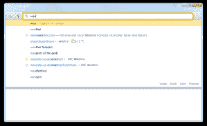

# Yandex 在俄罗斯给了谷歌一记组合拳:为当地搜索巨头 TechCrunch 提供新的浏览器和应用商店

> 原文：<https://web.archive.org/web/https://techcrunch.com/2012/10/01/yandex-gives-google-a-one-two-punch-in-russia-a-new-browser-and-an-app-store-for-the-local-search-giant/>

Yandex 今天加倍努力，确保谷歌不会蚕食其在俄罗斯的市场份额，推出了两款产品，直接瞄准谷歌与消费者(以及更广泛的开发者生态系统)的一些最强接触点。Yandex 今天推出了自己的互联网浏览器，还推出了第一个应用商店——前者针对桌面用户，后者旨在扩大其在移动市场的地位。

该公司表示，这两种产品都将首先在俄罗斯推出，目的是将其推广到 Yandex 运营的其他市场，如土耳其和其他独联体国家，然后推广到全球。一位 Yandex 内部人士告诉我:“我们看到谷歌正在进军俄罗斯市场，我们必须做出对称的回应。”。“我们推出了自己的浏览器，现在可以在俄罗斯使用，但它也将很快成为独联体其他国家、土耳其和世界的产品。”

对 Yandex 来说，提供搜索之外的更多产品是一个重要举措，不仅是为了在国内市场上保持与谷歌和 Mail.ru 等公司的竞争力，后者上周推出了其 Amigo“社交浏览器”，而且也是为了继续发展其业务。虽然 Yandex 目前在俄罗斯所有搜索中的[份额刚刚超过 60%](https://web.archive.org/web/20230211180353/http://company.yandex.com/press_center/press_releases/2012/2012-07-31.xml) ,但这一份额多年来一直在下降，因此它需要寻找其他途径和其他地区来支撑其业务。

在产品发布之前，两周前有消息称 Yandex 是苹果在俄罗斯的[地图合作伙伴](https://web.archive.org/web/20230211180353/https://techcrunch.com/2012/09/17/googles-lossyandexs-gain-in-apples-ios6-russian-search-giant-nabs-maps-api-search-deal-in-the-works/)——提供房源信息和其他数据，而苹果一直在其他市场努力提供全面可靠的地图应用，以抗衡苹果与谷歌合作开发原生地图应用时用户的体验。

根据 Live Internet 的统计数据，Yandex 目前在搜索领域仍然占据主导地位，甚至在俄罗斯的谷歌 Chrome 上，它也是搜索领域的霸主。考虑到谷歌是 Chrome 的默认搜索，这已经说得够多了，改变它需要的不仅仅是点击。它也是 T2 那些使用火狐浏览器的人的顶级搜索引擎。

今天推出的互联网浏览器仅面向桌面用户，尽管 Yandex 将其引入移动设备似乎只是时间问题。Yandex 已经在为用户提供一套搜索之外的在线产品——不仅仅是地图，还有云存储解决方案(Yandex。Drive)、音乐流媒体服务(Yandex。音乐)和电子邮件，其中大部分也是为多屏(桌面/移动/平板)使用而构建的。

和谷歌一样，Yandex 的目的是销售搜索和显示广告来应对这一切。

就像你进入 Chrome 一样，搜索和浏览窗口是合并的——但它与 Chrome 的不同之处在于，用户可以很容易地改变他们的搜索提供商(如果他们想的话，甚至可以去谷歌)。也许，Yandex 与坚持使用其搜索引擎的人联系不那么紧密的原因是，它在浏览器中集成了如此多的其他 Yandex 服务:它们包括实时的交通或天气情况，直接显示在浏览器界面中。(见下面截图。)

作为对主要说俄语和其他非英语语言的核心用户的让步，浏览器使用机器学习技术来帮助用户直观地找到相关的结果，即使用户无法在最初找到这些结果所需的语言中进行搜索。Yandex 还在使用卡巴斯基技术筛选和警告用户恶意网站。

Yandex 首席执行官 Arkady Volozh 在一份声明中表示:“基于云的浏览是应对现代互联网挑战的下一代解决方案。”“为了让每个人的互联网体验更快、更轻松、更安全，我们构建了一个基于云的浏览器，它集成了我们最好的产品和服务，并向其他 web 开发者开放。”

网络浏览器是基于 WebKit 构建的，用户界面基于 Chromium——这意味着开发人员也可以轻松地构建应用程序和扩展来使用浏览器。

Yandex 的移动应用商店公告也强调了开发者的推动。

这家专注于 Android 的商店将在未来几周内推出，这是 Yandex 进一步扩大其在移动设备上的影响力的又一举措。TechCrunch 了解到，它将推出 Yandex 本身的一些现成应用程序(搜索、邮件、磁盘和一些不同的地理定位应用程序)，以及第三方开发的应用程序——从发布之日起总共有 40，000 个。Yandex 能够做到这一点是因为它正在与 Opera Mobile 一起开发它，Opera Mobile 有自己的应用程序店面，也在与第三方合作提供白牌服务。

与亚马逊的应用商店一样，Yandex 的努力似乎直接针对那些使用 Android 分叉版本的手机制造商，因此无法提供谷歌的 Play 店面。与中国一样，俄罗斯正在成为这些公司的一个强大市场，Yandex 告诉我，至少有三家手机制造商——pocket book、texet 和 3Q——将推出预装 Yandex 应用商店的设备。

与其他应用商店类似，Yandex 将收入分成 70/30。

有趣的是，Yandex 表示，它也将自己的应用商店白标带给运营商，MegaFon 现在正准备推出自己的基于 Yandex 的应用商店。

虽然 Yandex 已经停止寻找自己的移动操作系统，但这些举措也让它越来越接近这一目标。Yandex 的发言人拒绝就这个问题置评。

