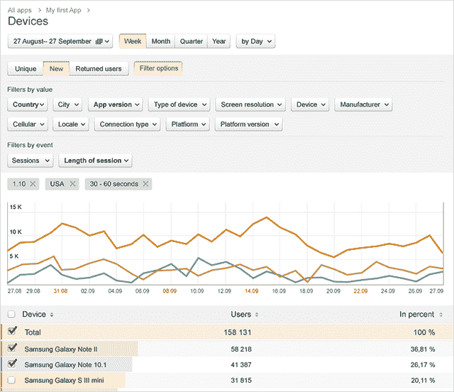

# Yandex 的 Metrica For Apps 为移动开发者提供了另一个免费工具来跟踪他们的商品

> 原文：<https://web.archive.org/web/https://techcrunch.com/2013/10/21/yandex-metrica-for-apps/>

# Yandex 的 Metrica For Apps 为移动开发者提供了另一个免费工具来追踪他们的商品

俄罗斯的 Yandex 在搜索、地图、翻译服务等领域与谷歌竞争，是其国内市场的主导搜索引擎(据报道，其份额为 61.7%，早在 7 月份)。现在它将目光投向了谷歌分析——[宣布](https://web.archive.org/web/20230224093919/http://company.yandex.com/press_center/blog/entry.xml?pid=39&from=subs217177)今天为使用 Android、iOS 或 Windows Phone 平台的移动开发者推出一款免费的分析工具。

该工具名为 [Metrica for Apps](https://web.archive.org/web/20230224093919/http://appmetrica.yandex.com/?from=subs217177&ncrnd=5837) ，基于 Yandex 现有的 [Metrica web 分析工具](https://web.archive.org/web/20230224093919/https://passport.yandex.com/passport?mode=auth&from=metrika&retpath=http%3A%2F%2Fmetrica.yandex.com%2Flist%2F%3Fauthredirlevel%3D1382355456.1%26counter_id%3D)，但完全专注于移动和平板电脑应用。

应用跟踪器工具包括跟踪实时应用使用数据的能力；获得定制的碰撞报告；根据用户的国家/地区、应用版本、操作系统和版本、设备类型(平板电脑或智能手机)、型号和制造商、屏幕分辨率、用户界面语言、移动提供商、连接类型、用户操作和用户会话时间等因素，构建其他详细的自定义报告。

在宣布 Metrica for Apps 发布的博客中，Yandex 表示，下一版本还将添加营销工具和新选项，使开发者能够“看到他们的流量来源和渠道，并使用高级活动设置”。Metrica for Apps 目前的所有功能都是完全免费的——但它可能会添加额外的功能，以便及时将产品变现。

“我们正在考虑，”Yandex 发言人告诉 TechCrunch。“正在研究更多报告，包括营销人员、高级应用内事件报告，以及一些独特的报告，如通过点击或滑动进行用户转化的‘热图’(如我们在 old good Yandex 中显示的[点击图](https://web.archive.org/web/20230224093919/http://help.yandex.com/metrica/behavior/click-map.xml))。网站的 Metrica)。”

除了谷歌分析之类的工具，Yandex 的工具还与其他成熟的应用追踪器业务竞争，如 [Flurry](https://web.archive.org/web/20230224093919/http://www.crunchbase.com/company/flurry) 和 [App Annie](https://web.archive.org/web/20230224093919/http://www.crunchbase.com/company/app-annie) 。但是，随着如此多的应用程序诞生，以及互联设备市场的增长继续向以应用程序为中心的设备倾斜，如平板电脑和智能手机，应用程序的兴起应该能够支持多种分析产品。

Yandex 在俄罗斯的搜索份额最近只是略有增加，因此它在如何扩展业务方面变得更加进取，并转向其他产品。应用分析只是它的最新尝试。例如，Yandex 上周收购了俄罗斯 KinoPoisk，进军电影搜索和推荐领域。